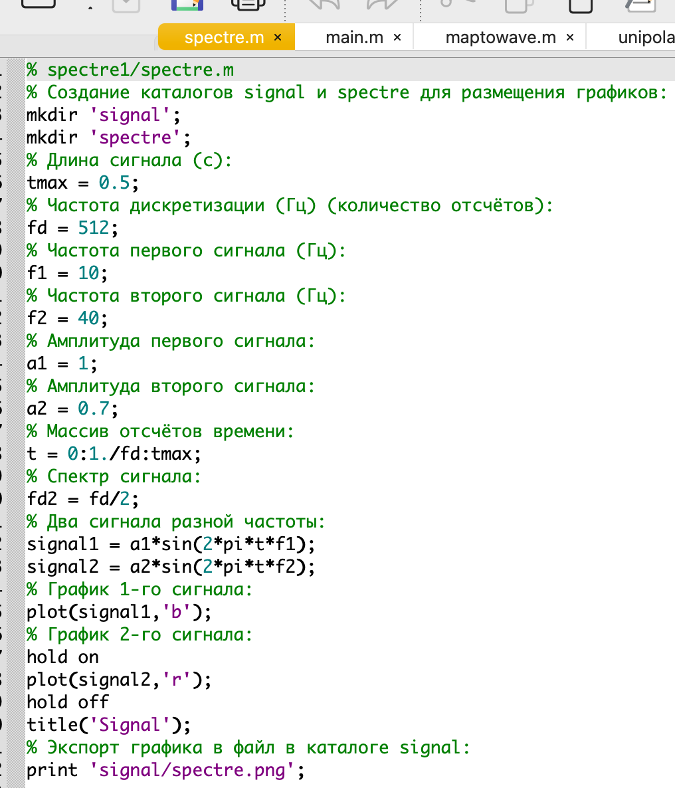
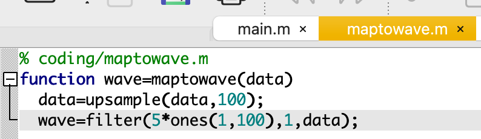

---
## Front matter
title: "Отчёт по лабораторной работе №1"
subtitle: "Дисциплина: Сетевые технологии"
author: "Мишина Анастасия Алексеевна"

## Generic options
lang: ru-RU
toc-title: "Содержание"

## Bibliography
bibliography: bib/cite.bib
csl: pandoc/csl/gost-r-7-0-5-2008-numeric.csl

## Pdf output format
toc: true # Table of contents
toc-depth: 2
lof: true # List of figures
lot: true # List of tables
fontsize: 14pt
linestretch: 1.5
papersize: a4
documentclass: scrreprt
## I18n polyglossia
polyglossia-lang:
  name: russian
  options:
	- spelling=modern
	- babelshorthands=true
polyglossia-otherlangs:
  name: english
## I18n babel
babel-lang: russian
babel-otherlangs: english
## Fonts
mainfont: PT Serif
romanfont: PT Serif
sansfont: PT Sans
monofont: PT Mono
mainfontoptions: Ligatures=TeX
romanfontoptions: Ligatures=TeX
sansfontoptions: Ligatures=TeX,Scale=MatchLowercase
monofontoptions: Scale=MatchLowercase,Scale=0.9
## Biblatex
biblatex: true
biblio-style: "gost-numeric"
biblatexoptions:
  - parentracker=true
  - backend=biber
  - hyperref=auto
  - language=auto
  - autolang=other*
  - citestyle=gost-numeric
## Pandoc-crossref LaTeX customization
figureTitle: "Рис."
tableTitle: "Таблица"
listingTitle: "Листинг"
lofTitle: "Список иллюстраций"
lotTitle: "Список таблиц"
lolTitle: "Листинги"
## Misc options
indent: true
header-includes:
  - \usepackage{indentfirst}
  - \usepackage{float} # keep figures where there are in the text
  - \floatplacement{figure}{H} # keep figures where there are in the text
---

# Цель работы

Целью данной работы является изучение методов кодирования и модуляции сигналов с помощью высокоуровнего языка программирования Octave. Определение спектра и параметров сигнала. Демонстрация принципов модуляции сигнала на примере аналоговой амплитудной модуляции. Исследование свойства самосинхронизации сигнала.

# Выполнение лабораторной работы

## Построение графиков в Octave

Запускаем Octave, создаем новый сценарий под названием plot_sin.m. В окне редактора повторяем листинг по построению графика функции y = sin x + 1/3 sin 3x + 1/5 sin 5x на интервале [−10; 10] (рис. [-@fig:001]).

{ #fig:001 width=80% }

Запускаем сценарий на выполнение, открывается окно с графиком (рис. [-@fig:002]). В рабочем каталоге появляются файла с графиками в форматах .eps, .png (рис. [-@fig:003]).

{ #fig:002 width=80% }

{ #fig:003 width=80% }

Сохраним сценарий под названием plot_sin_cos.m и изменим его так, чтобы наодном графике располагались отличающиеся по типу линий графики функций y1 = sin x + 1/3 sin 3x + 1/5 sin 5x, y2 = cos x + 1/3 cos 3x + 1/5 cos 5x. Итоговый листинг (рис. [-@fig:004]).

{ #fig:004 width=80% }

Запускаем, получаем еще один график (рис. [-@fig:005]).

{ #fig:005 width=80% }

## Разложение импульсного сигнала в частичный ряд Фурье

Создадим новый сценарий meandr.m. В кодe зададим начальные значения. Вычислим амплитуду гармоник и заполним массивы гармоник и элементов ряда. Далее задаём массив значений гармоник массив элементов ряда. Для построения в одном окне отдельных графиков меандра с различным количеством гармоник реализуем суммирование ряда с накоплением и воспользуемся функциями subplot и plot для построения графиков. Также экспортируем полученный график в файл в формате .png (рис. [-@fig:006]), (рис. [-@fig:007]).

{ #fig:006 width=80% }

{ #fig:007 width=80% }

Также реализуем меандр через синусы (рис. [-@fig:008]), (рис. [-@fig:009]).

{ #fig:008 width=80% }

{ #fig:009 width=80% }

## Определение спектра и параметров сигнала

Создадим в рабочем каталоге каталог spectre1 и в нем новый сценарий spectre.m. В коде сценария зададим начальные значения, а также два синусоидальных сигнала разной частоты, построим графики сигналов (рис. [-@fig:010]), (рис. [-@fig:011]).

{ #fig:010 width=80% }

{ #fig:011 width=80% }

Затем с помощью быстрого преобразования Фурье найдем спектры сигналов, добавив в файл spectre.m код из мануала в ТУИСе. Учитывая реализацию преобразования Фурье, скорректируем график спектра (рис. [-@fig:012]): отбросим дублирующие отрицательные частоты, а также примим в расчёт то, что на каждом шаге вычисления быстрого преобразования Фурье происходит суммирование амплитуд сигналов.

{ #fig:012 width=80% }

Получим следующие графики: график спектров синусоидальных сигналов (рис. [-@fig:013]) и исправленный график спектров синусоидальных сигналов (рис. [-@fig:014]).

{ #fig:013 width=80% }

{ #fig:014 width=80% }

Найдем спектр суммы рассмотренных сигналов, создадим каталог spectr_sum и в нем spectre_sum.m (рис. [-@fig:015]), (рис. [-@fig:016]).

{ #fig:015 width=80% }

{ #fig:016 width=80% }

В результате должен получится аналогичный предыдущему результат (рис. [-@fig:017]), т.е. спектр суммы сигналов должен быть равен сумме спектров сигналов, что вытекает из свойств преобразования Фурье.

{ #fig:017 width=80% }

## Амплитудная модуляция

В рабочем каталоге создадим каталог modulation и в нём новый сценарий с именем am.m. Добавим в него код из мануала (рис. [-@fig:018]).

{ #fig:018 width=80% }

В результате получаем, что спектр произведения представляет собой свертку спектров (рис. [-@fig:019]), (рис. [-@fig:020]).

{ #fig:019 width=80% }

{ #fig:020 width=80% }

## Кодирование сигнала. Исследование свойства самосинхронизации сигнала

В рабочем каталоге создадим каталог coding и в нём файлы main.m, maptowave.m, unipolar.m, ami.m, bipolarnrz.m, bipolarrz.m, manchester.m, diffmanc.m, calcspectre.m.

В окне интерпретатора команд проверяем, установлен ли пакет расширений signal: pkg list. Так как он не установлен, то устанавливаем его: pkg list -forge и pkg install control signal (рис. [-@fig:021]).

{ #fig:021 width=80% }

В файле main.m подключаем пакет signal и задаем входные кодовые последовательности (рис. [-@fig:022]).

{ #fig:022 width=80% }

Затем в этом же файле пропишем вызовы функций для построения графиков модуляций кодированных сигналов для кодовой последовательности data (рис. [-@fig:023]).

{ #fig:023 width=80% }

Пропишем вызовы функций для построения графиков модуляций кодированных сигналов для кодовой последовательности data_sync (рис. [-@fig:024]).

{ #fig:024 width=80% }

Далее в этом же файле пропишем вызовы функций для построения графиков спектров (рис. [-@fig:025]).

{ #fig:025 width=80% }

В файле maptowave.m пропишем функцию, которая по входному битовому потоку строит график сигнала (рис. [-@fig:026]).

{ #fig:026 width=80% }

В файлах unipolar.m (рис. [-@fig:027]), ami.m (рис. [-@fig:028]), bipolarnrz.m (рис. [-@fig:029]), bipolarrz.m (рис. [-@fig:030]), manchester.m (рис. [-@fig:031]), diffmanc.m (рис. [-@fig:032]) пропишем соответствующие функции преобразования кодовой последовательности data с вызовом функции maptowave для построения соответствующего графика.

{ #fig:027 width=80% }

{ #fig:028 width=80% }

{ #fig:029 width=80% }

{ #fig:030 width=80% }

{ #fig:031 width=80% }

{ #fig:032 width=80% }

В файле calcspectre.m пропишем функцию построения спектра сигнала (рис. [-@fig:033]).

{ #fig:033 width=80% }

Запустим главный скрипт main.m. В каталоге signal должны быть получены файлы с графиками кодированного сигнала (рис. [-@fig:034]-[-@fig:039]), в каталоге sync — файлы с графиками, иллюстрирующими свойства самосинхронизации (рис. [-@fig:040]-[-@fig:045]), в каталоге spectre — файлы с графиками спектров сигналов (рис. [-@fig:046]-[-@fig:051]).

{ #fig:034 width=80% }

{ #fig:035 width=80% }

{ #fig:036 width=80% }

{ #fig:037 width=80% }

{ #fig:38 width=80% }

{ #fig:039 width=80% }

{ #fig:040 width=80% }

{ #fig:041 width=80% }

{ #fig:042 width=80% }

{ #fig:043 width=80% }

{ #fig:044 width=80% }

{ #fig:045 width=80% }

{ #fig:046 width=80% }

{ #fig:047 width=80% }

{ #fig:048 width=80% }

{ #fig:049 width=80% }

{ #fig:050 width=80% }

{ #fig:051 width=80% }

# Выводы

В ходе выполнения данной лабораторной работы я изучила методы кодирования и модуляции сигналов с помощью высокоуровнего языка программирования Octave. Определила спектр и параметры сигнала. Продемонстрировала принципы модуляции сигнала на примере аналоговой амплитудной модуляции. Исследовала свойства самосинхронизации сигнала.

