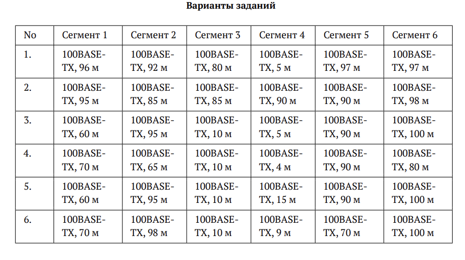
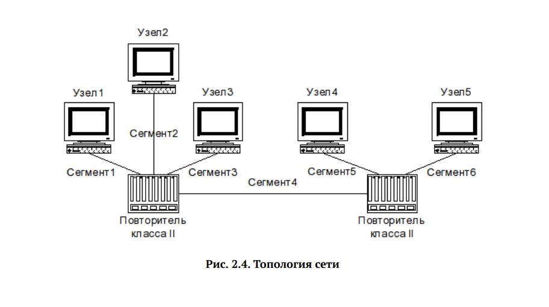
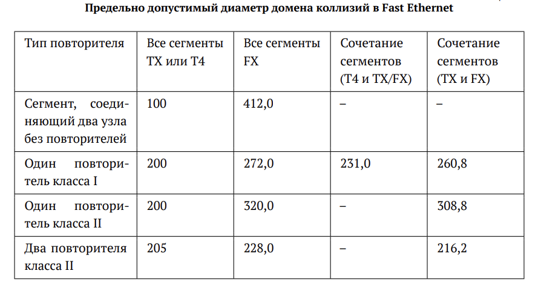
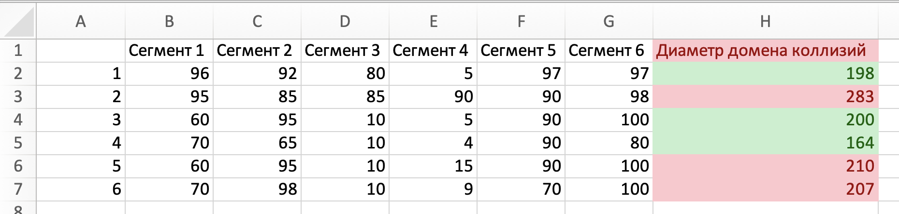
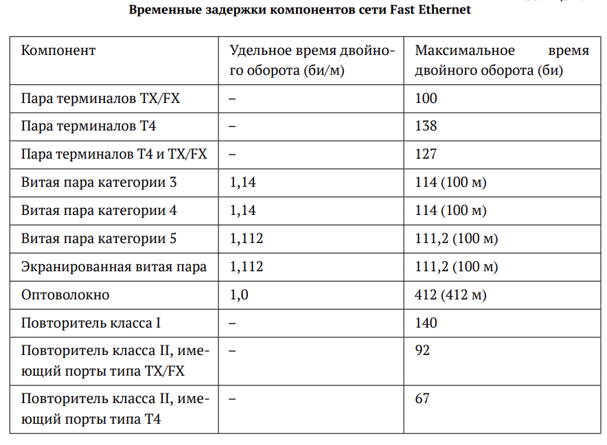
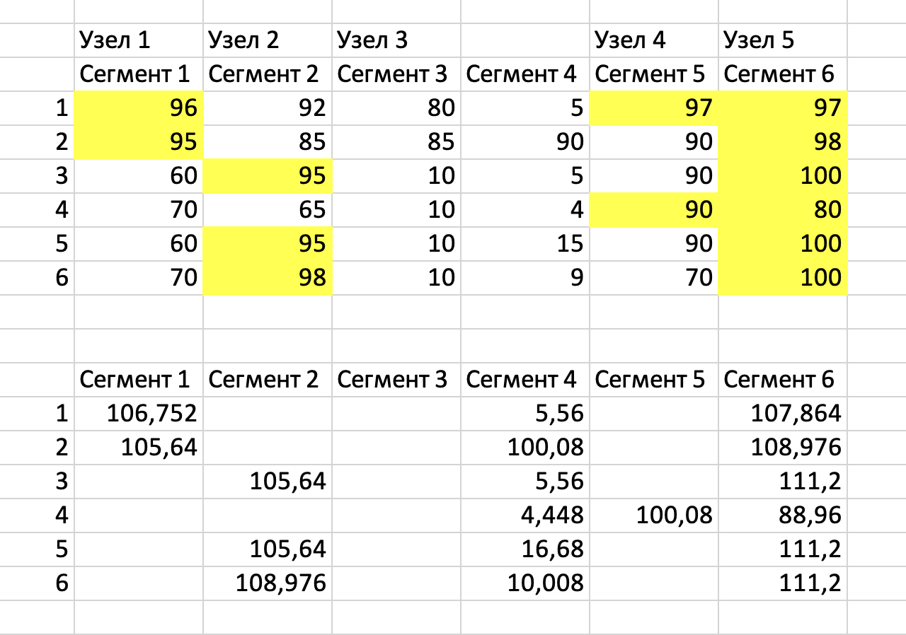
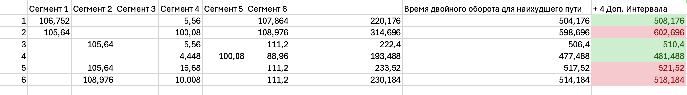

---
## Front matter
lang: ru-RU
title: Лабораторная работа №2
subtitle: Сетевые технологии
author:
  - Мишина А. А.
date: 25 сентября 2024

## i18n babel
babel-lang: russian
babel-otherlangs: english

## Formatting pdf
toc: false
toc-title: Содержание
slide_level: 2
aspectratio: 169
section-titles: true
theme: metropolis
header-includes:
 - \metroset{progressbar=frametitle,sectionpage=progressbar,numbering=fraction}
 - '\makeatletter'

 - '\makeatother'
---

## Цели и задачи

- Цель данной работы — изучение принципов технологий Ethernet и Fast Ethernet и практическое освоение методик оценки работоспособности сети, построенной на базе технологии Fast Ethernet.

# Задание

## Задание

- Оценить работоспособность 100-мегабитной сети Fast Ethernet в соответствии с первой и второй моделями.

{ #fig:1 width=60% }

## Задание

{ #fig:2 width=60% }

# Выполнение лабораторной работы

## Первая модель

{ #fig:3 width=80% }

## Первая модель

{ #fig:4 width=80% }

## Вторая модель

- В нашей конфигурации все сегменты 100BASE-TX.

{ #fig:5 width=40% }

## Время двойного оборота на сегментах

{ #fig:6 width=60% }

## Вторая модель

- Время двойного оборота двух повторителей класса II (92 би/м)
- Время пары терминалов с интерфейсами TX (100 би/м)
- 4 битовых интервала для учета задержек 

{ #fig:7 width=80% }

## Вывод

- В ходе выполнения лабораторной работы были изучены принципы технологий Ethernet и Fast Ethernet. Также были практически освоены методики оценки работоспособности сети, построенной на базе технологии Fast Ethernet.