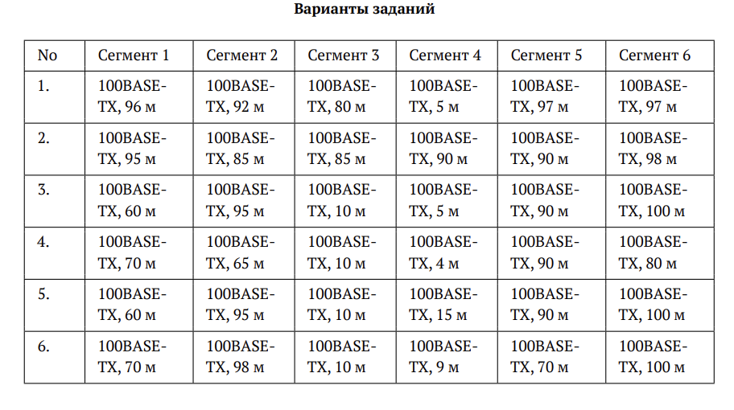
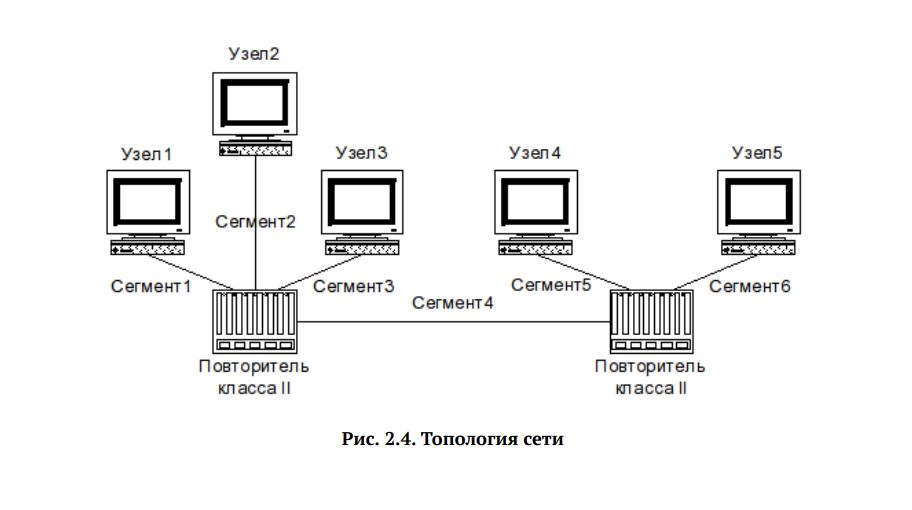
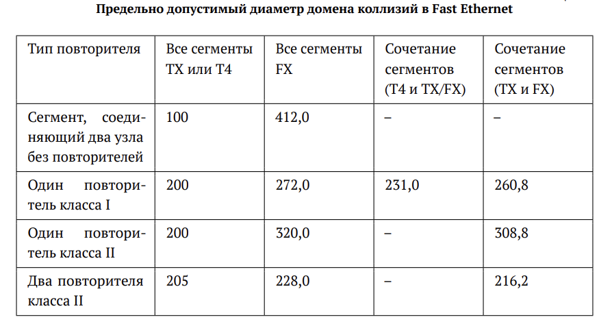
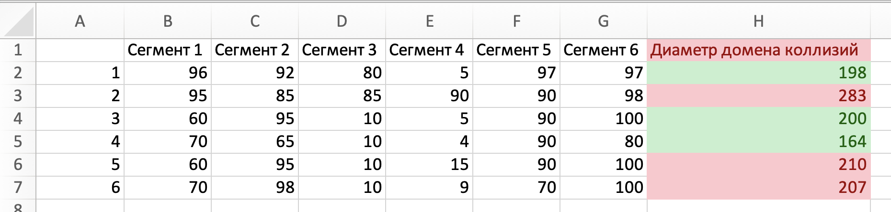
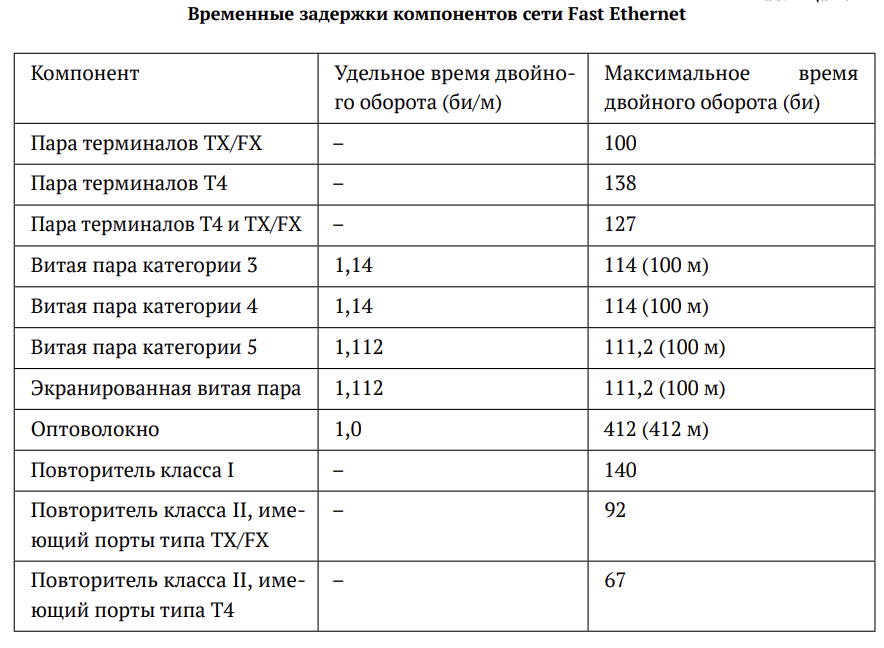
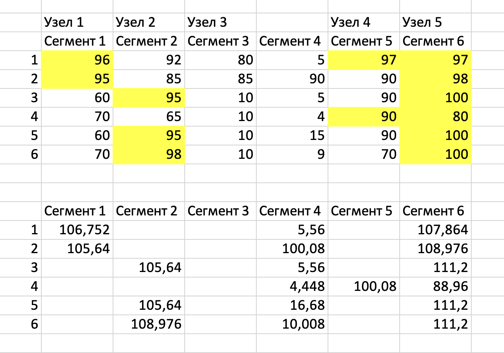
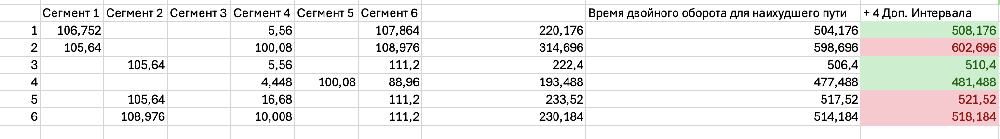

---
## Front matter
title: "Отчёт по лабораторной работе №2"
subtitle: "Дисциплина: Сетевые технологии"
author: "Мишина Анастасия Алексеевна"

## Generic options
lang: ru-RU
toc-title: "Содержание"

## Bibliography
bibliography: bib/cite.bib
csl: pandoc/csl/gost-r-7-0-5-2008-numeric.csl

## Pdf output format
toc: true # Table of contents
toc-depth: 2
lof: true # List of figures
lot: true # List of tables
fontsize: 14pt
linestretch: 1.5
papersize: a4
documentclass: scrreprt
## I18n polyglossia
polyglossia-lang:
  name: russian
  options:
	- spelling=modern
	- babelshorthands=true
polyglossia-otherlangs:
  name: english
## I18n babel
babel-lang: russian
babel-otherlangs: english
## Fonts
mainfont: PT Serif
romanfont: PT Serif
sansfont: PT Sans
monofont: PT Mono
mainfontoptions: Ligatures=TeX
romanfontoptions: Ligatures=TeX
sansfontoptions: Ligatures=TeX,Scale=MatchLowercase
monofontoptions: Scale=MatchLowercase,Scale=0.9
## Biblatex
biblatex: true
biblio-style: "gost-numeric"
biblatexoptions:
  - parentracker=true
  - backend=biber
  - hyperref=auto
  - language=auto
  - autolang=other*
  - citestyle=gost-numeric
## Pandoc-crossref LaTeX customization
figureTitle: "Рис."
tableTitle: "Таблица"
listingTitle: "Листинг"
lofTitle: "Список иллюстраций"
lotTitle: "Список таблиц"
lolTitle: "Листинги"
## Misc options
indent: true
header-includes:
  - \usepackage{indentfirst}
  - \usepackage{float} # keep figures where there are in the text
  - \floatplacement{figure}{H} # keep figures where there are in the text
---

# Цель работы

Цель данной работы — изучение принципов технологий Ethernet и Fast Ethernet и практическое освоение методик оценки работоспособности сети, построенной на базе технологии Fast Ethernet.

# Задание

В данной лабораторной работе требуется оценить работоспособность 100-мегабитной сети Fast Ethernet в соответствии с первой и второй моделями.

Нам даны конфигурации сети (рис. [-@fig:1]) и топология сети (рис. [-@fig:2]).

{ #fig:1 width=80% }

{ #fig:2 width=80% }

# Выполнение лабораторной работы

Для начала оценим работоспособность с помощью первой модели. Требуется высчитать диаметр домена коллизий и сравнить его с референтным значением. Так как по условию у нас имеются два повторителя класса II и все сегменты TX (а именно 100BASE-TX), то в соответствии с таблицей (рис. [-@fig:3]) получаем, что предельно допустимый диаметр домена коллизий в Fast Ethernet 205 м.

{ #fig:3 width=80% }

Посчитаем суммы длин сегментов в каждой строке и сравним их с референтным значением. Результаты меньше 205 м отмечаем зеленым - это работоспособные сети (1, 3 и 4) (рис. [-@fig:4]).

{ #fig:4 width=80% }

Теперь оценим работоспособность сети с помощью второй модели. Для этого требуется найти наихудшие пути в домене коллизий, определить сегменты. В нашей конфигурации все сегменты 100BASE-TX и используется витая пара категории 5. Рассчитаем время для двойного оборота на сегментах, умножая длину сегмента на удельное время двойного оборота 1,112 би/м, исходя из таблицы (рис. [-@fig:5]).

{ #fig:5 width=80% }

Для каждой строки перемножим значения сегментов наихудшего пути и удельное время двойного оборота сегментов, полученные значения сложим (рис. [-@fig:6]).

{ #fig:6 width=80% }

Затем к получившейся сумме добавим время двойного оборота двух повторителей класса II (92 би/м для каждого) и пары терминалов с интерфейсами TX (100 би/м). Также добавим 4 битовых интервала для учета задержек и сравним результат с числом 512. Результаты меньше 512 указывают нам на работоспособные сети (выделены зеленым) (рис. [-@fig:7]).

{ #fig:7 width=80% }

В результате рабочими остаются те же варианты сетей, что и по первой модели (сети 1, 3 и 4).

# Выводы

В ходе выполнения лабораторной работы были изучены принципы технологий Ethernet и Fast Ethernet. Также были практически освоены методики оценки работоспособности сети, построенной на базе технологии Fast Ethernet.

