---
## Front matter
title: "Отчёт по лабораторной работе №3"
subtitle: "Дисциплина: Сетевые технологии"
author: "Мишина Анастасия Алексеевна"

## Generic options
lang: ru-RU
toc-title: "Содержание"

## Bibliography
bibliography: bib/cite.bib
csl: pandoc/csl/gost-r-7-0-5-2008-numeric.csl

## Pdf output format
toc: true # Table of contents
toc-depth: 2
lof: true # List of figures
lot: true # List of tables
fontsize: 14pt
linestretch: 1.5
papersize: a4
documentclass: scrreprt
## I18n polyglossia
polyglossia-lang:
  name: russian
  options:
	- spelling=modern
	- babelshorthands=true
polyglossia-otherlangs:
  name: english
## I18n babel
babel-lang: russian
babel-otherlangs: english
## Fonts
mainfont: PT Serif
romanfont: PT Serif
sansfont: PT Sans
monofont: PT Mono
mainfontoptions: Ligatures=TeX
romanfontoptions: Ligatures=TeX
sansfontoptions: Ligatures=TeX,Scale=MatchLowercase
monofontoptions: Scale=MatchLowercase,Scale=0.9
## Biblatex
biblatex: true
biblio-style: "gost-numeric"
biblatexoptions:
  - parentracker=true
  - backend=biber
  - hyperref=auto
  - language=auto
  - autolang=other*
  - citestyle=gost-numeric
## Pandoc-crossref LaTeX customization
figureTitle: "Рис."
tableTitle: "Таблица"
listingTitle: "Листинг"
lofTitle: "Список иллюстраций"
lotTitle: "Список таблиц"
lolTitle: "Листинги"
## Misc options
indent: true
header-includes:
  - \usepackage{indentfirst}
  - \usepackage{float} # keep figures where there are in the text
  - \floatplacement{figure}{H} # keep figures where there are in the text
---

# Цель работы

Изучение посредством Wireshark кадров Ethernet, анализ PDU протоколов транспортного и прикладного уровней стека TCP/IP.

# Выполнение лабораторной работы

## MAC-адресация

С помощью команды ipconfig для ОС типа Windows выводим информацию о текущем сетевом соединении. Просматриваем информацию о сетевых адаптерах и конкретно о беспроводном соединении. Отсюда можно узнать IPv6-адрес, IPv4-адрес (уникальный IPv4-адрес узла), маску подсети (используется для определения сетевой и узловой частей IPv4-адреса) и шлюз (рис. [-@fig:1]).

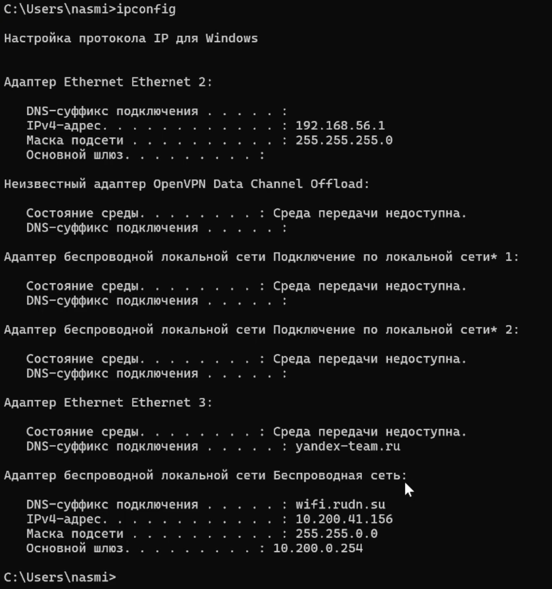{#fig:1 width=70%}

Вводим ipconfig /all для вывода более подробной информации. Просматриваем данные о беспроводном соединении. Видим описание устройства (производитель Intel, MAC-адрес - DC-45-46-63-D4-E5). MAC-адрес состоит из 6 октетов:  первые 3 октета идентифицируют производителя, последние 3 октета идентифицируют сетевой интерфейс (рис. [-@fig:2]).

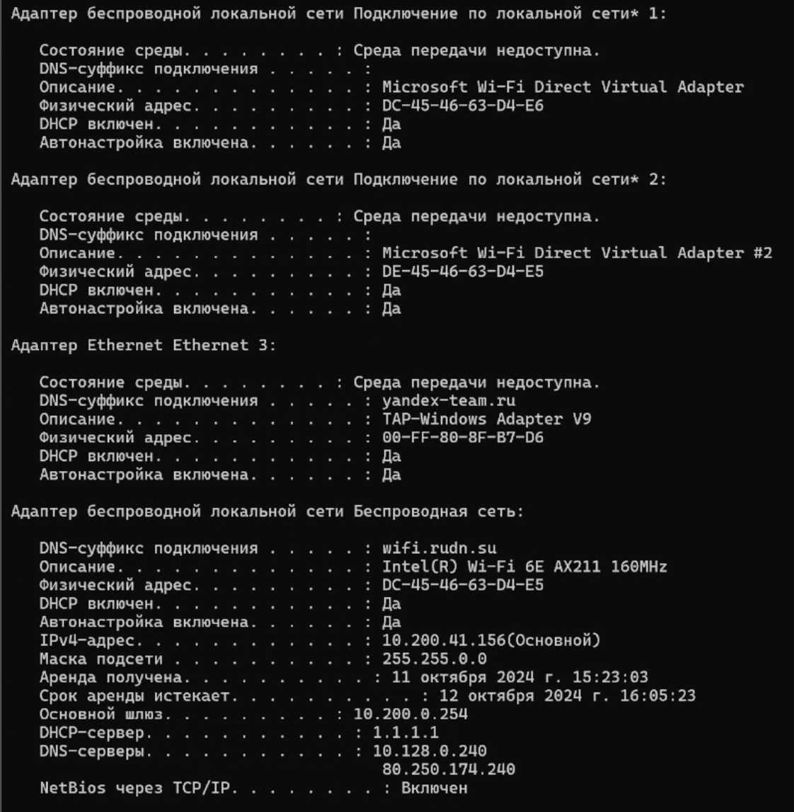{#fig:2 width=70%}

Проверив на специальном сайте производителя устройства по первым 3 октетам выясняем, что устройство выпущено компанией Intel Corporate. Взяв первый байт (DC) и переведя в двоичную систему счисления, получаем 11011100. Так как последний бит = 0, адрес является индивидуальным. Предпоследний бит = 0, следовательно, адрес глобально администрируемый.

##  Анализ кадров канального уровня в Wireshark

Запускаем Wireshark и выбираем беспроводное соединение. Запускаем захват трафика (рис. [-@fig:3]). 

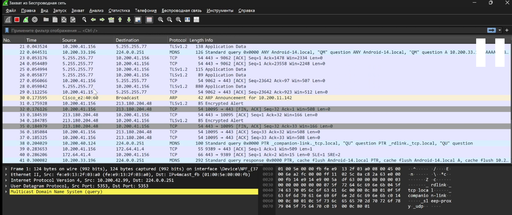{#fig:3 width=70%}

Шлюз по умолчанию для моего устройства - 100.200.0.254 (было определено в предыдущем задании). С помощью команды ping 100.200.0.254 пингуем шлюз по умолчанию (рис. [-@fig:4]). 

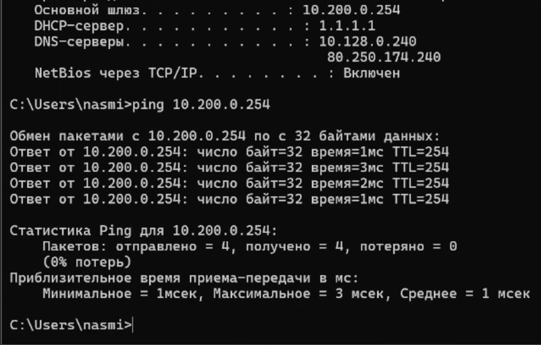{#fig:4 width=70%}

Останавливаем захват трафика. В строке фильтра указываем icmp. Убедимся, что в списке пакетов отобразятся только пакеты ICMP, в частности пакеты, которые были сгенерированы с помощью команды ping, отправленной с моего устройства на шлюз по умолчанию. Видим 4 пакета-запроса и 4 пакета-ответа. Выбираем запрос и просматриваем в нижней части экрана информацию о нем. На вкладке физического уровня можно найти длину кадра (74 бита). Чтобы узнать MAC-адрес источника и шлюза перейдем на канальный уровень. Адрес источника (Source, откуда запрос отправлен) – это адрес моего устройства (DC-45-46-63-D4-E5). Адрес шлюза (destination, то куда отправлен запрос) - B8-E3-B1-7D-D5-B6. Тип адреса тут указан (показаны нулевые и первые биты MAC-адресов). Что адрес источника, что адрес шлюза индивидуальные и глобально администрируемые (рис. [-@fig:5])

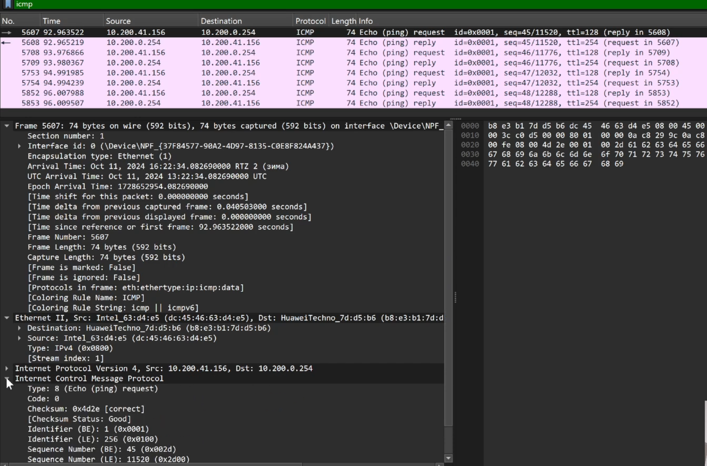{#fig:5 width=70%}

Далее посмотрим на полученный ответ. Тут все почти то же самое, что и в запросе (длина кадра 74 бита). Только теперь MAC-адрес источника – MAC-адрес шлюза (B8-E3-B1-7D-D5-B6), а адрес назначения – адрес моего устройства (DC-45-46-63-D4-E5) (рис. [-@fig:6]). 

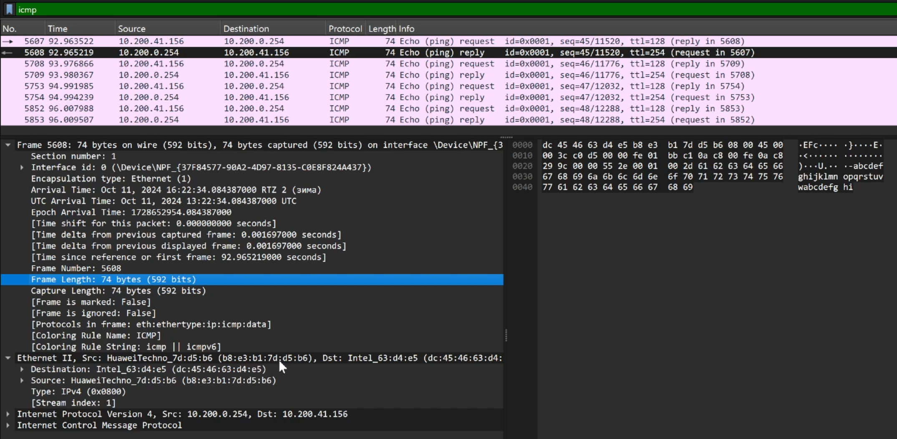{#fig:6 width=80%}

Изучим кадры данных протокола ARP: длина кадра равняется 42 байта. Hardware type – это адрес канального уровня (Ethernet (1)), Protocol type – сетевой уровень (протокол IPv4), далее указаны размеры MAC-адреса (6 байт) и размер IPv4-адреса (4 байта). Код запроса – 1. Изучим данные в полях заголовка Ethernet II. Здесь указаны MAC-адреса источника и получателя. Получатель в нашем случае – широковещательный адрес (групповой и локально администрируемый). Источник – адрес нашего шлюза (индивидуальный и глобально администрируемый) (рис. [-@fig:7]). 

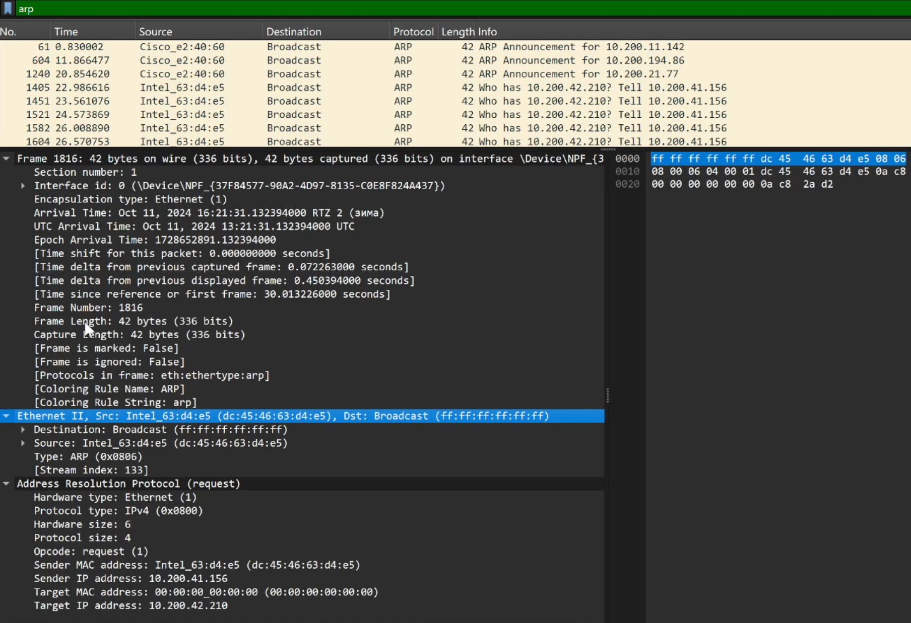{#fig:7 width=80%}

Начнем новый процесс захвата трафика в Wireshark. Пропингуем сайт яндекса - www.yandex.ru. На wi-fi sci-pfu ни один из сайтов не пинговался, поэтому переключаемся на раздачу интернета с телефона и продолжаем выполнение работы, сайт пингуется успешно (рис. [-@fig:8]). 

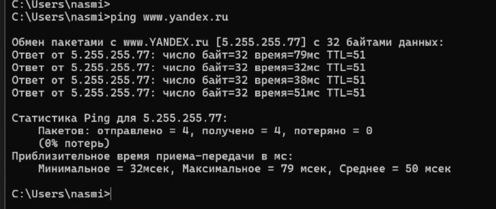{#fig:8 width=80%}

Изучим запрос протокола ICMP. Адрес источника (Source, откуда запрос отправлен) – это адрес моего устройства (DC-45-46-63-D4-E5). Адрес получателя (destination, то куда отправлен запрос) - 02-4B-77-4D-6F-6A. Aдрес источника индивидуальный и глобально администрируемые, адрес шлюза - индивидуальный и локально администрируемый (рис. [-@fig:9]). 

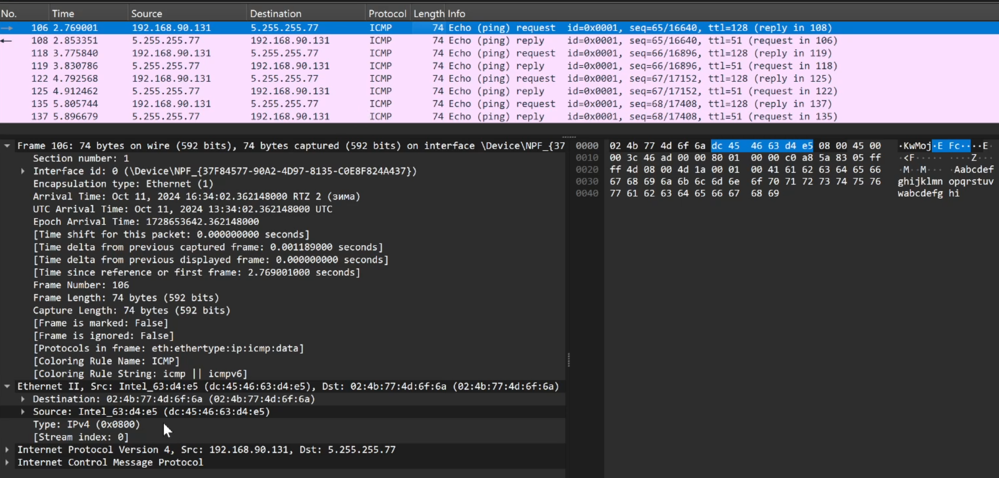{#fig:9 width=80%}

Также изучим ответ протокола ICMP. Тут почти то же самое, однако адрес источника и получателя меняются местами (рис. [-@fig:10]). 

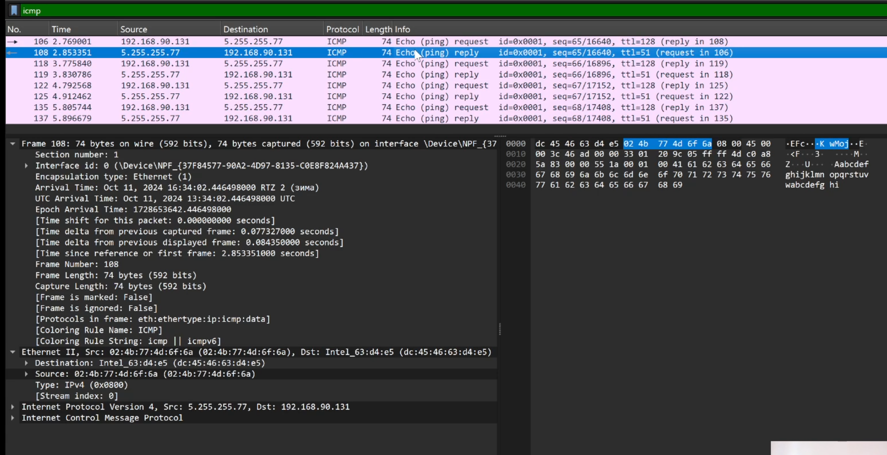{#fig:10 width=80%}

Изучим запросы и ответы ARP. MAC-адрес точки назначения – это первые 6 байт заголовка Ethernet, а MAC-адрес источника – следующие 6 байт заголовка Ethernet, оба MAC-адреса являются индивидуальными и глобально администрируемыми (рис. [-@fig:20]). 

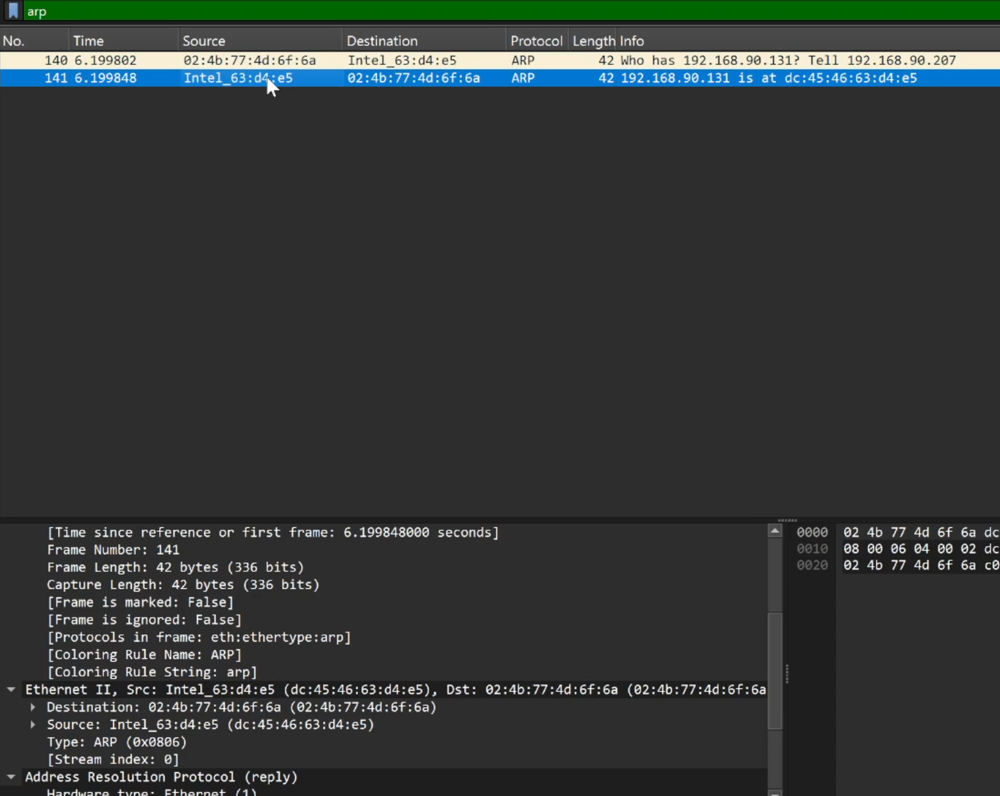{#fig:20 width=80%}

## Анализ протоколов транспортного уровня в Wireshark

Запустив Wireshark, начинаем захват трафика. Открываем в браузере сайт, работающий по протоколу HTTP (http://info.cern.ch/). Перемещаемся по страницам. В строке фильтра указываем http и просматриваем информацию по протоколу TCP о запросе. Порт источника задан случайно и равен 11298, порт назначения равен 80 - это стандартный порт HTTP. Также тут есть поле Порядковый номер (Sequence Number) и поле Номер подтверждения (Acknowledgment Number) (рис. [-@fig:11])

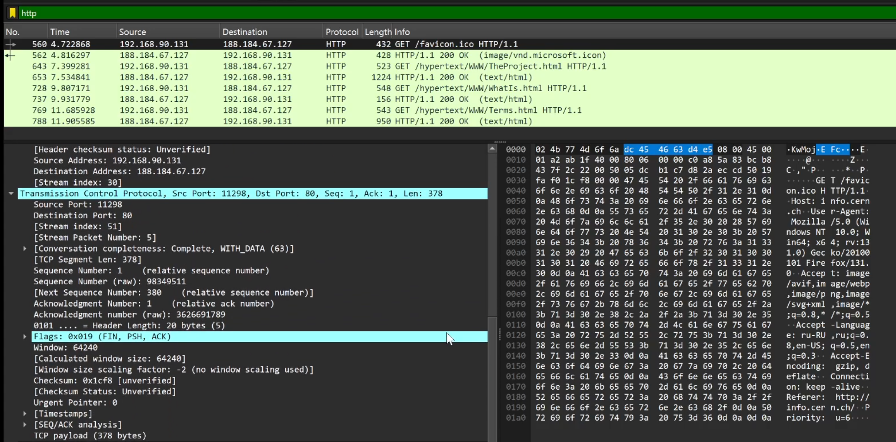{#fig:11 width=70%}

В случае ответа порты заданы наоборот, то есть источник - 80 порт, назначение - 11298 (рис. [-@fig:12])

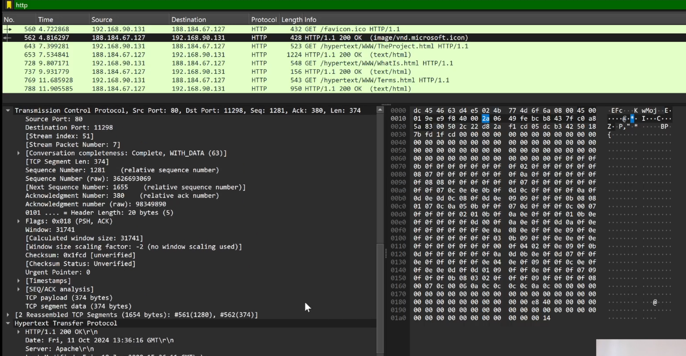{#fig:12 width=70%}

В Wireshark в строке фильтра укажем dns и проанализируем информацию по протоколу UDP в случае запросов и ответов. Порт источника задан случайно и равен 52759, порт назначения равен 53 (порт DNS по умолчанию) (рис. [-@fig:13]). В случае ответа порты заданы наоборот рис. ([-@fig:14]).

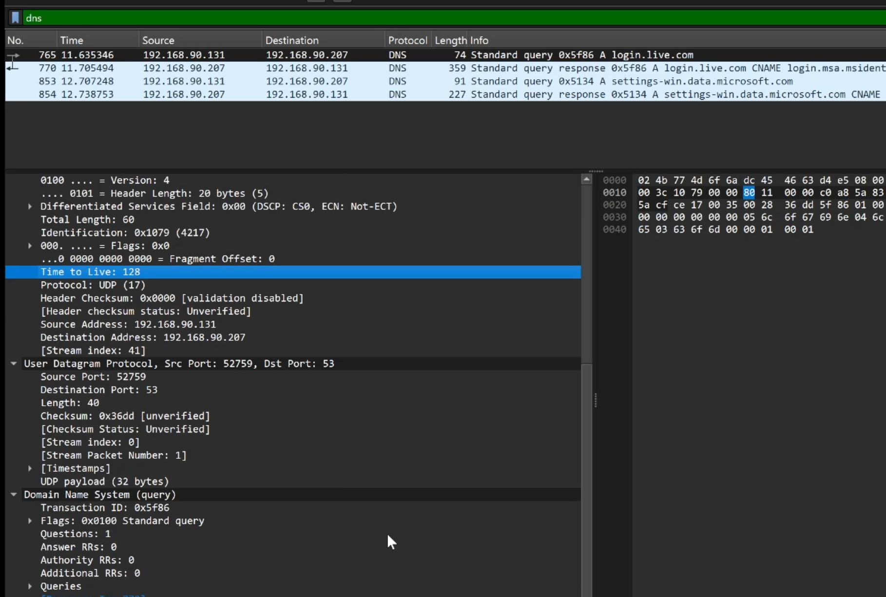{#fig:13 width=70%}

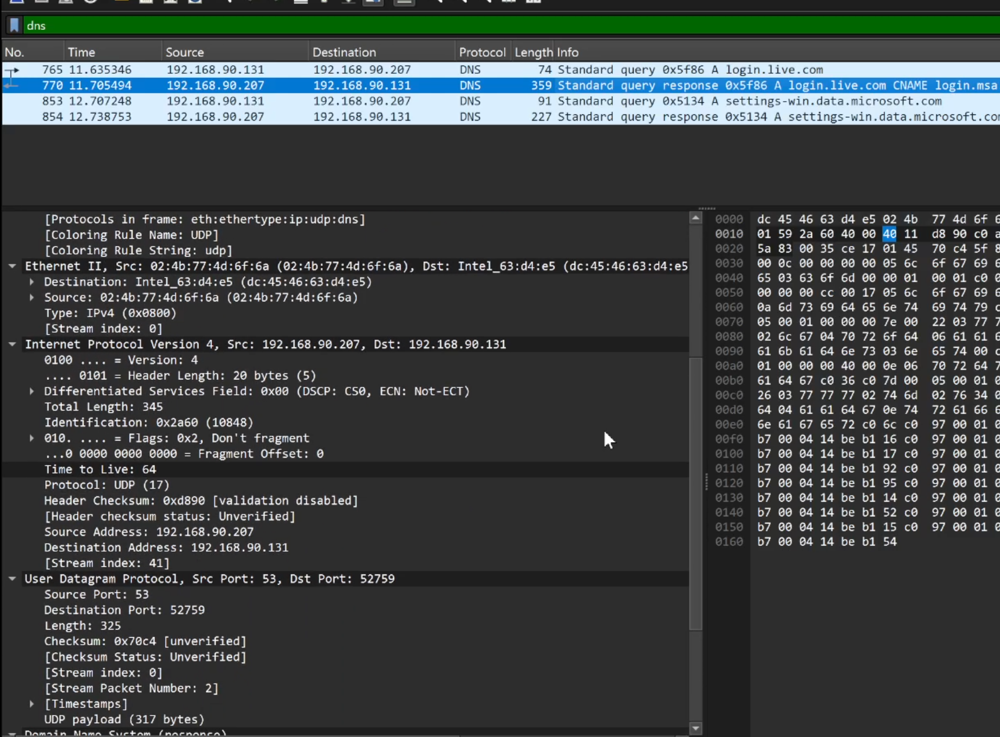{#fig:14 width=70%}

В строке фильтра указываем quic. Изначально ни одного запроса не находилось, пришлось сменить браузер с firefox на chrome. После этого запросы появились. Проанализируем информацию по протоколу quic. Как и в случае dns можем посмотреть информацию транспортного уровня по протоколу UDP. Порт источника задан случайно, выбором из непривелигированных и незанятых портов, и равен 52268, порт назначения равен 443 - это стандартный порт HTTPS, следовательно, quic сразу шифруется. Для создания альтернативы TCP поверх UDP строятся протоколы прикладного уровня QUIC IETF, которые управляют трафиком, управляют качеством обслуживания (рис. [-@fig:15]). В случае ответа порты заданы наоборот.

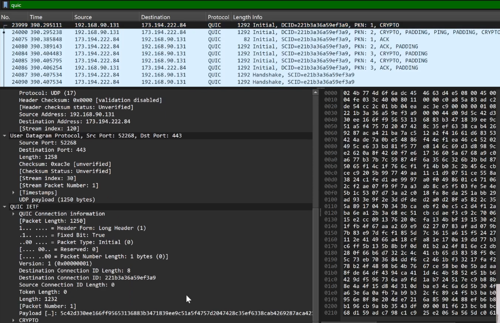{#fig:15 width=70%}

## Анализ handshake протокола TCP в Wireshark

Начав захват трафика, запускаем в браузере сайт, работающий по протоколу HTTP (http://info.cern.ch/), однако анализировать будем тот handshake, который нашли для примера. Установление связи клиент-сервер в TCP осуществляется в три этапа (трёхступенчатый handshake).

1. Режим активного доступа (Active Open). Клиент посылает сообщение SYN, ISSa, т.е. в передаваемом сообщении установлен бит SYN (Synchronize Sequence Number), а в поле Порядковый номер (Sequence Number) — начальное 32-битное значение ISSa (Initial Sequence Number)

Находим кадр с флагом SYN. Sequence Number = 0 (рис. [-@fig:16]).

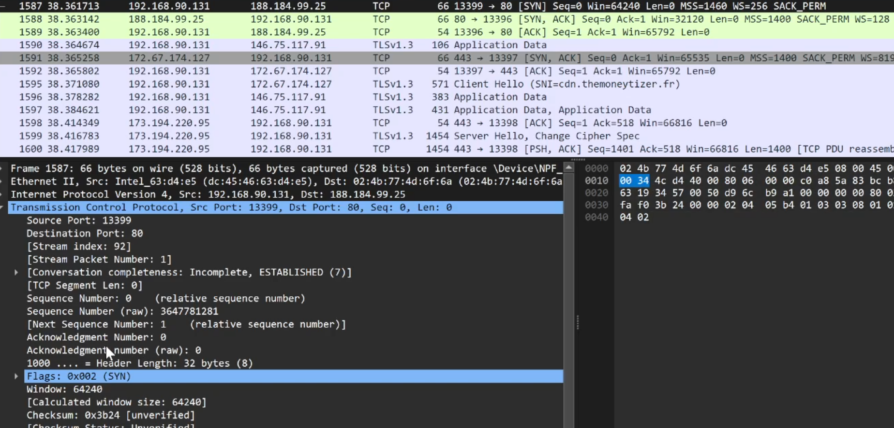{#fig:16 width=70%}

2. Режим пассивного доступа (Passive Open). Сервер откликается, посылая сообщение SYN, ACK, ISSb, ACK(ISSa+1), т.е. установлены биты SYN и ACK; в поле Порядковый номер (Sequence Number) хостом B устанавливается начальное значение счётчика — ISSb; поле Номер подтверждения (Acknowledgment Number) содержит значение ISSa, полученное в первом пакете от хоста A и увеличенное на единицу. 

Кадр с флагами SYN и ACK, где ACK равен Sequence Number из предыдущего шага, увеличенный на 1 (0 + 1 = 1) (рис. [-@fig:17]).

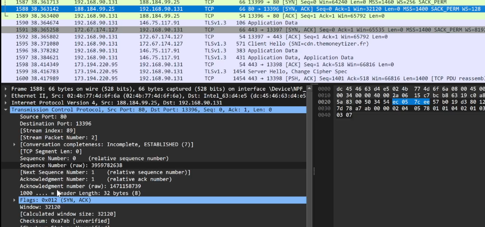{#fig:17 width=70%}

3. Завершение рукопожатия. Клиент отправляет подтверждение получения SYNсегмента от сервера с идентификатором, равным ISN (сервера)+1: ACK, ISSa+1, ACK(ISSb+1). В этом пакете установлен бит ACK, поле Порядковый номер (Sequence Number) содержит ISSa+1, поле Номер подтверждения (Acknowledgment Number) содержит значение ISSb+1. Посылкой этого пакета заканчивается трёхступенчатый handshake, и TCP-соединение считается установленным. 

Теперь клиент может посылать пакеты с данными на сервер по только что
созданному виртуальному TCP-каналу: ACK, ISSa+1, ACK(ISSb+1); DATA.

Кадр с флагом ACK, где Sequence Number равен 1, Acknowledgment Number равен 1 (рис. [-@fig:18]).

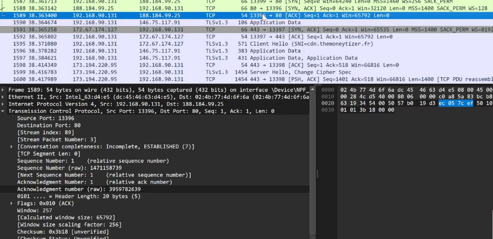{#fig:18 width=70%}

В Wireshark в меню «Статистика» выбираем «График Потока». На графике видно, что сначала клиент послал сообщение на сервер, значение Seq = 0. Затем сервер откликнулся, значение Seq = 0, а значение Ack = 1. И в третьем пакете клиент оправил подтверждение получение SYN-сегмента, оба значения Syn и Ack равны 1 (рис. [-@fig:19]).

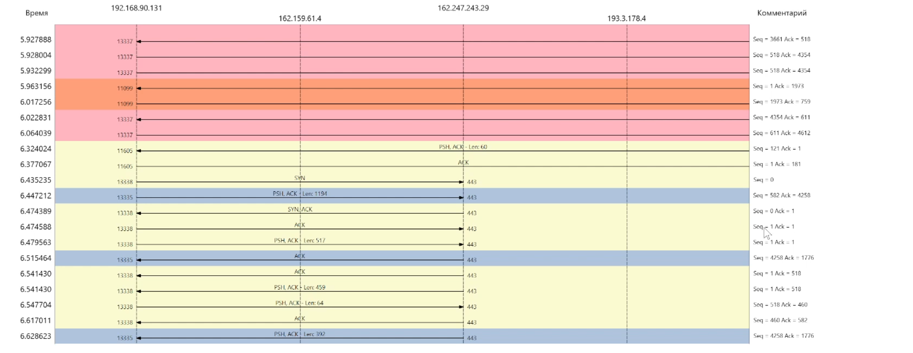{#fig:19 width=70%}

В Wireshark останавливаем захват трафика. 

# Выводы

В результате выполнения работы были изучены посредством Wireshark кадры Ethernet, произведен анализ PDU протоколов транспортного и прикладного уровней стека TCP/IP.