---
## Front matter
lang: ru-RU
title: Лабораторная работа №4
subtitle: Сетевые технологии
author:
  - Мишина А. А.
date: 24 октября 2024

## i18n babel
babel-lang: russian
babel-otherlangs: english

## Formatting pdf
toc: false
toc-title: Содержание
slide_level: 2
aspectratio: 169
section-titles: true
theme: metropolis
header-includes:
 - \metroset{progressbar=frametitle,sectionpage=progressbar,numbering=fraction}
 - '\makeatletter'

 - '\makeatother'
---

# Цель работы

Установка и настройка GNS3 и сопутствующего программного обеспечения.

# Задание

1. Установить GNS3-all-in-one, GNS3 VM, проверить корректность запуска.

2. Импортировать в GNS3 образ маршрутизатора FRR.

3. Импортировать в GNS3 образ маршрутизатора VyOS.

# Выполнение лабораторной работы

# Установка GNS3

## Установка GNS3-all-in-one

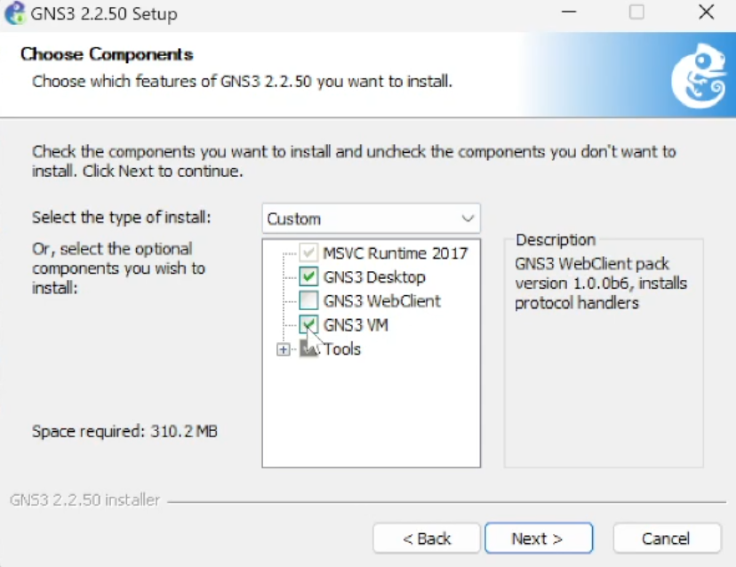{#fig:1 width=60%}

## Установка GNS3-all-in-one

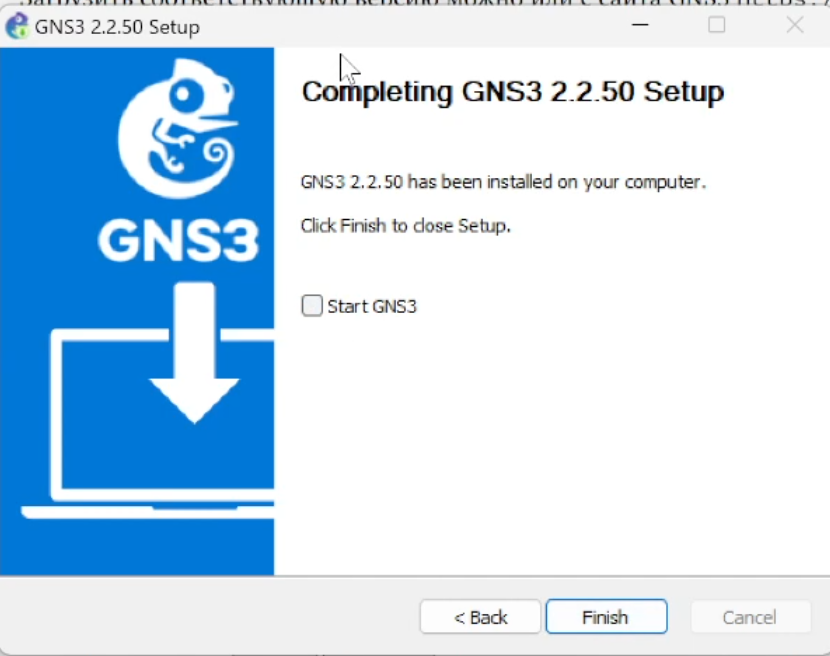{#fig:2 width=60%}

## Установка GNS3 VM для VirtualBox

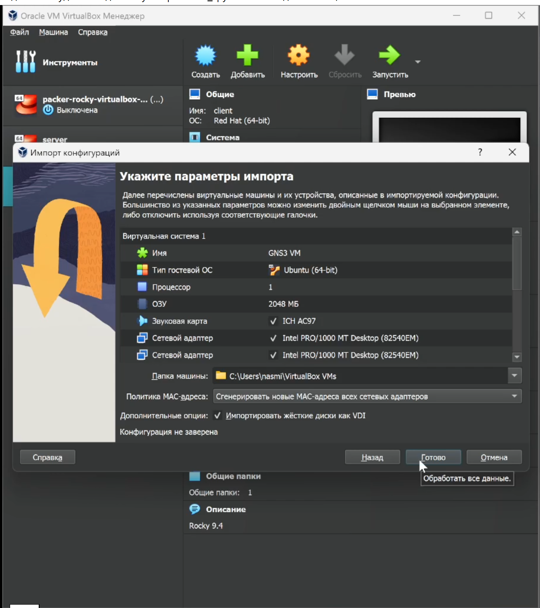{#fig:3 width=30%}

## Настройка ВМ

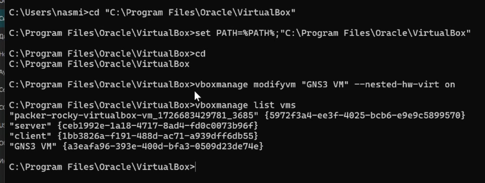{#fig:4 width=70%}

## Настройка ВМ

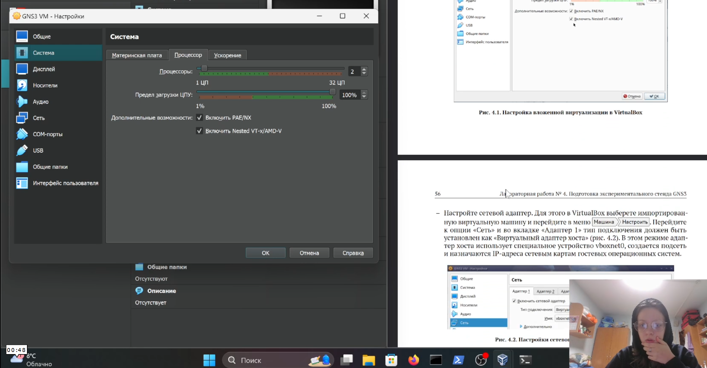{#fig:5 width=70%}

## Настройка ВМ

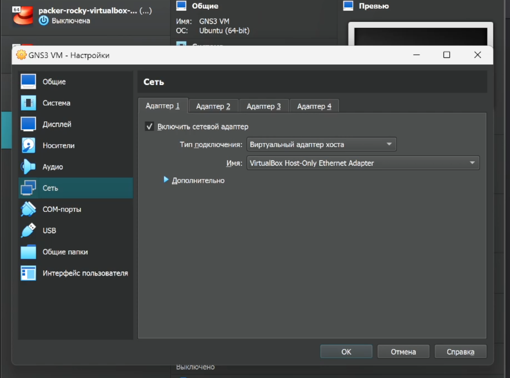{#fig:6 width=60%}

## Запуск экземпляра GNS3 в VirtualBox

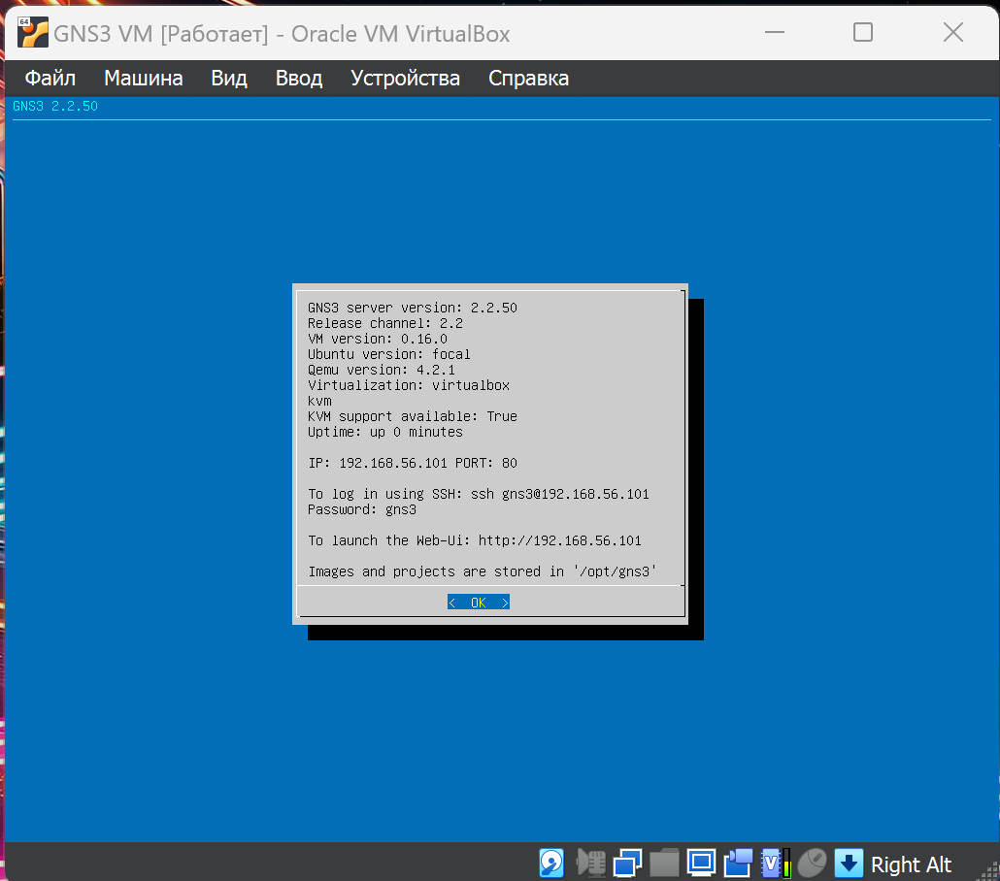{#fig:7 width=50%}

## Подключение к серверу

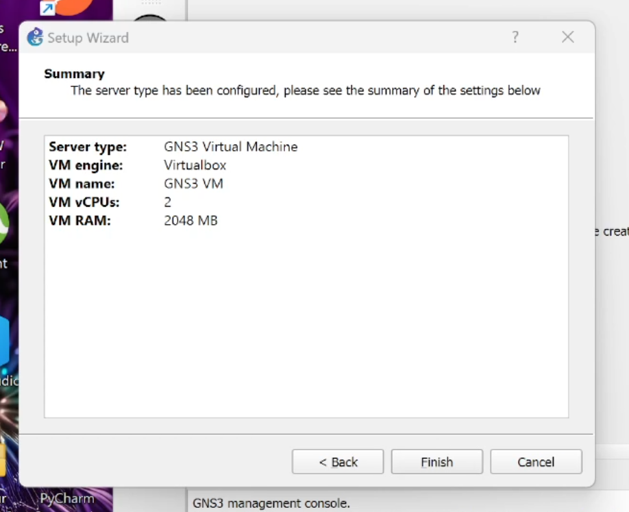{#fig:8 width=60%}

## Подключение к серверу

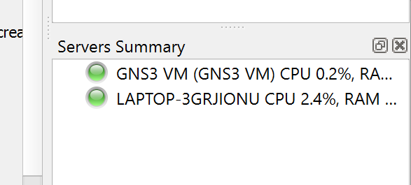{#fig:9 width=80%}

# Подключение образа оборудования в GNS3

## Добавление образа маршрутизатора FRR

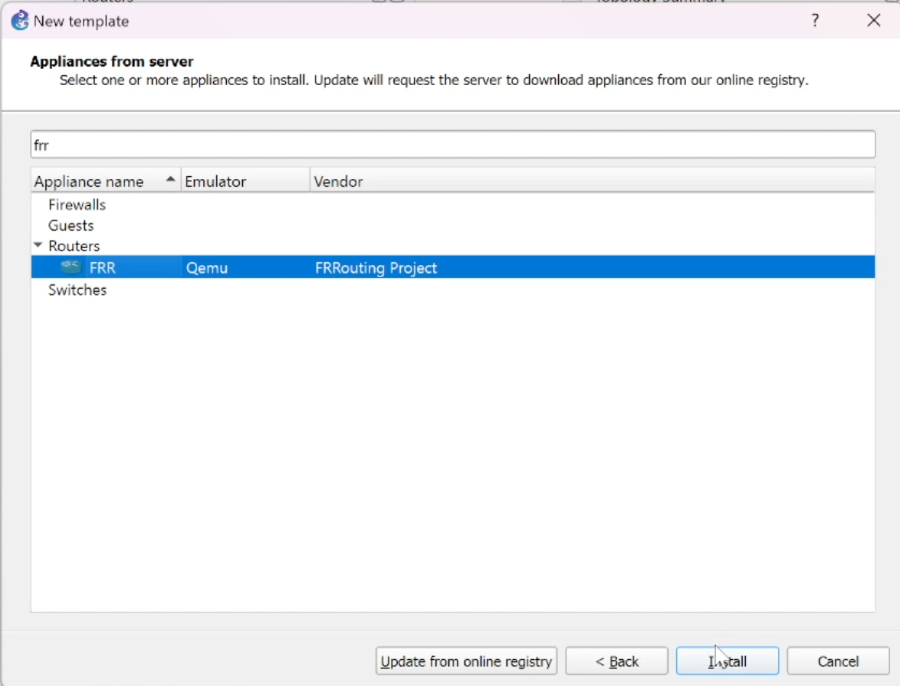{#fig:10 width=60%}

## Добавление образа маршрутизатора FRR

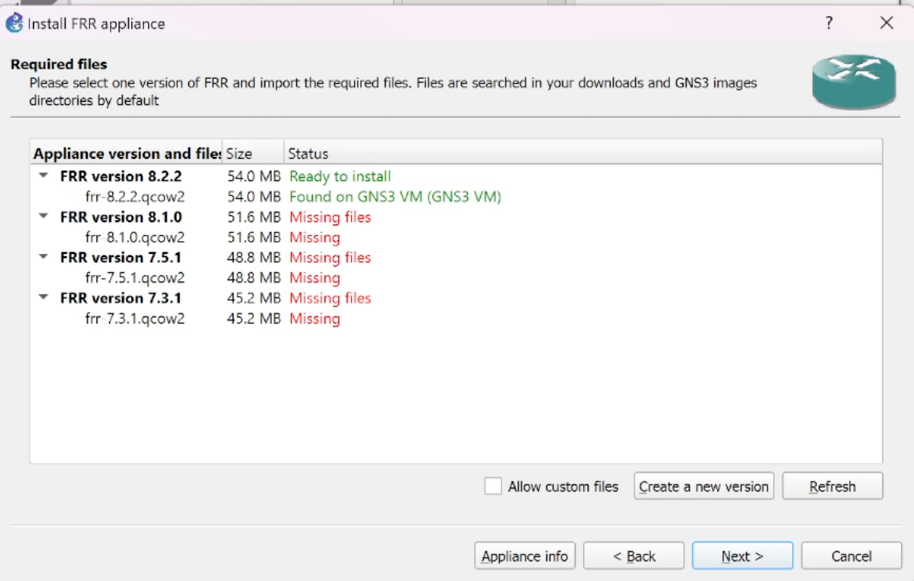{#fig:11 width=70%}

## Настройка образа

{#fig:12 width=40%}

## Настройка образа

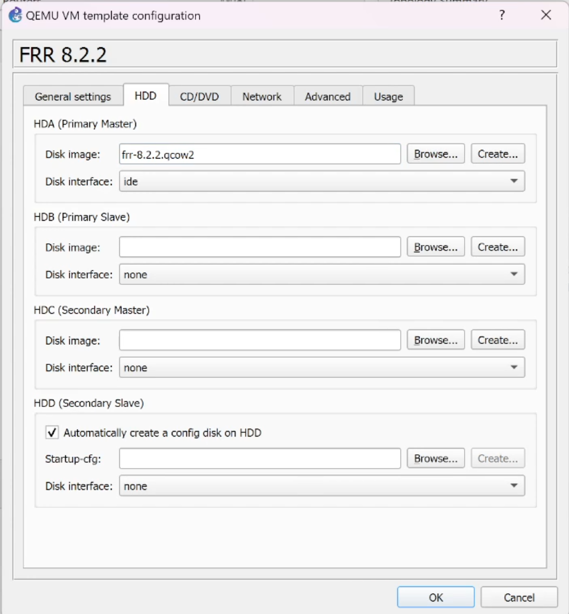{#fig:13 width=40%}

## Добавление образа маршрутизатора VyOS

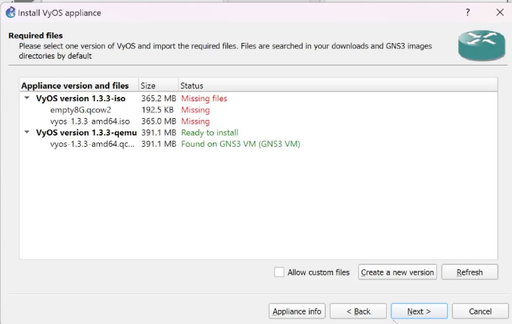{#fig:14 width=70%}

## Настройка образа

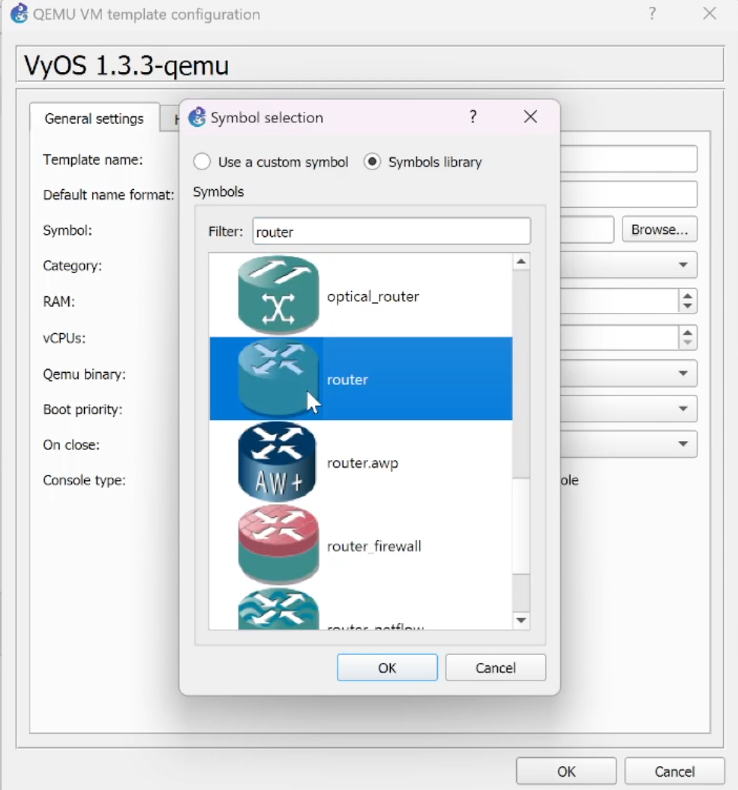{#fig:15 width=40%}

## Настройка образа

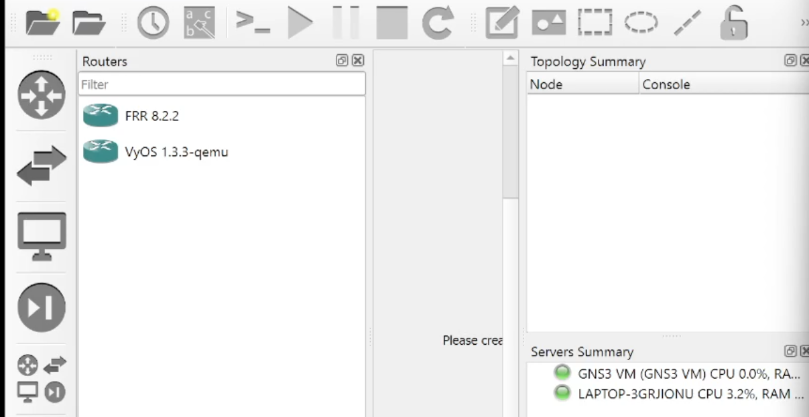{#fig:16 width=70%}

# Выводы

- В результате выполнения работы была произведена установка и настройка GNS3 и сопутствующего программного обеспечения.