---
## Front matter
title: "Отчёт по лабораторной работе №5"
subtitle: "Дисциплина: Сетевые технологии"
author: "Мишина Анастасия Алексеевна"

## Generic options
lang: ru-RU
toc-title: "Содержание"

## Bibliography
bibliography: bib/cite.bib
csl: pandoc/csl/gost-r-7-0-5-2008-numeric.csl

## Pdf output format
toc: true # Table of contents
toc-depth: 2
lof: true # List of figures
lot: true # List of tables
fontsize: 14pt
linestretch: 1.5
papersize: a4
documentclass: scrreprt
## I18n polyglossia
polyglossia-lang:
  name: russian
  options:
	- spelling=modern
	- babelshorthands=true
polyglossia-otherlangs:
  name: english
## I18n babel
babel-lang: russian
babel-otherlangs: english
## Fonts
mainfont: PT Serif
romanfont: PT Serif
sansfont: PT Sans
monofont: PT Mono
mainfontoptions: Ligatures=TeX
romanfontoptions: Ligatures=TeX
sansfontoptions: Ligatures=TeX,Scale=MatchLowercase
monofontoptions: Scale=MatchLowercase,Scale=0.9
## Biblatex
biblatex: true
biblio-style: "gost-numeric"
biblatexoptions:
  - parentracker=true
  - backend=biber
  - hyperref=auto
  - language=auto
  - autolang=other*
  - citestyle=gost-numeric
## Pandoc-crossref LaTeX customization
figureTitle: "Рис."
tableTitle: "Таблица"
listingTitle: "Листинг"
lofTitle: "Список иллюстраций"
lotTitle: "Список таблиц"
lolTitle: "Листинги"
## Misc options
indent: true
header-includes:
  - \usepackage{indentfirst}
  - \usepackage{float} # keep figures where there are in the text
  - \floatplacement{figure}{H} # keep figures where there are in the text
---

# Цель работы

Построить простейшие модели сетей на базе коммутатора и маршрутизаторов FRR и VyOS в GNS3, проанализировать трафик посредством Wireshark.

# Выполнение лабораторной работы

## Анализ трафика в GNS3 посредством Wireshark

Для начала запустим GNS3 VM и GNS3, а также создадим новый проект.
В рабочей области GNS3 разместим коммутатор Ethernet и два VPCS. В меню Configure изменим название устройства, включив в имя устройства имя моей учётной записи. Коммутатору присвоим название msk-aamishina-sw-01. Соединим VPCS с коммутатором и отобразим обозначение интерфейсов соединения (рис. @fig:01).
 
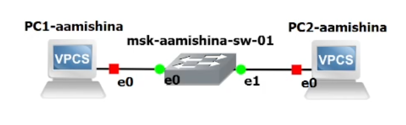{#fig:01 width=70%}

Зададим IP-адреса VPCS. Для этого с помощью меню, вызываемого правой кнопкой мыши, запустим Start PC-1, затем вызовем его терминал Console. Для просмотра синтаксиса возможных для ввода команд можно набрать /?. Для задания IP-адреса 192.168.1.11 в сети 192.168.1.0/24 введем: ip 192.168.1.11/24 192.168.1.1.
Для сохранения конфигурации введем команду save (рис. @fig:02).
 
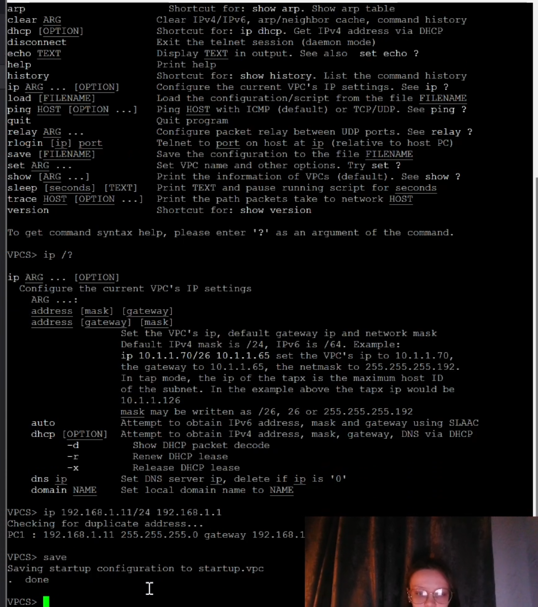{#fig:02 width=70%}

Аналогичным образом зададим IP-адрес 192.168.1.12 для PC-2. Пингуем соответственно IP-адрес PC-1. Получаем эхо-ответ от PC-1. Значит соединение наших PC работоспособно (рис. @fig:03).
 
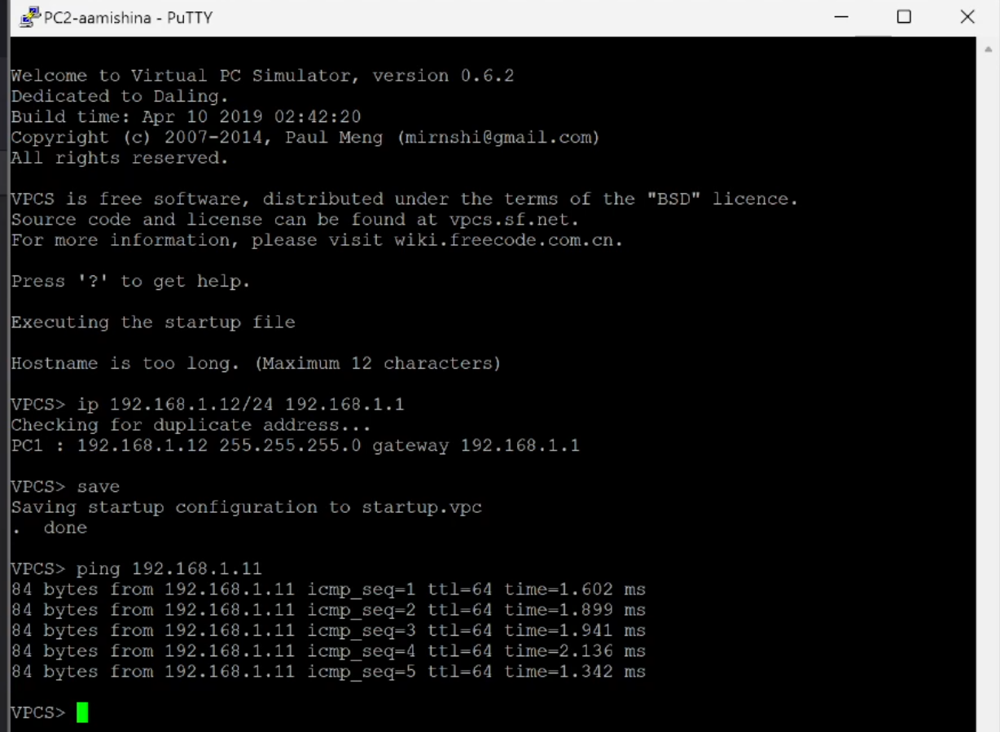{#fig:03 width=70%}

Проверим работоспособность соединения между PC-1 и PC-2 с помощью команды ping. В терминале PC-1 введем команду ping и IP-адрес, присвоенный PC-2. Получаем эхо-ответ от PC-2 (возвращены 5 пакетов) (рис. @fig:04). 
 
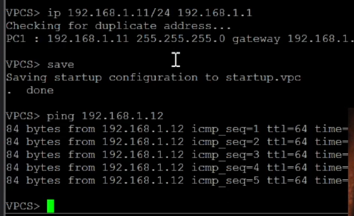{#fig:04 width=70%}

Остановим в проекте все узлы (рис. @fig:05).
 
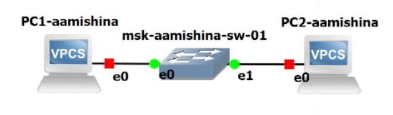{#fig:05 width=70%}

Запустим на соединении между PC-1 и коммутатором анализатор трафика. Для этого щёлкнем правой кнопкой мыши на соединении, выберем в меню Start capture. После этого запустился Wireshark, а в проекте GNS3 на соединении появился значок лупы.В проекте GNS3 стартуем все узлы (рис. @fig:06). 
 
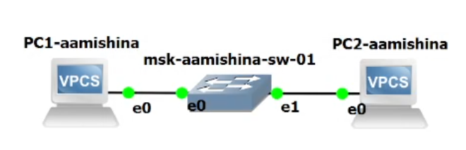{#fig:06 width=70%}

В окне Wireshark отобразится информация по протоколу ARP (рис. @fig:07). В поле кадра физического уровня мы можем узнать длину кадра (в моем случае было 64 бита). В поле канального уровня можем посмотреть mac-адреса источника и получателя. По  нулевому и первому битам можем определить тип mac-адресов (получатель – локально администрируемый и широковещательный; источник - глобально администрируемый и индивидуальный). 
 
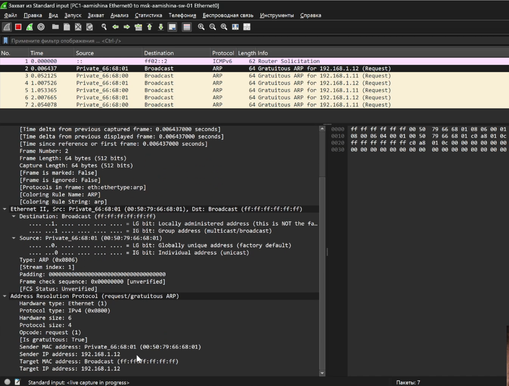{#fig:07 width=70%}

В терминале PC-2 посмотрим информацию по опциям команды ping. Затем сделаем один эхо-запрос в ICMP-моде к узлу PC-1. Для этого используем опцию -1 (рис. @fig:08).
 
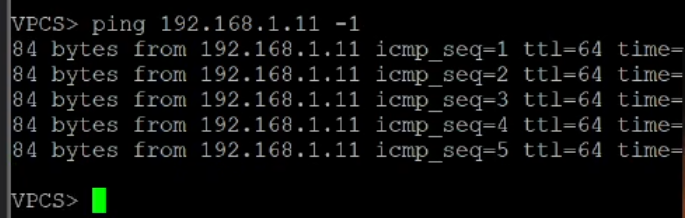{#fig:08 width=70%}

Далее откроем Wireshark и проанализируем эхо-запрос по протоколу ICMP (рис. @fig:09) и (рис. @fig:010). В поле канального уровня можем посмотреть mac-адреса источника и получателя. По нулевому и первому битам можем определить тип mac-адресов (получатель и источник - глобально администрируемые и одиночные, так как биты равны 0). В поле сетевого уровня указан протокол ICMP и IP-адреса источника (192.168.1.12, то есть PC-2) и получателя (192.168.1.11, то есть PC-2).
 
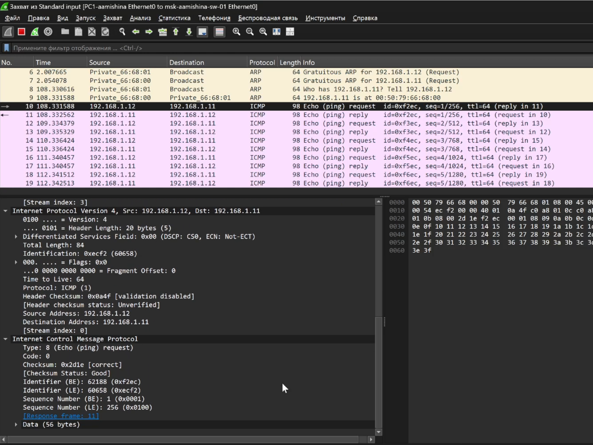{#fig:09 width=70%}
 
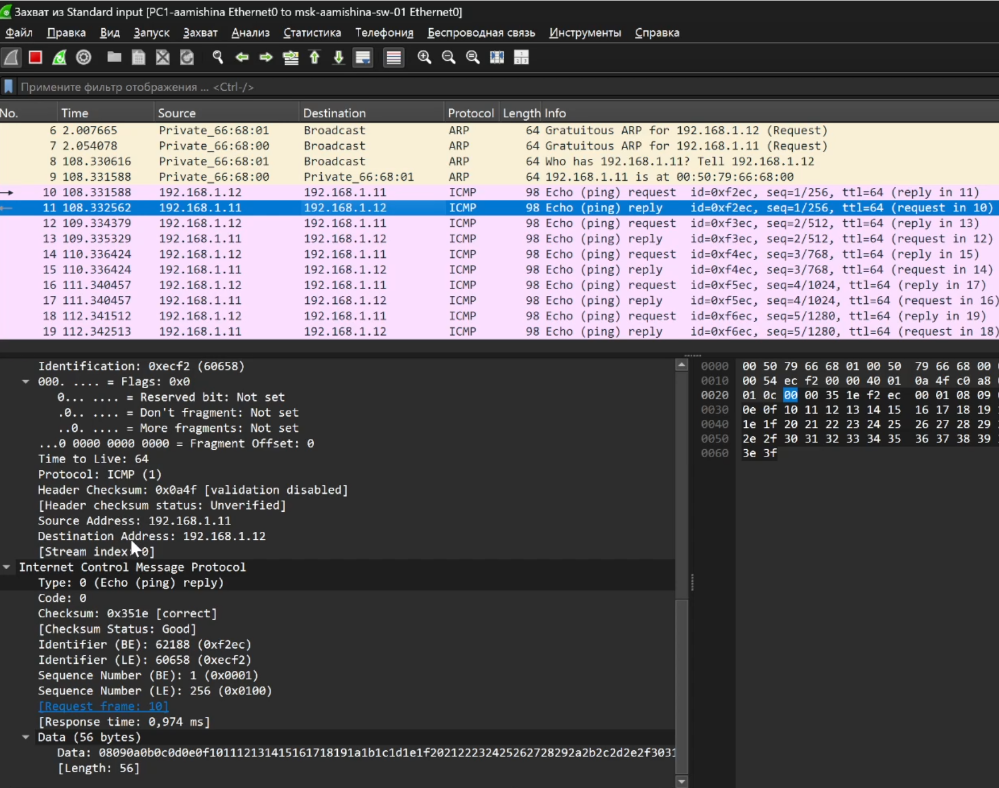{#fig:010 width=70%}

Сделаем один эхо-запрос в UDP-моде к узлу PC-1. Для этого используем опцию -2 (рис. @fig:011).
 
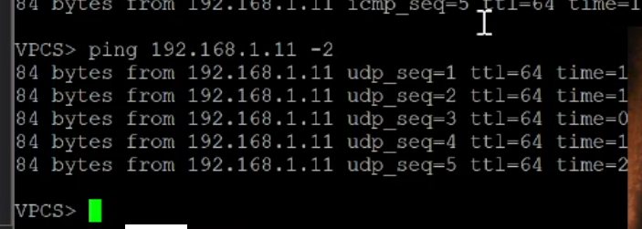{#fig:011 width=70%}

Далее откроем Wireshark и проанализируем эхо-запрос по протоколу UDP (рис. @fig:012) и (рис. @fig:013). В поле канального уровня можем посмотреть mac-адреса источника и получателя. По нулевому и первому битам можем определить тип mac-адресов (получатель и источник - глобально администрируемые и одиночные, так как биты равны 0). В поле сетевого уровня указан протокол UDP и IP-адреса источника (192.168.1.12, то есть PC-2) и получателя (192.168.1.11, то есть PC-1). В поле протокола UDP указаны порты источника (17622) и получателя (7).
 
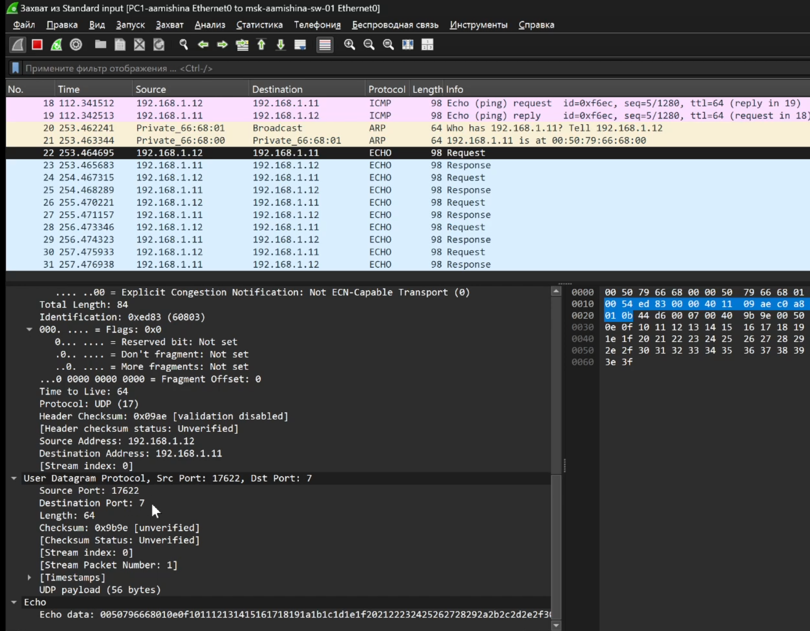{#fig:012 width=70%}

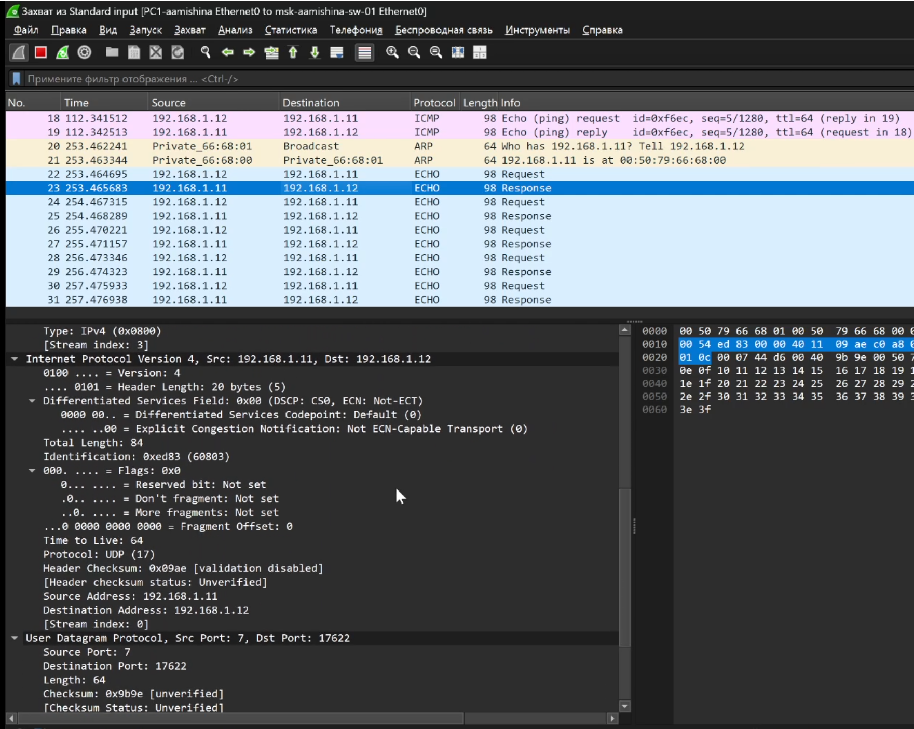{#fig:013 width=70%}

Сделаем один эхо-запрос в TCP-моде к узлу PC-1. Для этого используем опцию -3 (рис. @fig:014).
 
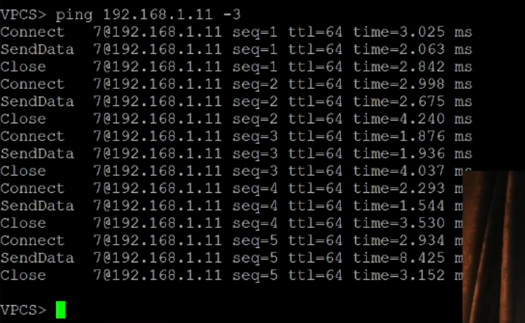{#fig:014 width=70%}

Далее откроем Wireshark и проанализируем эхо-запрос по протоколу TCP. В поле канального уровня можем посмотреть mac-адреса источника и получателя. По нулевому и первому битам можем определить тип mac-адресов (получатель и источник - глобально администрируемые и одиночные, так как биты равны 0). В поле сетевого уровня указан протокол TCP и IP-адреса источника (192.168.1.12, то есть PC-2) и получателя (192.168.1.11, то есть PC-1).

В поле протокола TCP можем узнать порты источника (20665) и получателя (7). А также посмотреть, как работает handshake протокола TCP. На первом шаге установлен флаг SYN (рис. @fig:015), а также Порядковому номеру (Sequence Number) присвоено начальное 32-битное значение ISSa (в нашем случае 884368193). 
 
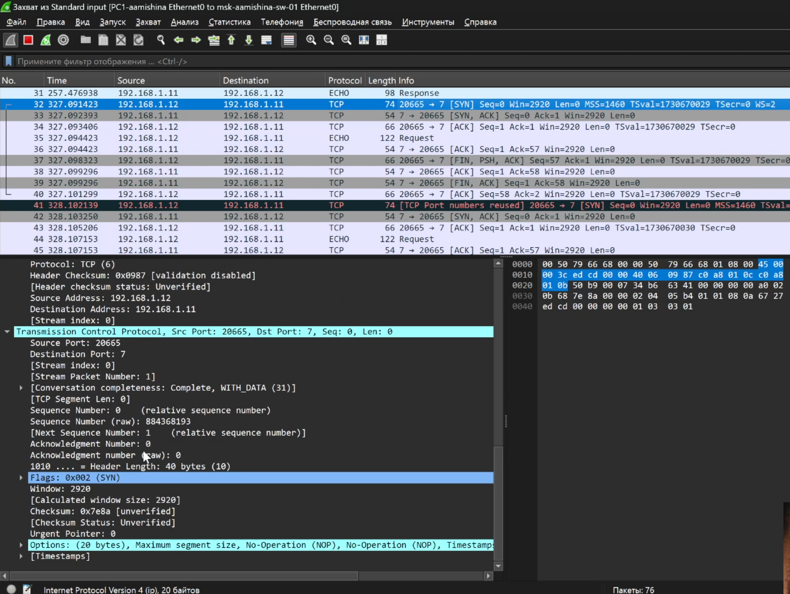{#fig:015 width=70%}
 
На втором шаге установлены флаги SYN и ACK (рис. @fig:016).
 
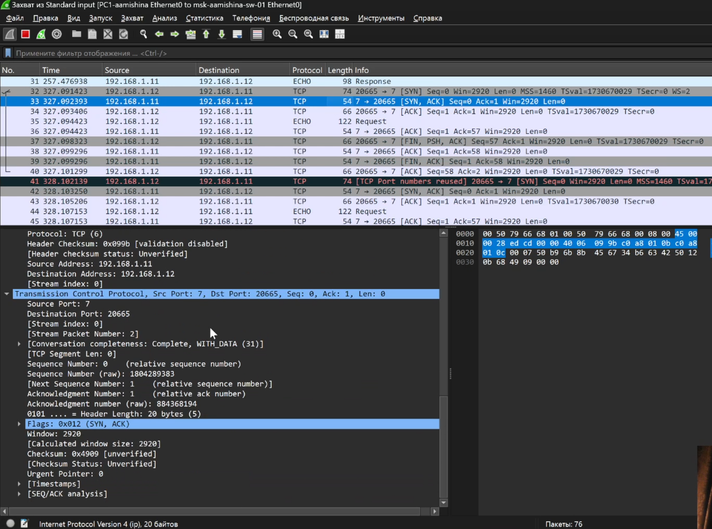{#fig:016 width=70%}

На третьем шаге установлен флаг ACK (рис. @fig:017).

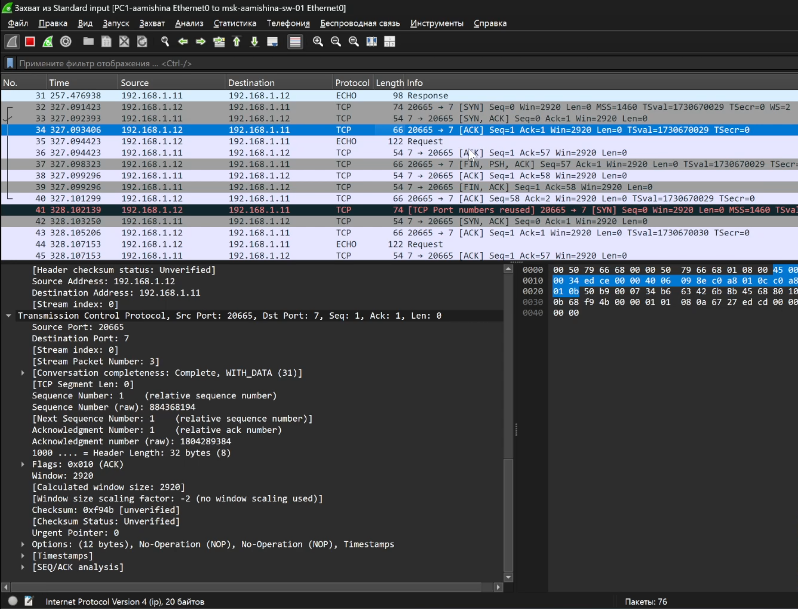{#fig:017 width=70%}

Теперь можно остановить захват трафика в Wireshark.

## Моделирование простейшей сети на базе маршрутизатора FRR в GNS3

Теперь нам нужно построить в GNS3 топологию сети (рис. @fig:018), состоящей из маршрутизатора FRR, коммутатора Ethernet и оконечного устройства. Изменим отображаемые названия устройств. Коммутатору присвоим название msk-aamishina-sw-01, маршрутизатору — по принципу msk-aamishina-gw-01, VPCS — по принципу PC1-aamishina. Включим захват трафика на соединении между коммутатором и маршрутизатором. Запустим все устройства проекта, а также откроем консоль всех устройств проекта.

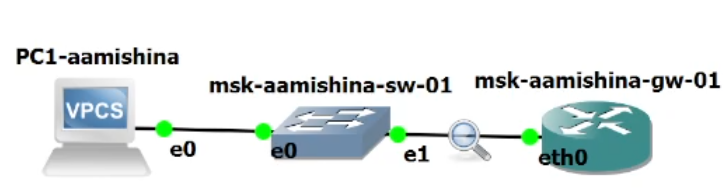{#fig:018 
width=70%}

Настроим IP-адресацию для интерфейса узла PC1 (рис. @fig:019):

```
ip 192.168.1.10/24 192.168.1.1
save
show ip
```

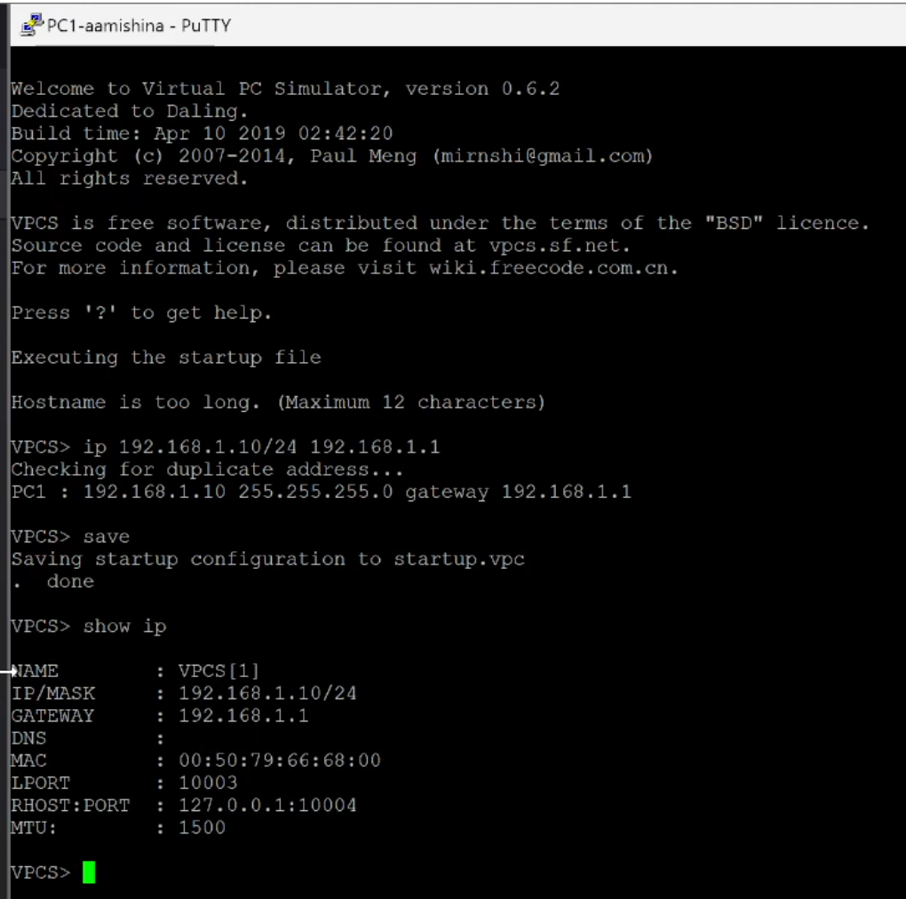{#fig:019 width=70%}

Настроим IP-адресацию для интерфейса локальной сети маршрутизатора. Проверим конфигурацию маршрутизатора и настройки IP-адресации (рис. @fig:020).

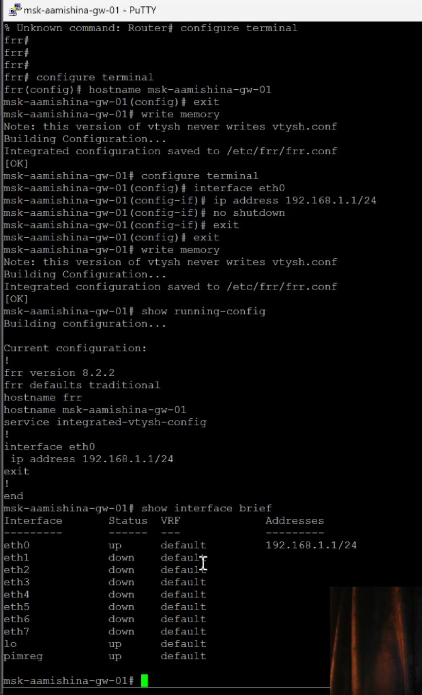{#fig:020 width=70%}

Проверим подключение. Узел PC1 успешно отправляет эхо-запросы
на адрес маршрутизатора 192.168.1.1 (рис. @fig:021).

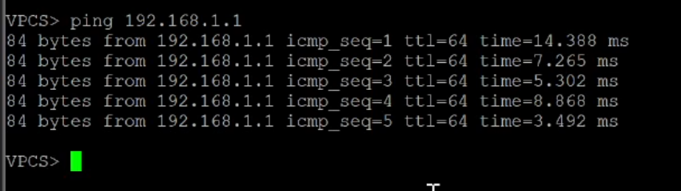{#fig:021 width=70%}

В окне Wireshark проанализируем полученную информацию (рис. @fig:022). В поле канального уровня можем посмотреть mac-адреса источника и получателя. По нулевому и первому битам можно определить типа mac-адресов (получатель и источник - глобально администрируемые и одиночные, так как биты равны 0). В поле сетевого уровня указано протокол ICMP и IP-адреса источника (192.168.1.10, то есть PC-1) и получателя (192.168.1.1, то есть маршрутизатор FRR).

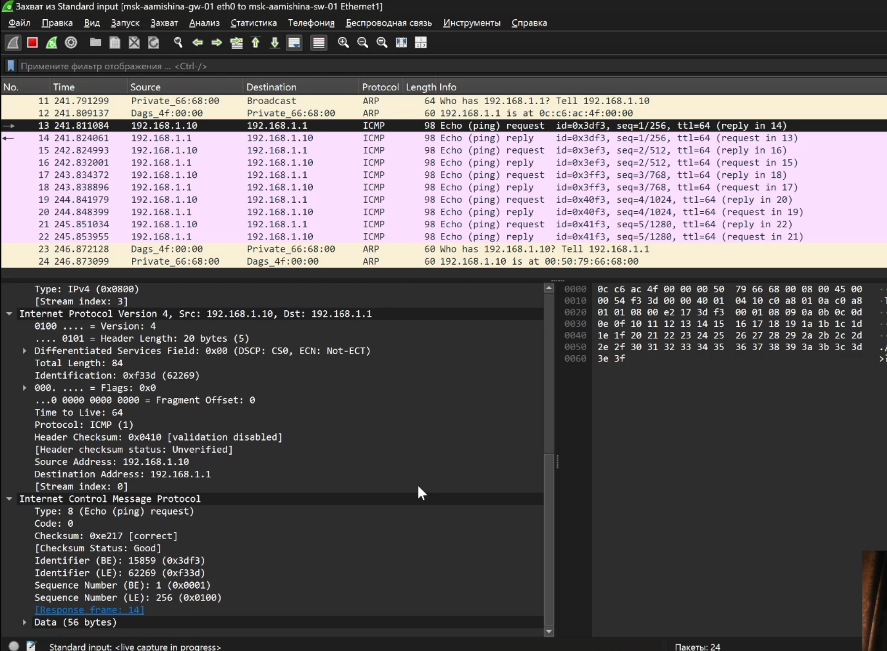{#fig:022 width=70%}

Останавливаем захват пакетов в Wireshark. Останавливаем все устройства в проекте.

## Моделирование простейшей сети на базе маршрутизатора VyOS в GNS3

В рабочей области GNS3 разместим VPCS, коммутатор Ethernet и маршрутизатор VyOS. Изменим отображаемые названия устройств. Коммутатору присвоим название msk-aamishina-sw-01, маршрутизатору — по принципу msk-aamishina-gw-01, VPCS — по принципу PC1-aamishina. Включим захват трафика на соединении между коммутатором и маршрутизатором (рис. @fig:023) (появится значок лупы). Запустим все устройства проекта и откроем консоль всех устройств проекта.
 
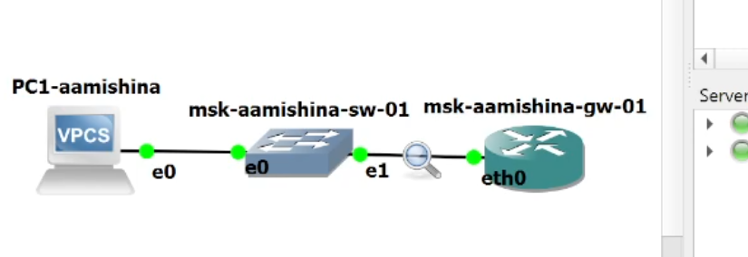{#fig:023 width=70%}

Откроем окно терминала PC-1 и настроим IP-адресацию для интерфейса этого узла (рис. @fig:024).
 
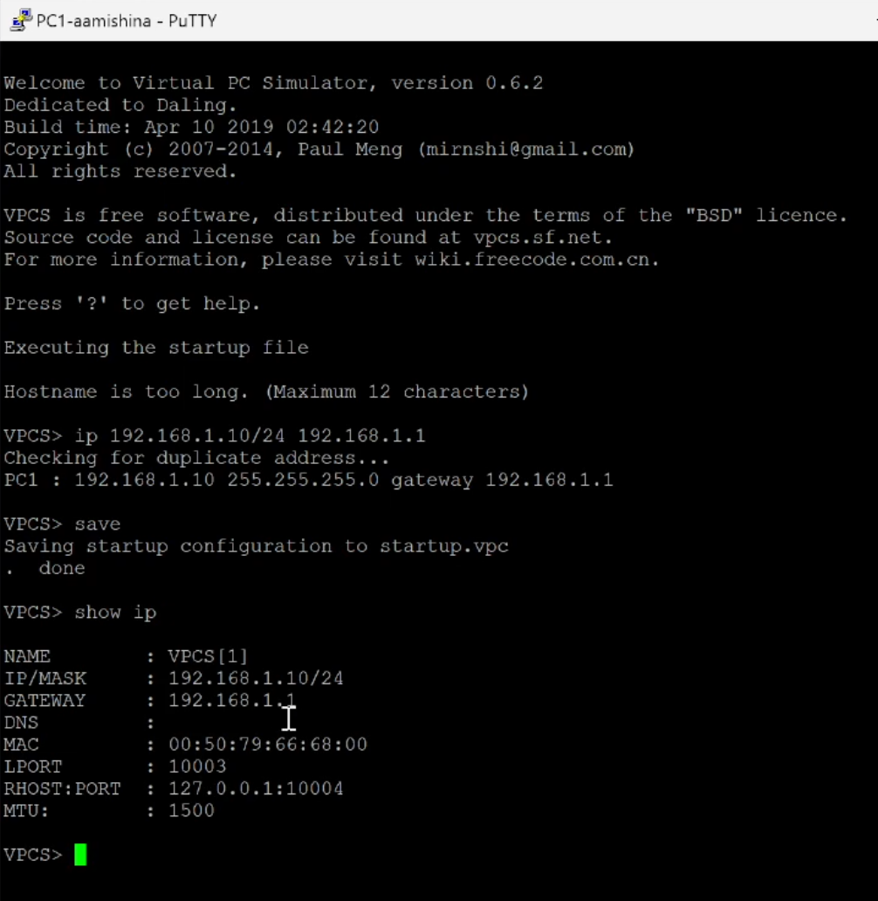{#fig:024 width=70%}

Настроим маршрутизатор VyOS (рис. @fig:025): Во-первых, после загрузки нужно ввести логин vyos и пароль vyos. В рабочем режиме в командной строке отобразится символ $. Далее надо установить систему на диск с помощью команды install image, но у меня эта система уже была установлена. На всякий случай перезапускаем маршрутизатор.

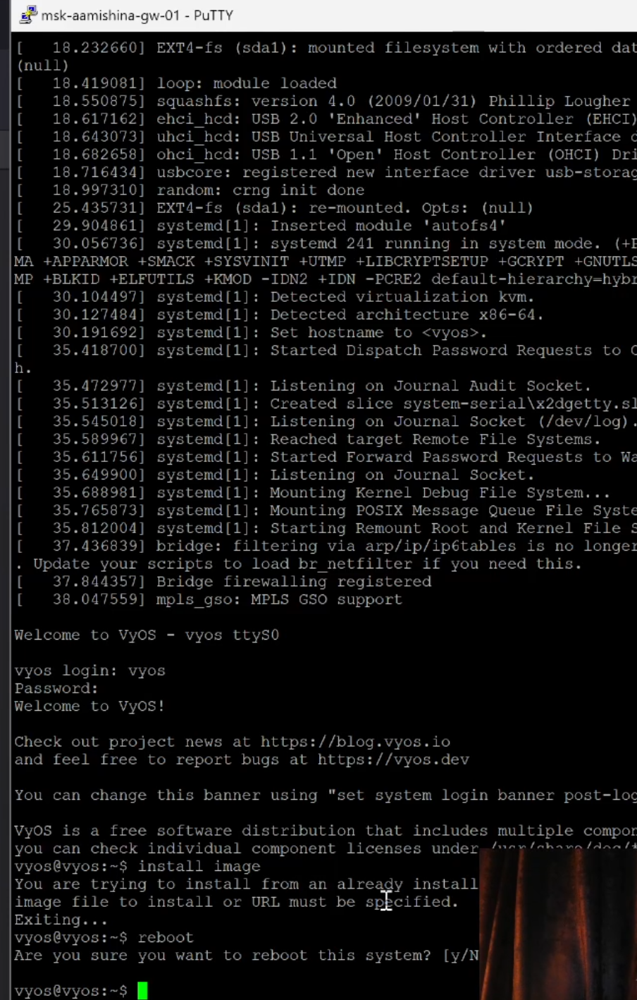{#fig:025 width=70%}

Следующим шагом перейдем в режим конфигурирования с помощью команды configure. Изменим имя устройства командой set system host-name msk-aamishina-gw-01. Зададим IP-адрес на интерфейсе eth0 командой set interfaces ethernet eth0 address 192.168.1.1/24
Посмотрим внесённые в конфигурацию изменения с помощью команды compare. Далее применим изменения в конфигурации и сохраним саму конфигурацию с помощью команд commit и save. Посмотрим информацию об интерфейсах маршрутизатора с помощью команды show interfaces. Выйдем из режима конфигурирования, используя команду exit (рис. @fig:026).

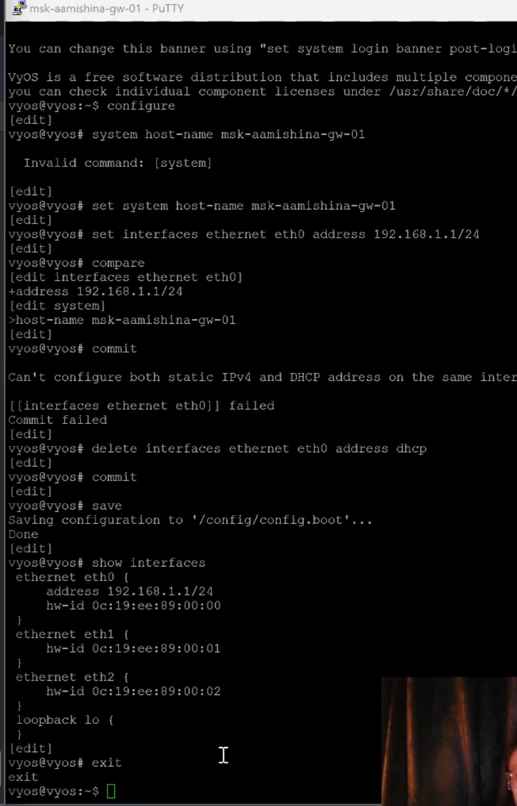{#fig:026 width=70%}

Теперь проверим подключение. Узел PC1 должен успешно отправлять эхо-запросы на адрес маршрутизатора 192.168.1.1. Для проверки пингуем маршрутизатор (рис. @fig:027). Получили эхо-ответ (4 пакета).
 
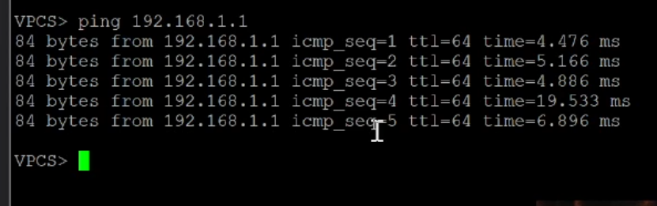{#fig:027 width=70%}

В окне Wireshark проанализируем полученную информацию (рис. @fig:028). В поле канального уровня можем посмотреть mac-адреса источника и получателя. По нулевому и первому битам можем определить тип mac-адресов (получатель и источник - глобально администрируемые и одиночные, так как биты равны 0). В поле сетевого уровня указан протокол ICMP и IP-адреса источника (192.168.1.10, то есть PC-1) и получателя (192.168.1.1, то есть маршрутизатор VyOS). 
 
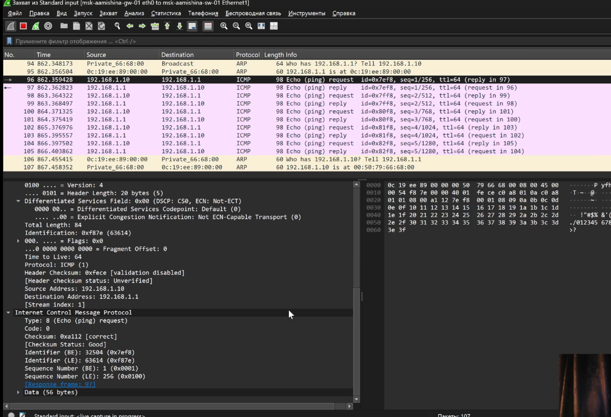{#fig:028 width=70%}

# Выводы
 
В процессе выполнения лабораторной работы мы построили простейшие модели сетей на базе коммутатора и маршрутизаторов FRR и VyOS в GNS3, проанализировали трафик посредством Wireshark.