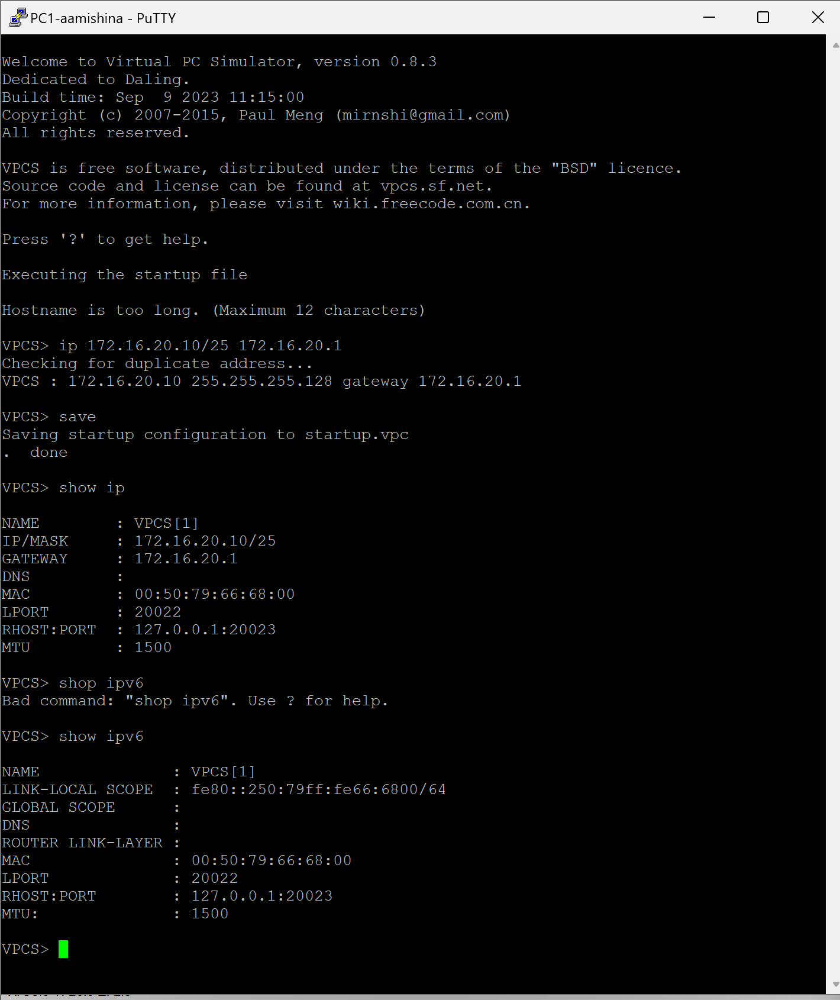
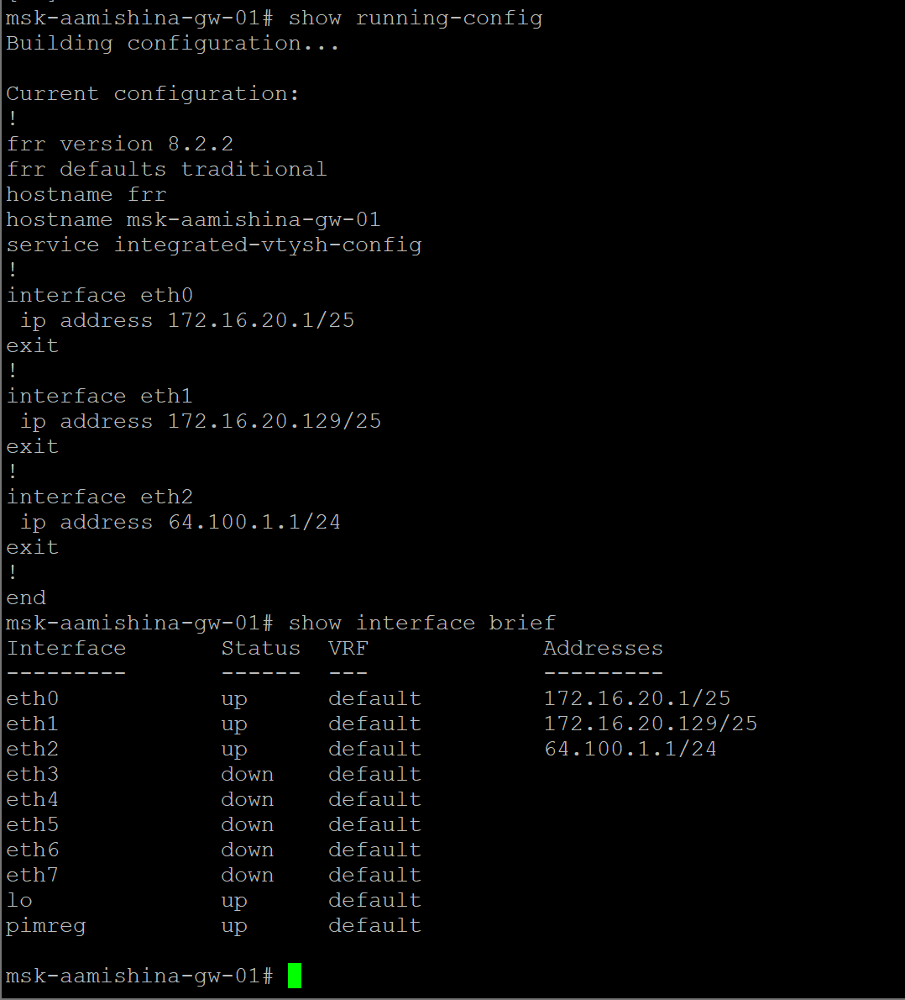
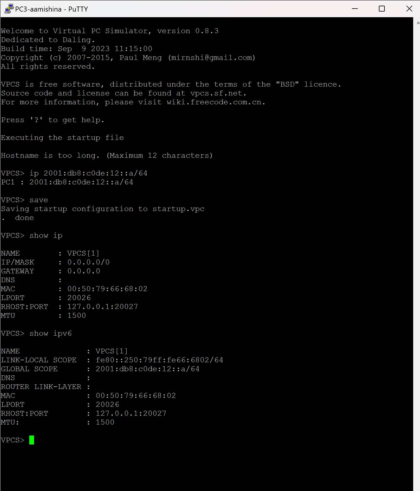
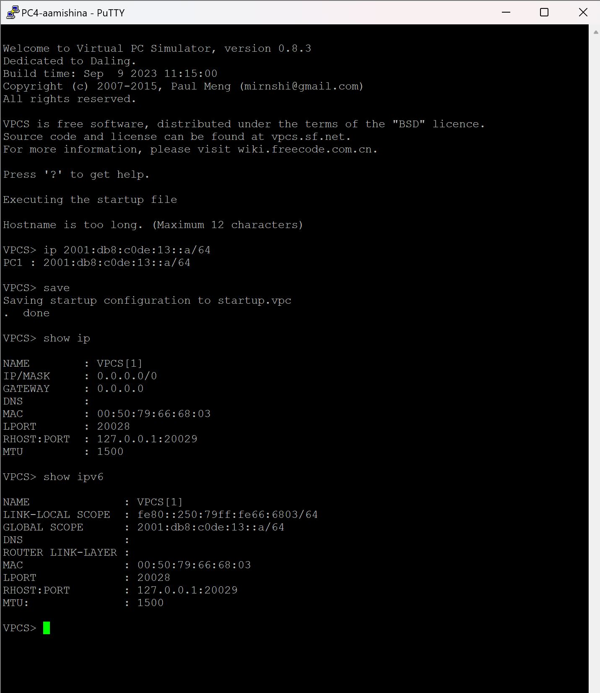
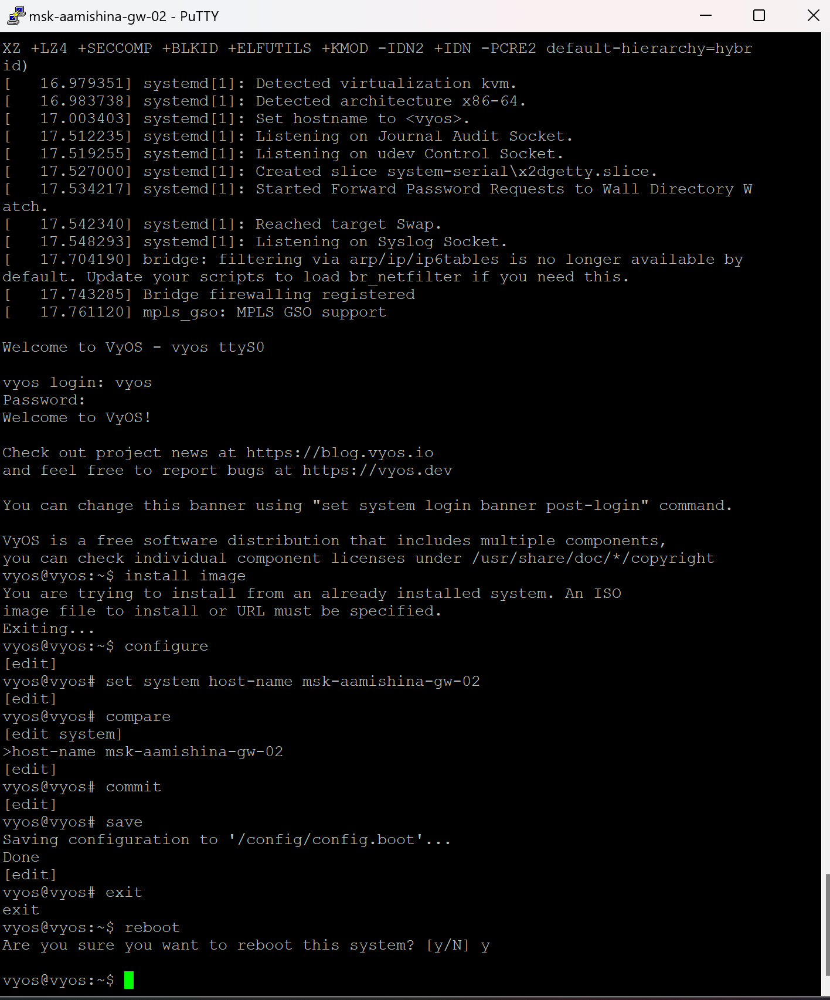
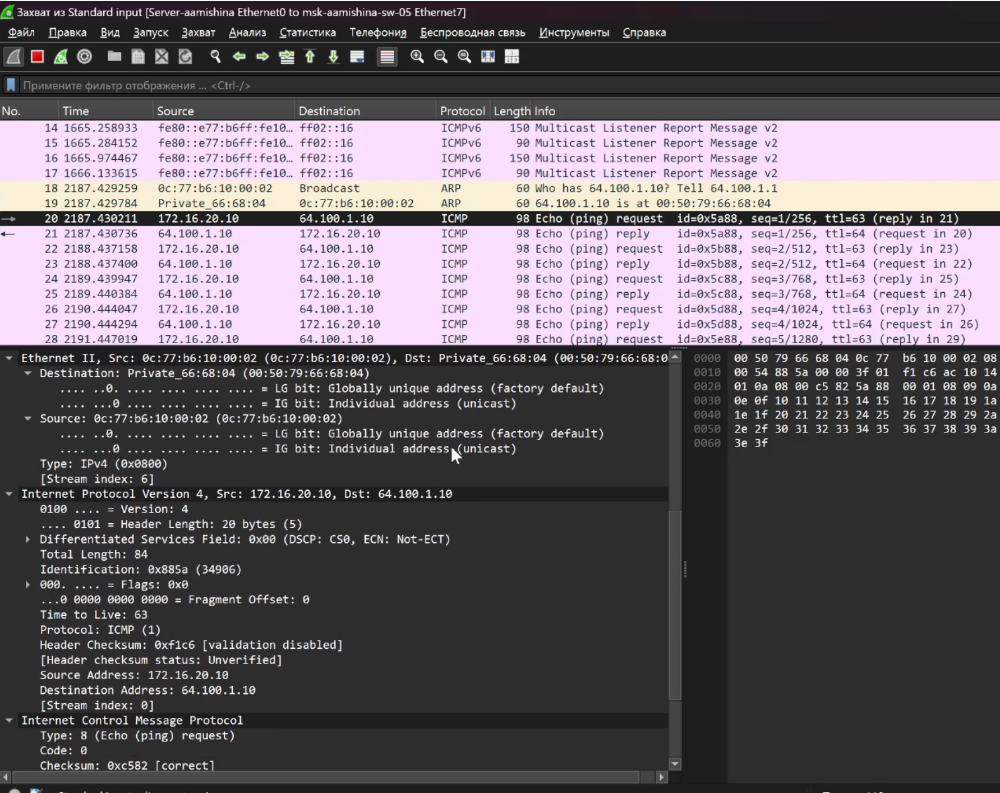
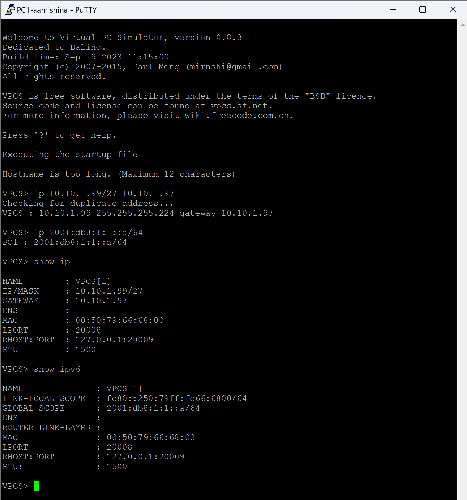
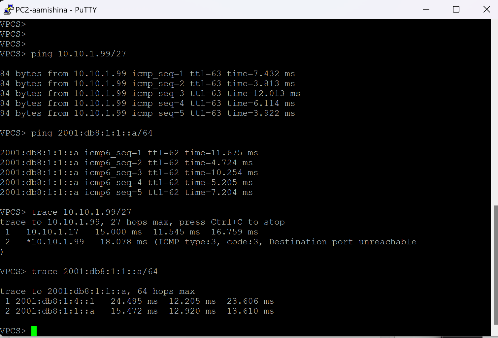

---
## Front matter
title: "Отчёт по лабораторной работе №6"
subtitle: "Дисциплина: Сетевые технологии"
author: "Мишина Анастасия Алексеевна"

## Generic options
lang: ru-RU
toc-title: "Содержание"

## Bibliography
bibliography: bib/cite.bib
csl: pandoc/csl/gost-r-7-0-5-2008-numeric.csl

## Pdf output format
toc: true # Table of contents
toc-depth: 2
lof: true # List of figures
lot: true # List of tables
fontsize: 14pt
linestretch: 1.5
papersize: a4
documentclass: scrreprt
## I18n polyglossia
polyglossia-lang:
  name: russian
  options:
	- spelling=modern
	- babelshorthands=true
polyglossia-otherlangs:
  name: english
## I18n babel
babel-lang: russian
babel-otherlangs: english
## Fonts
mainfont: PT Serif
romanfont: PT Serif
sansfont: PT Sans
monofont: PT Mono
mainfontoptions: Ligatures=TeX
romanfontoptions: Ligatures=TeX
sansfontoptions: Ligatures=TeX,Scale=MatchLowercase
monofontoptions: Scale=MatchLowercase,Scale=0.9
## Biblatex
biblatex: true
biblio-style: "gost-numeric"
biblatexoptions:
  - parentracker=true
  - backend=biber
  - hyperref=auto
  - language=auto
  - autolang=other*
  - citestyle=gost-numeric
## Pandoc-crossref LaTeX customization
figureTitle: "Рис."
tableTitle: "Таблица"
listingTitle: "Листинг"
lofTitle: "Список иллюстраций"
lotTitle: "Список таблиц"
lolTitle: "Листинги"
## Misc options
indent: true
header-includes:
  - \usepackage{indentfirst}
  - \usepackage{float} # keep figures where there are in the text
  - \floatplacement{figure}{H} # keep figures where there are in the text
---

# Цель работы

Изучение принципов распределения и настройки адресного пространства на
устройствах сети.


# Выполнение лабораторной работы

##  Разбиение сети на подсети

### Разбиение IPv4-сети на подсети

1. Задана IPv4-сеть 172.16.20.0/24. Для заданной сети определите префикс, маску, broadcast-адрес, число возможных подсетей, диапазон адресов узлов. Разбейте сеть на 3 подсети с максимально возможным числом адресов узлов 126, 62, 62 соответственно.

| Характеристика              | Значение                             |
|-----------------------------|--------------------------------------|
| Адрес сети                  | 172.16.20.0/24                       |
| Префикс маски               | /24                                  |
| Маска                       | 255.255.255.0                        |
| Broadcast-адрес             | 172.16.20.255                        |
| Адрес сети в двоичной форме | 10101100.00010000.00010100.00000000  |
| Маска в двоичной форме      | 11111111.11111111.11111111.00000000  |
| Число возможных подсетей    | 2^8=256                              |
| Диапазон адресов узлов      | 172.16.20.1 - 172.16.20.254          |

Маска: /24 означает, что первые 24 бита адреса являются сетевой частью маски (24 единицы в двоичном виде), а оставшиеся 8 бит (нули в двоичном виде) - частью для устройств в сети. Broadcast-адрес: Этот адрес можно вычислить, инвертировав биты в 
сетевой части маски и применив их к заданной сети. Для вычисления broadcast-адреса инвертируем биты в сетевой части маски: 

```
Маска: 11111111.11111111.11111111.00000000
Инвертированная маска: 00000000.00000000.00000000.11111111 
```
Теперь применяем инвертированную маску к сети: `172.16.20.0` (сетевая часть) OR `0.0.0.255` (инвертированная маска) = `172.16.20.255`. 

Необходимо разбить сеть на 3 подсети с 126, 62, 62 узлами. Для первой подсети требуется 126 + 2 = 128 адресов (резервируется 1 для адреса сети и 1 для широковещательного адреса). 128 = 2^7, значит в маске подсети требуется оставить 7 нулей. `11111111.11111111.11111111.10000000 = 255.255.255.128` Префикс маски - `/25`. Диапазон адресов для данной подсети: `172.16.20.1 - 172.16.20.126`. Широковещательный адрес: `172.16.20.127`.

Для двух других подсетей требуется 62 + 2 = 64 адреса. 64 = 2^6, значит в маске подсети требуется оставить 6 нулей. `11111111.11111111.11111111.11000000 = 255.255.255.192`. Префикс маски - `/26`. Диапазон адресов для второй подсети: `172.16.20.129 - 172.16.20.190`. Широковещательный адрес: `172.16.20.191`. Диапазон адресов для третьей подсети: `172.16.20.193 - 172.16.20.254`. Широковещательный адрес: `172.16.20.255`.

2. Задана сеть 10.10.1.64/26. Для заданной сети определите префикс, маску, broadcast-адрес, число возможных подсетей, диапазон адресов узлов. Выделите в этой сети подсеть на 30 узлов. Запишите характеристики для выделенной подсети.

| Характеристика              | Значение                             |
|-----------------------------|--------------------------------------|
| Адрес сети                  | 10.10.1.64/26                        |
| Префикс маски               | /26                                  |
| Маска                       | 255.255.255.192                      |
| Broadcast-адрес             | 10.10.1.127                          |
| Адрес сети в двоичной форме | 00001010.00001010.00000001.01000000  |
| Маска в двоичной форме      | 11111111.11111111.11111111.11000000  |
| Число возможных подсетей    | 2^6=64                               |
| Диапазон адресов узлов      | 10.10.1.65 - 10.10.1.126             |

Чтобы разбить подсеть на 30 узлов, нужно 30 + 2 = 32 адреса, следовательно маска подсети будет `11111111.11111111.11111111.11100000 = 255.255.255.224 = /27`. Диапазон адресов: `10.10.1.65 - 10.10.1.94`. Адрес подсети: `10.10.1.64`. Широковещательный адрес: `10.10.1.95`.

3. Задана сеть 10.10.1.0/26. Для этой сети определите префикс, маску, broadcast адрес, число возможных подсетей, диапазон адресов узлов. Выделите в этой сети подсеть на 14 узлов. Запишите характеристики для выделенной подсети.

| Характеристика              | Значение                             |
|-----------------------------|--------------------------------------|
| Адрес сети                  | 10.10.1.0/26                         |
| Префикс маски               | /26                                  |
| Маска                       | 255.255.255.192                      |
| Broadcast-адрес             | 10.10.1.63                           |
| Адрес сети в двоичной форме | 00001010.00001010.00000001.00000000  |
| Маска в двоичной форме      | 11111111.11111111.11111111.11000000  |
| Число возможных подсетей    | 2^6=64                               |
| Диапазон адресов узлов      | 10.10.1.1 - 10.10.1.62               |

Чтобы разбить подсеть на 14 узлов, нужно 14 + 2 = 16 адресов, следовательно маска подсети будет `11111111.11111111.11111111.11110000 = 255.255.255.240 = /28`. Диапазон адресов: `10.10.1.1 - 10.10.1.14`. Адрес подсети: `10.10.1.0`. Широковещательный адрес: `10.10.1.15`.

### Разбиение IPv6-сети на подсети

1. Задана сеть 2001:db8:c0de::/48. Охарактеризуйте адрес, определите маску, префикс, диапазон адресов для узлов сети (краевые значения). Разбейте сеть на 2 подсети двумя способами — с использованием идентификатора подсети и с использованием идентификатора интерфейса. Поясните предложенные вами варианты разбиения.

Адрес `2001:db8:c0de::/48` – адрес локальной подсети. Первые 48 бит фиксированы, далее 16 бит – подсеть, остальные 64 бита - идентификатор конкретного интерфейса узла подсети.

| Характеристика         | Значение                                                               |
|------------------------|------------------------------------------------------------------------|
| Адрес сети             | 2001:db8:c0de::/48                                                     |
| Длина префикса         | 48                                                                     |
| Префикс                | 2001:db8:c0de::                                                        |
| Маска                  | ffff:ffff:ffff:0:0:0:0:0                                               |
| Диапазон адресов узлов | 2001:db8:c0de:0:0:0:0 - 2001:db8:c0de:ffff:ffff:ffff:ffff              |

Разбиение сети на 2 подсети с использованием идентификатора подсети. Для определения доступных подсетей достаточно рассчитать шестнадцатеричное число (идентификатор подсети), следующее за префиксом глобальной маршрутизации (48 бит). Последние 64 бита идентифицируют конкретный узел сети. Можно выделить следующие 2 подсети:

``` 
2001:db8:c0de:0003::/64
2001:db8:c0de:0002::/64

```

Разбиение сети на 2 подсети с использованием идентификатора интерфейса. Создается подсеть на границе полубайта (4 бита или одна шестнадцатеричная цифра). Например, префикс подсети /64 расширяется на четыре бита (или один полубайт) до подсети /68, что позволяет уменьшить размер идентификатора интерфейса на 4 бита (с 64 до 60). 

Тогда можно выделить, например, такие подсети: 

```
2001:db8:c0de:0000:1000/68
2001:db8:c0de:0000:2000/68

```

2. Задана сеть 2a02:6b8::/64. Охарактеризуйте адрес, определите маску, префикс, диапазон адресов для узлов сети (краевые значения). Разбейте сеть на 2 подсети двумя способами — с использованием идентификатора подсети и с использованием идентификатора интерфейса. Поясните предложенные вами варианты разбиения.

Адрес `2a02:6b8::/64` – адрес локальной связи. Первые 64 бита фиксированы, остальные 64 идентифицируют конкретный 
интерфейс узла.

| Характеристика         | Значение                                                              |
|------------------------|-----------------------------------------------------------------------|
| Адрес сети             | 2a02:6b8::/64                                                         |
| Длина префикса         | 64                                                                    |
| Префикс                | 2a02:6b8:0000:0000                                                    |
| Маска                  | ffff:fffff:ffff:ffff:0:0:0:0                                          |
| Диапазон адресов узлов | 2a02:6b8:: - 2a02:6b8:0:0:ffff:ffff:ffff:ffff                         |

Разбиение сети на 2 подсети с использованием идентификатора интерфейса. Можно выделить, например, такие подсети: 

```
2a02:6b8:0000:0000:1000::/68
2a02:6b8:0000:0000:2000::/68
```

## Настройка двойного стека адресации IPv4 и IPv6 в локальной сети

Запускаем GNS3 VM и GNS3. Создаем новый проект. В рабочей области GNS3 размещаем коммутаторы Ethernet, маршрутизатор FFR и VyOS, 5 VPCS. Формируем топологию сети согласно инструкции и таблице адресации (рис. [-@fig:1]).

{#fig:1 width=70%}

Включаем захват трафика между сервером двойного стека и ближайшим к нему коммутатором. Включаем все устройства сети.

Задаем IP-адреса PC-1 (рис. [-@fig:2]) и PC-2 (рис. [-@fig:3]). Вызываем терминалы и настраиваем адресацию в соответствии с таблицей, проверяем конфигурации.

{#fig:2 width=70%}

{#fig:3 width=70%}

Настраиваем адресацию на сервере (рис. [-@fig:4]).

{#fig:4 width=70%}

По таблице адресации настраиваем IPv4-адресацию для интерфейсов локальной сети маршрутизатора FRR `msk-aamishina-gw-01`  (рис. [-@fig:5]). 

{#fig:5 width=70%}

Проверяем конфигурацию маршрутизатора (рис. [-@fig:6]).

{#fig:6 width=70%}

Проверяем подключение с помощью `ping` и `trace`. С PC-1 посылаю запросы на PC-2 и сервер (рис. [-@fig:7]), с PC-2 - на PC-1 и сервер (рис. [-@fig:8]).

{#fig:7 width=70%}

{#fig:8 width=70%}

Задаем IP-адреса PC-3 (рис. [-@fig:9]) и PC-4 (рис. [-@fig:10]). Вызываем терминалы и настраиваем адресацию в соответствии с таблицей, проверяем конфигурации.

{#fig:9 width=80%}

{#fig:10 width=80%}

Настраиваю адресацию на сервере (рис. [-@fig:11]). 

{#fig:11 width=70%}

Настраиваем hostname для маршрутизатора VyOs (рис. [-@fig:12]). В соответствии с таблицей адресации настраиваем IPv6-адресацию для интерфейсов локальной сети маршрутизатора VyOS (рис. [-@fig:13]). Сохраняем изменения и проверяем, просмотрев интерфейсы.

{#fig:12 width=70%}

{#fig:13 width=70%}

Проверяем подключение. Пингуем PC-4 и сервер с РС-3 (рис. [-@fig:14]), PC-3 и сервер с PC-4 (рис. [-@fig:15]), также проверяем с помощью `trace`.

{#fig:14 width=70%}

{#fig:15 width=70%}

Убеждаемся, что устройства из подсети IPv4 недоступны для устройств из подсети IPv6 и наоборот (рис. [-@fig:16], рис. [-@fig:17]).

{#fig:16 width=70%}

{#fig:17 width=70%}

Посмотрим захваченный на соединении сервера двойного стека адресации с коммутатором трафик ARP (рис. [-@fig:18]), ICMP (рис. [-@fig:19]), ICMPv6 (рис. [-@fig:20]).

{#fig:18 width=70%}

{#fig:19 width=70%}

{#fig:20 width=70%}

На физическом уровне можно узнать, например, длину кадра. На канальной уровне можно узнать MAC-адреса источника и получателя. Далее идет протокол ARP, где мы видим, что подключение Ethernet, и используется IPv4-адрес. Для mac-адреса выделено 6 байт, для IPv4-адреса – 4 байта.

Для ICMP-пакетов доступна информация сетевого уровня, такая как IP-адреса источника (172.16.20.10 - PC1) и получателя (64.100.1.10 - Server). Для ICMPv6 информация аналогична, но IP-адреса записаны в формате IPv6.

## Задание для самостоятельного выполнения

Характеристика подсетей:

- подсеть 1: **IPv4** `10.10.1.96/27`; длина префикса - 27,  маска подсети: `255.255.255.224`, широковещательный адрес: `10.10.1.127`, диапазон: `10.10.1.97 - 10.10.1.126`; **IPv6** `2001:DB8:1:1::/64`; длина префикса - 64, диапазон: `2001:db8:1:1:0:0:0:0 - 2001:db8:1:1:ffff:ffff:ffff:ffff`;

– подсеть 2: **IPv4** `10.10.1.16/28`; длина префикса - 28, маска подсети: `255.255.255.240`, широковещательный адрес: `10.10.1.31`, диапазон адресов: `10.10.1.17 - 10.10.1.30`; **IPv6** `2001:DB8:1:4::/64`; длина префикса - 64, диапазон: `2001:db8:1:4:0:0:0:0 - 2001:db8:1:4:ffff:ffff:ffff:ffff`.

Формируем топологию сети в соответствии с инструкцией (рис. [-@fig:21]).

{#fig:21 width=70%}

Таблица адресации для заданной топологии:

| Устройство     | Интерфейс     | IPv4            | IPv6                  | Шлюз                  |
|----------------|---------------|-----------------|-----------------------|-----------------------|
| PC-1           | NIC           | 10.10.1.99/27   | 2001:db8:1:1::a/64    | 10.10.1.97 / gw-01    |
| PC-2           | NIC           | 10.10.1.18/28   | 2001:db8:1:4::a/64    | 10.10.1.17 / gw-01    |
| gw-01          | eth0          | 10.10.1.97/27   | 2001:db8:1:1::1/64    |                       |
| gw-01          | eth1          | 10.10.1.17/28   | 2001:db8:1:4::1/64    |                       |

Настраиваем IPv4- и IPv6-адресацию на PC-1, введя команды `ip 10.10.1.99/27 10.10.1.97` и `ip 2001:db8:1:1::a/64` и проверяем (рис. [-@fig:22]). 

{#fig:22 width=70%}

Настраиваем IPv4- и IPv6-адресацию на PC-2 аналогичным образом и проверяем (рис. [-@fig:23]). 

{#fig:23 width=70%}

Настраиваем IPv4-адресацию на маршрутизаторе VyOS, установив на его интерфейсах наименьшие адреса в подсетях (рис. [-@fig:24]):

{#fig:24 width=70%}

Настраиваем IPv6-адресацию на маршрутизаторе VyOS. Просматриваем внесенные изменения (рис. [-@fig:25]). 

{#fig:25 width=70%}

Проверяем подключение между устройствами подсети: c PC-1 пингую IPv4 и IPv6 адреса PC-2 (рис. [-@fig:26])  и наоборот (рис. [-@fig:27]). 

{#fig:26 width=70%}

{#fig:27 width=70%}

# Выводы

В результате выполнения работы были изучены принципы распределения и настройки адресного пространства на устройствах сети.