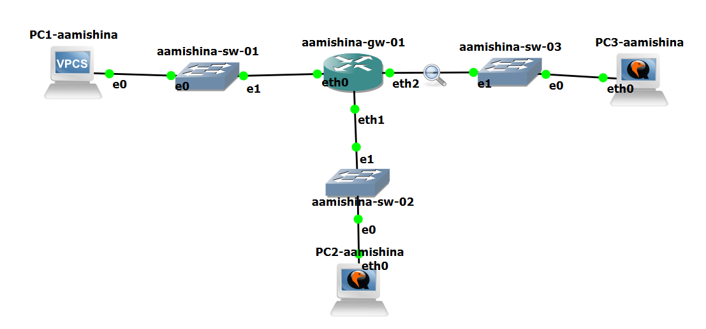
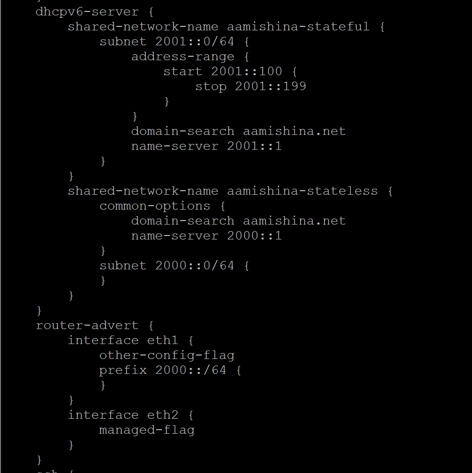

---
## Front matter
lang: ru-RU
title: Лабораторная работа №7
subtitle: Сетевые технологии
author:
  - Мишина А. А.
date: 4 декабря 2024

## i18n babel
babel-lang: russian
babel-otherlangs: english

## Formatting pdf
toc: false
toc-title: Содержание
slide_level: 2
aspectratio: 169
section-titles: true
theme: metropolis
header-includes:
 - \metroset{progressbar=frametitle,sectionpage=progressbar,numbering=fraction}
 - '\makeatletter'

 - '\makeatother'
---

## Цель работы

Получить навыки настройки службы DHCP на сетевом оборудовании для распределения адресов IPv4 и IPv6.

# Выполнение лабораторной работы

# Настройка DHCP в случае IPv4

## Топология сети

{#fig:1 width=70%}

## VyOS

{#fig:2 width=70%}

## Системный пользователь

{#fig:3 width=70%}

## Настройка

{#fig:4 width=70%}

## Статистика

{#fig:5 width=70%}

## PC1

{#fig:6 width=30%}

## PC1

{#fig:7 width=70%}

## Статистика

{#fig:8 width=70%}

## Журнал

{#fig:9 width=30%}

## Wireshark

{#fig:10 width=70%}

# Настройка DHCP в случае IPv6

## Установка

{#fig:11 width=70%}

## Топология

{#fig:12 width=70%}

## Настройка

{#fig:13 width=60%}

## Router Advertisements

{#fig:14 width=70%}

## Настройка

{#fig:15 width=70%}

## Результат

{#fig:16 width=30%}

## ifconfig

{#fig:17 width=40%}

## Проверка

{#fig:18 width=70%}

## Получение адреса

{#fig:19 width=50%}

## Проверка

{#fig:20 width=70%}

## Wireshark

{#fig:21 width=70%}

## Router Advertisements

{#fig:22 width=70%}

## Настройка

{#fig:23 width=70%}

## Результат

{#fig:24 width=45%}

## ifconfig

{#fig:25 width=40%}

## Получение адреса

{#fig:26 width=70%}

## ifconfig

{#fig:27 width=70%}

## Проверка

{#fig:28 width=70%}

## Проверка

{#fig:29 width=70%}

## Wireshark

{#fig:30 width=70%}

## Выводы

В процессе выполнения лабораторной работы я получила навыки настройки службы DHCP на сетевом оборудовании для распределения адресов IPv4 и IPv6.