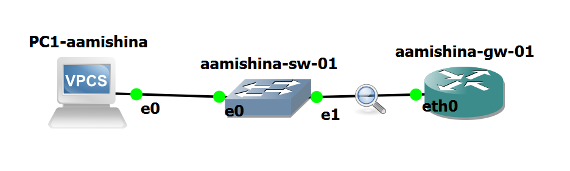
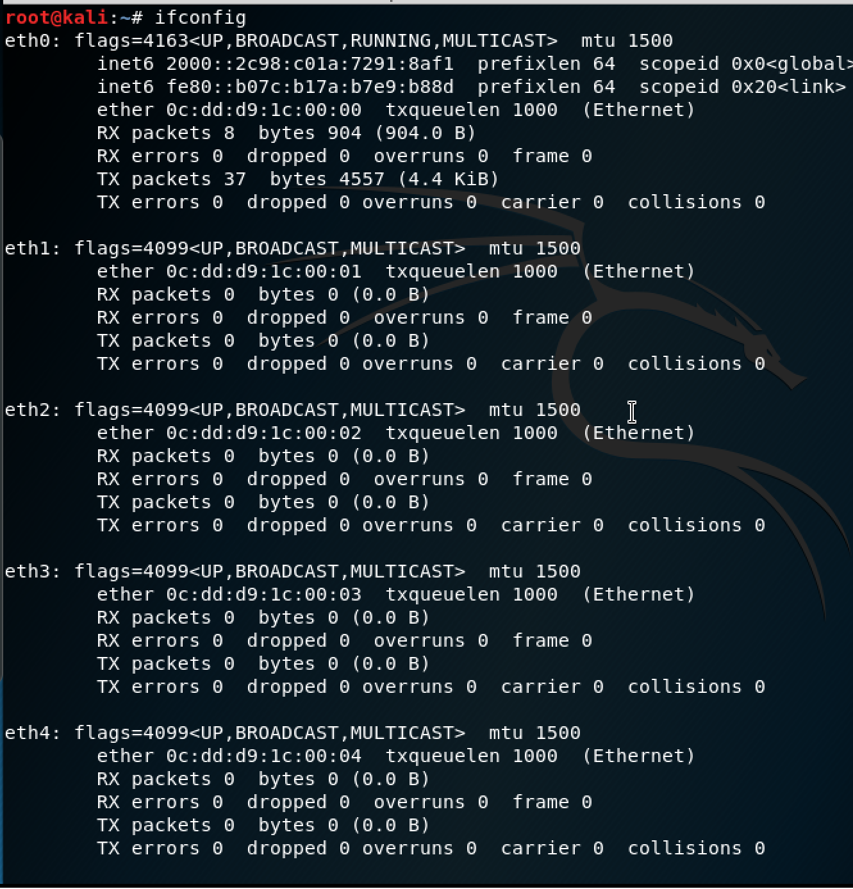
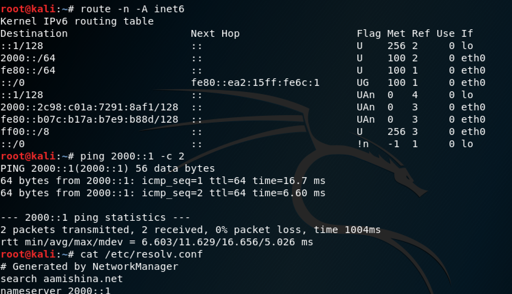
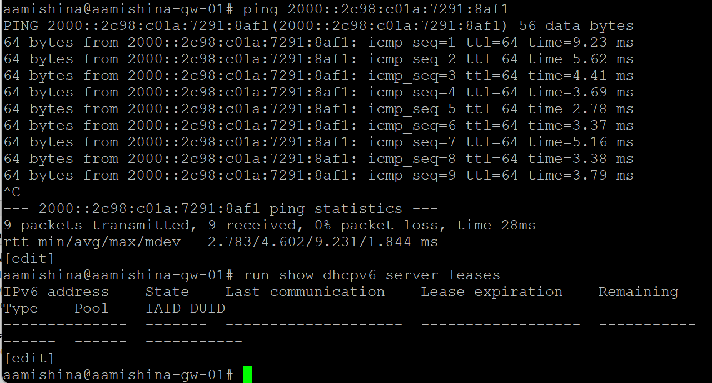
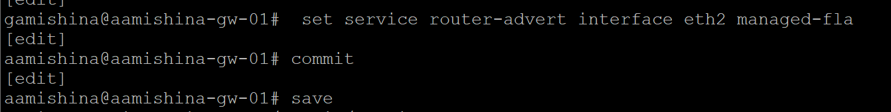

---
## Front matter
title: "Отчёт по лабораторной работе №7"
subtitle: "Дисциплина: Сетевые технологии"
author: "Мишина Анастасия Алексеевна"

## Generic options
lang: ru-RU
toc-title: "Содержание"

## Bibliography
bibliography: bib/cite.bib
csl: pandoc/csl/gost-r-7-0-5-2008-numeric.csl

## Pdf output format
toc: true # Table of contents
toc-depth: 2
lof: true # List of figures
lot: true # List of tables
fontsize: 14pt
linestretch: 1.5
papersize: a4
documentclass: scrreprt
## I18n polyglossia
polyglossia-lang:
  name: russian
  options:
	- spelling=modern
	- babelshorthands=true
polyglossia-otherlangs:
  name: english
## I18n babel
babel-lang: russian
babel-otherlangs: english
## Fonts
mainfont: PT Serif
romanfont: PT Serif
sansfont: PT Sans
monofont: PT Mono
mainfontoptions: Ligatures=TeX
romanfontoptions: Ligatures=TeX
sansfontoptions: Ligatures=TeX,Scale=MatchLowercase
monofontoptions: Scale=MatchLowercase,Scale=0.9
## Biblatex
biblatex: true
biblio-style: "gost-numeric"
biblatexoptions:
  - parentracker=true
  - backend=biber
  - hyperref=auto
  - language=auto
  - autolang=other*
  - citestyle=gost-numeric
## Pandoc-crossref LaTeX customization
figureTitle: "Рис."
tableTitle: "Таблица"
listingTitle: "Листинг"
lofTitle: "Список иллюстраций"
lotTitle: "Список таблиц"
lolTitle: "Листинги"
## Misc options
indent: true
header-includes:
  - \usepackage{indentfirst}
  - \usepackage{float} # keep figures where there are in the text
  - \floatplacement{figure}{H} # keep figures where there are in the text
---

# Цель работы

Получить навыки настройки службы DHCP на сетевом оборудовании для распределения адресов IPv4 и IPv6.

# Выполнение лабораторной работы

## Настройка DHCP в случае IPv4

После запуска GNS3 VM и GNS3 и создания проекта в рабочем пространстве разместим и соединим устройства в соответствии с данной нам топологией. Используем маршрутизатор VyOS и хост VPCS. Изменим отображаемые названия устройств в соответствии с требованиями. Включим захват трафика между коммутатором и маршрутизатором (рис. [-@fig:1]).

{#fig:1 width=70%}

Далее перейдем к настройке образа VyOS. Перейдем в режим конфигурирования, изменим имя устройства и доменное имя, заменим системного пользователя, заданного по умолчанию, на моего пользователя. Зайдем в систему под своим пользователем, которого задали (рис. [-@fig:2]). Удалим системного пользователя, заданного по умолчанию (рис. [-@fig:3]).

{#fig:2 width=70%}

{#fig:3 width=70%}

На маршрутизаторе под созданным пользователем перейдем в режим конфигурирования и настроем адресацию IPv4, а также добавим конфигурацию DHCP-сервера на маршрутизаторе (рис. [-@fig:4]).

{#fig:4 width=70%}

Таким образом, при помощи указанных выше команд была создана разделяемая сеть (shared-network-name) с названием aamishina, подсеть (subnet) с адресом 10.0.0.0/24, задан диапазон адресов (range) с именем hosts, содержащий адреса 10.0.0.2–10.0.0.253.

Далее просмотрим статистику DHCP-сервера и выданных адресов (рис. [-@fig:5]).

{#fig:5 width=70%}

Перейдем к настройке оконечного устройства (PC1) (рис. [-@fig:6]).

{#fig:6 width=70%}

Проверим конфигурацию на узле и пропингуем маршрутизатор (рис. [-@fig:7]).

{#fig:7 width=70%}

На маршрутизаторе вновь посмотри статистику DHCP-сервера и выданные адреса (рис. [-@fig:8]).

{#fig:8 width=70%}

Анализ статистики: видно, что в столбце Leases значение изменилось с 0 до 1, поскольку один сетевой адрес выдан на время PC1. Соответственно в столбце Available число доступных сетевых адресов уменьшилось на 1. Анализ выданных адресов: видно, что выдан адрес 10.0.0.2 (первый из заданного нами диапазона IP-адресов для подсети 10.0.0.0.24), также указан физический адрес, а также время аренды (адрес выдан на день).

Далее просмотрим журнал работы DHCP-сервера (рис. [-@fig:9]).

{#fig:9 width=70%}

Посмотрим захваченную анализатором трафика пакеты, относящиеся к работе DHCP и назначению адреса устройства (рис. [-@fig:10]).

{#fig:10 width=70%}

- В процессе получения устройством адреса по протоколу DHCP сначала идет сообщение «DHCP DISCOVER»: устройство отправляет широковещательный запрос, в котором во фрейме (PDU канального уровня) в поле адреса отправителя указывается MAC-адрес устройства, а в поле адреса получателя — широковещательный адрес ffff.ffff.ffff; в пакете (PDU сетевого уровня) в поле адреса отправителя указан адрес 0.0.0.0, а в поле адреса получателя — адрес 255.255.255.255;
– сообщение «DHCP OFFER»: DHCP-сервер после получения широковещательного сообщения выделяет (но не резервирует) в своём пуле адресов некоторый адрес DHCP-клиенту на заданное время (lease time), назначает другие настройки (опции) и пересылает всю информацию DHCP-клиенту; при этом в соответствующих полях получателя в сообщении указываются выделенный клиенту IP-адрес и его MAC-адрес (тут видим, что адрес отправителя – 10.0.0.1 – адрес DHCP-сервера, а адрес получателя
10.0.0.2 – адрес, предлагаемый клиенту);
– сообщение «DHCP REQUEST»: клиент отправляет DHCP-серверу согласие с полученными параметрами;
– сообщение «DHCP ACKNOWLEDGE»: DHCP-сервер резервирует за DHCP-клиентом выделенный адрес на какое-то время (lease time), вносит информацию в свою ARP-таблицу и высылает DHCP-клиенту сообщение об успешной регистрации адреса.

## Настройка DHCP в случае IPv6

В предыдущем проекте в рабочем пространстве дополним сеть, разместив и соединив устройства в соответствии с топологией, приведённой в примере. Используем хост (клиент) Kali Linux (рис. [-@fig:11]) (Изначально была попытка использовать Kali Linux CLI, но консоль не открывалась, открылась только Auxiliary Console с BusyBox, где урезанный функционал) (добавим образ Kali Linux версии 2019.3 в перечень устройств в GNS3), поскольку клиент VPCS не поддерживает DHCPv6. Изменим отображаемые названия устройств, выполняя соглашение об именовании. Включим захват трафика на соединениях между маршрутизатором gw-01 и коммутаторами sw-02 и sw-03 (рис. [-@fig:12]).

{#fig:11 width=70%}

{#fig:12 width=70%}

Настроим адресацию IPv6 на маршрутизаторе (рис. [-@fig:13]).

{#fig:13 width=70%}

На маршрутизаторе настроим DHCPv6 без отслеживания состояния (DHCPv6 Stateless configuration). Для начала настроим объявления о маршрутизаторах (Router Advertisements, RA) на интерфейсе eth1. Опция other-config-flag означает, что для конфигурации не адресных параметров использует протокол с сохранением состояния (рис. [-@fig:14]). Добавим конфигурации DHCP-сервера (рис. [-@fig:15]).

{#fig:14 width=70%}

{#fig:15 width=70%}

Здесь с помощью указанных выше команд создана разделяемая сеть (sharednetwork-name) с названием aamishina, задана информация общих опций (common-options) для разделяемой сети. При этом подсеть (subnet) 2000::/64 не требуется настраивать, поскольку она не будет содержать полезной информации.

Покажем результат с помощью команды run show configure (рис. [-@fig:16]).

{#fig:16 width=70%}

Перейдем к настройке сети на PC2 (рис. [-@fig:17]). На узле PC2 пропингуем маршрутизатор и получим пакеты назад, следовательно соединение есть. Проверим настройки DNS (рис. [-@fig:18]).

{#fig:17 width=70%}

{#fig:18 width=70%}

Получим адрес по DHCPv6 протоколу. Здесь опция -6 указывает на использование протокола DHCPv6, опция -S —на запрос только информации DHCPv6, но не адреса, опция -v — на вывод на экран подробной информации (рис. [-@fig:19]). Вновь пропингуем от узла PC2 маршрутизатор, проверим настройки DNS.

{#fig:19 width=70%}

На маршрутизаторе посмотрим выданные адреса. Почему-то сервер не показывает адрес, который он только что выдал. Хотя если пропинговать с маршрутизатора PC2 по присвоенному адресу пакеты будут получены (рис. [-@fig:20]).

{#fig:20 width=70%}

Откроем Wireshark и посмотрим полученную информацию по захваченным пакетам (рис. [-@fig:21]).

{#fig:21 width=70%}

- Сообщение INFORMATION-REQUEST: используется клиентом для запроса только параметров конфигурации (например адреса DNS-сервера) в случае, когда DHCPv6-сервер работает без отслеживания состояния.
- сообщение REPLY: используется DHCPv6-сервером для отправки клиенту сетевых настроек и завершения обработки запроса. Передача данных в DHCPv6 осуществляется через протокол UDP, при этом сервер принимает сообщения от клиентов на порт 547 и отправляет сообщения клиентам на порт 546.

На маршрутизаторе настроим DHCPv6 с отслеживанием состояния (DHCPv6 Stateful configuration). На интерфейсе eth2 маршрутизатора настроим объявления о
маршрутизаторах (Router Advertisements, RA). Опция managed-flag означает, что хосты использует администрируемый (отслеживающий состояние) протокол для автоматической настройки адресов в дополнение (рис. [-@fig:22]).

{#fig:22 width=70%}

Добавим конфигурацию DHCP-сервера на маршрутизаторе. Здесь при помощи указанных выше команд создана разделяемая сеть (shared-network-name) с названием  aamishina, подсеть (subnet) с адресом 2001::/64, задан диапазон адресов (range) с именем hosts, содержащий адреса 2001::100 – 2001::199 (рис. [-@fig:23]).

{#fig:23 width=70%}

Покажем результат с помощью команды run show configure (рис. [-@fig:24]).

{#fig:24 width=70%}

Подключимся к узлу PC3 и проверим настройки сети (рис. [-@fig:25]).

{#fig:25 width=70%}

На узле PC3 проверим настройки DNS и получим адрес по DHCPv6 (рис. [-@fig:26]), (рис. [-@fig:27]).

{#fig:26 width=70%}

{#fig:27 width=70%}

Вновь на узле PC3 проверим настройки сети, пропингуем маршрутизатор, проверим настройки DNS (рис. [-@fig:28]).

{#fig:28 width=70%}

На маршрутизаторе посмотрим выданные адреса (рис. [-@fig:29]).

{#fig:29 width=70%}

Откроем Wireshark и посмотрим информацию по захваченным пакетам. Передача данных в DHCPv6 осуществляется через протокол UDP, при этом сервер принимает сообщения от клиентов на порт 547 и отправляет сообщения клиентам на порт 546 (рис. [-@fig:30]).

{#fig:30 width=70%}

Процесс получения устройством адреса по протоколу DHCPv6:

- сообщение SOLICIT: устройство направляет на зарезервированный IPv6-адрес многоадресной рассылки FF02::1:2 широковещательный запрос;
- сообщение ADVERTISE: DHCPv6-сервер сообщает DHCPv6-клиенту, что сервер доступен для предоставления службы DHCPv6;
- сообщение REQUEST: используется клиентом для запроса IPv6-адреса и всех остальных параметров конфигурации от сервера в случае, когда DHCPv6-сервер работает с сохранением состояния;
- сообщение REPLY: используется DHCPv6-сервером для отправки клиенту сетевых настроек и завершения обработки запроса.

# Выводы

В процессе выполнения лабораторной работы я получила навыки настройки службы DHCP на сетевом оборудовании для распределения адресов IPv4 и IPv6.