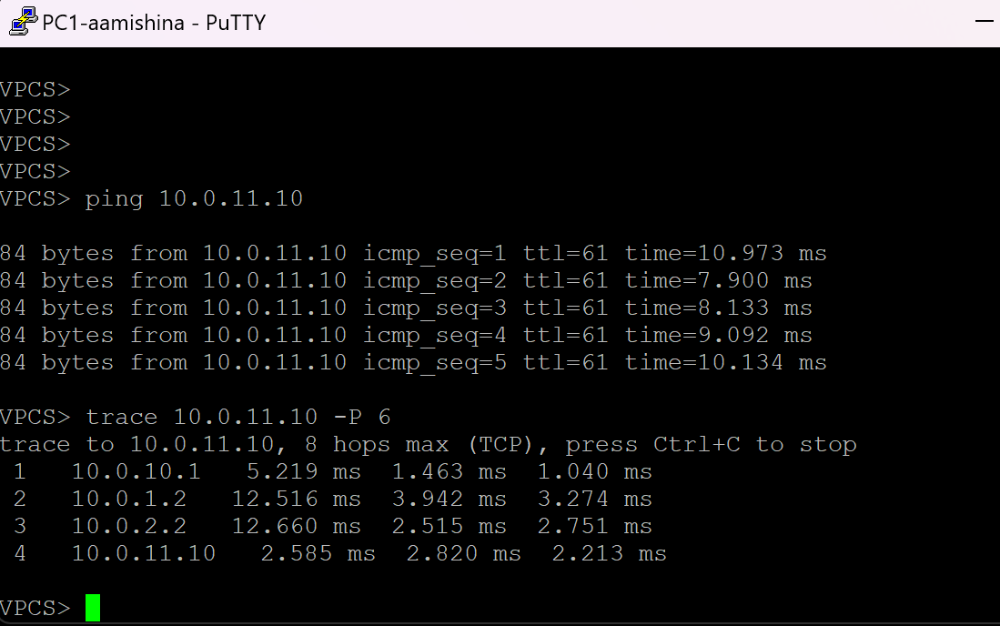
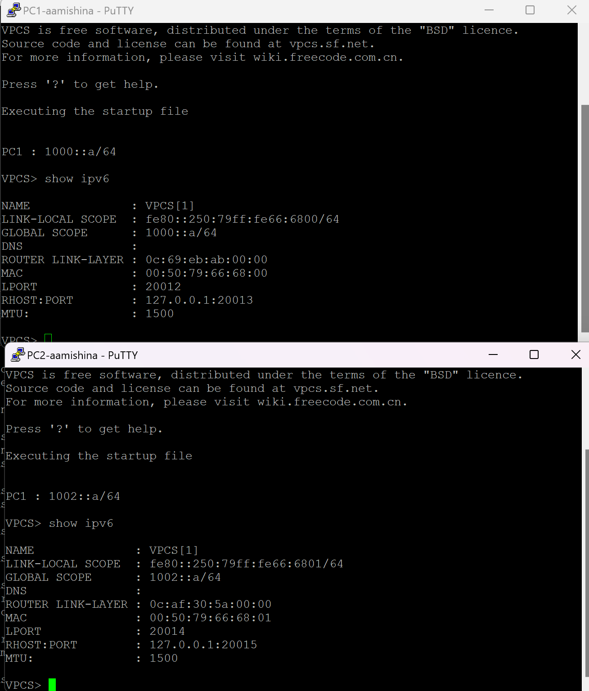
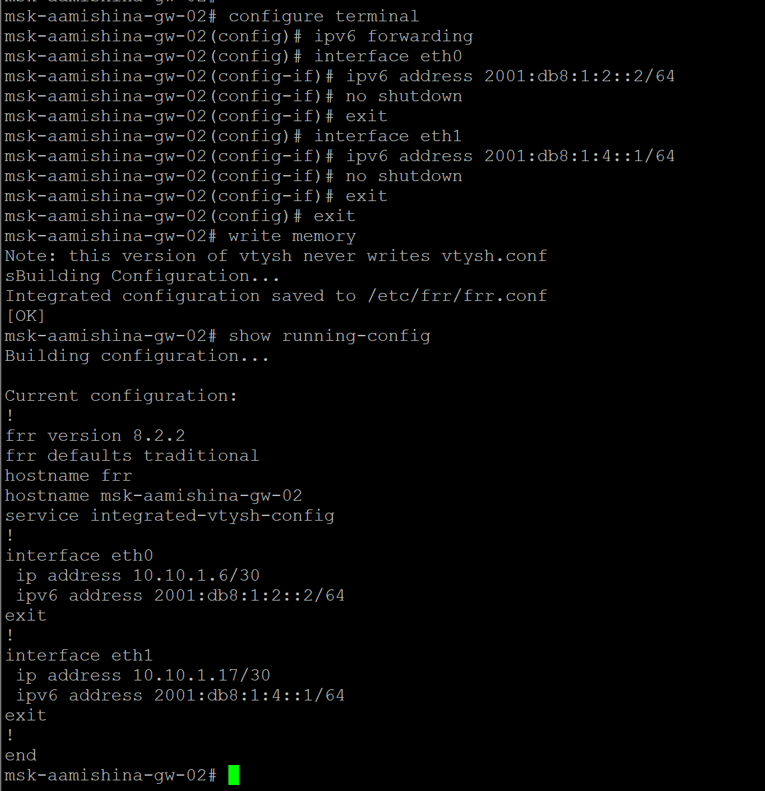
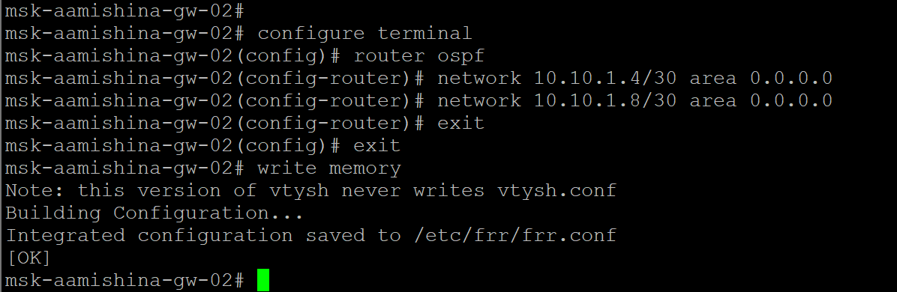
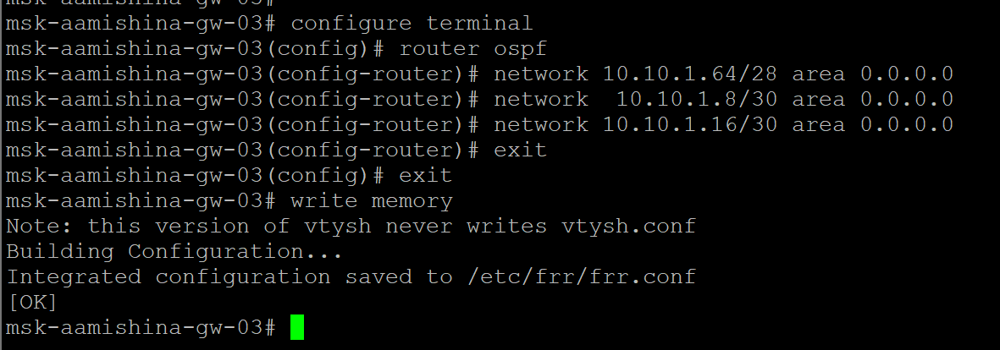
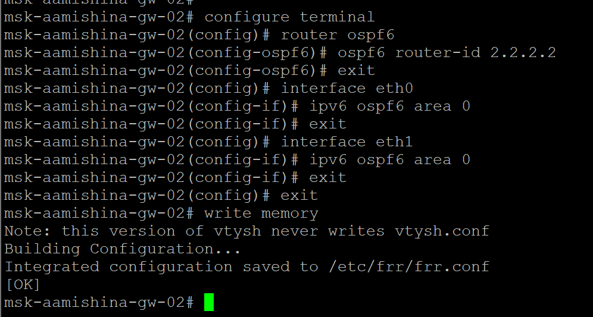

---
## Front matter
title: "Отчёт по лабораторной работе №8"
subtitle: "Дисциплина: Сетевые технологии"
author: "Мишина Анастасия Алексеевна"

## Generic options
lang: ru-RU
toc-title: "Содержание"

## Bibliography
bibliography: bib/cite.bib
csl: pandoc/csl/gost-r-7-0-5-2008-numeric.csl

## Pdf output format
toc: true # Table of contents
toc-depth: 2
lof: true # List of figures
lot: true # List of tables
fontsize: 14pt
linestretch: 1.5
papersize: a4
documentclass: scrreprt
## I18n polyglossia
polyglossia-lang:
  name: russian
  options:
	- spelling=modern
	- babelshorthands=true
polyglossia-otherlangs:
  name: english
## I18n babel
babel-lang: russian
babel-otherlangs: english
## Fonts
mainfont: PT Serif
romanfont: PT Serif
sansfont: PT Sans
monofont: PT Mono
mainfontoptions: Ligatures=TeX
romanfontoptions: Ligatures=TeX
sansfontoptions: Ligatures=TeX,Scale=MatchLowercase
monofontoptions: Scale=MatchLowercase,Scale=0.9
## Biblatex
biblatex: true
biblio-style: "gost-numeric"
biblatexoptions:
  - parentracker=true
  - backend=biber
  - hyperref=auto
  - language=auto
  - autolang=other*
  - citestyle=gost-numeric
## Pandoc-crossref LaTeX customization
figureTitle: "Рис."
tableTitle: "Таблица"
listingTitle: "Листинг"
lofTitle: "Список иллюстраций"
lotTitle: "Список таблиц"
lolTitle: "Листинги"
## Misc options
indent: true
header-includes:
  - \usepackage{indentfirst}
  - \usepackage{float} # keep figures where there are in the text
  - \floatplacement{figure}{H} # keep figures where there are in the text
---

# Цель работы

Изучение принципов маршрутизации в IPv4- и IPv6-сетях и принципов настройки сетевого оборудования.

# Выполнение лабораторной работы

## Настройка динамической маршрутизации в сетях IPv4 и IPv6

Повторяем топологию сети (рис. [-@fig:1]).

{#fig:1 width=70%}

Присваиваем IPv4-адреса оконечным устройствам PC1 и PC2 в соответствии с данными (рис. [-@fig:2]), (рис. [-@fig:3]).

{#fig:2 width=70%}

{#fig:3 width=70%}

Настроим IPv4-адреса на интерфейсах маршрутизаторов (рис. [-@fig:4]), (рис. [-@fig:5]), (рис. [-@fig:6]), (рис. [-@fig:7]), (рис. [-@fig:8]).

{#fig:4 width=70%}

{#fig:5 width=70%}

{#fig:6 width=70%}

{#fig:7 width=70%}

{#fig:8 width=70%}

Присвоим IPv6-адреса оконечным устройствам PC1 и PC2 в соответствии с данными (рис. [-@fig:9]), (рис. [-@fig:10]).

{#fig:9 width=70%}

{#fig:10 width=70%}

Настроим IPv6-адреса на интерфейсах маршрутизаторов (рис. [-@fig:11]), (рис. [-@fig:12]), (рис. [-@fig:13]), (рис. [-@fig:14]).

{#fig:11 width=70%}

{#fig:12 width=70%}

{#fig:13 width=70%}

{#fig:14 width=70%}

### Настройка динамической маршрутизации по протоколу RIP

На маршрутизаторах настроим RIP в качестве протокола динамической
маршрутизации (рис. [-@fig:15]), (рис. [-@fig:16]), (рис. [-@fig:17]), (рис. [-@fig:18]).

{#fig:15 width=70%}

{#fig:16 width=70%}

{#fig:17 width=70%}

{#fig:18 width=70%}

Убедимся, что маршрутизация по RIP настроена (рис. [-@fig:19]), (рис. [-@fig:20]), (рис. [-@fig:21]), (рис. [-@fig:22]).

{#fig:19 width=70%}

{#fig:20 width=70%}

{#fig:21 width=70%}

{#fig:22 width=70%}

Проверим пути прохождения пакетов: с PC1 пропингуем PC2 и определим путь следования пакетов (рис. [-@fig:23]).

{#fig:23 width=70%}

Проверим метрики протокола RIP (рис. [-@fig:24]).

{#fig:24 width=70%}

Предположим, что пакет проходит через маршрутизатор msk-aamishina-gw-02. Отключим на маршрутизаторе msk-aamishina-gw-02 интерфейс (рис. [-@fig:25]).

{#fig:25 width=70%}

Проверим метрики протокола RIP (рис. [-@fig:26]).

{#fig:26 width=70%}

С PC1 пропингуем PC2 и определим путь следования пакетов. Примерное время засечь не удалось, но маршрут восстановился (рис. [-@fig:27]), (рис. [-@fig:28]).

{#fig:27 width=70%}

{#fig:28 width=70%}

Включим на маршрутизаторе msk-aamishina-gw-02 интерфейс (рис. [-@fig:29]).

{#fig:29 width=70%}

С PC1 пропингуем PC2 и определим путь следования пакетов (рис. [-@fig:30]).

{#fig:30 width=70%}

Посмотрим захваченный на соединениях трафик в Wireshark (рис. [-@fig:31]), (рис. [-@fig:32]). Видим протокол RIPv2, который использует многоадресную рассылку по адресу 224.0.0.9 для отправки обновлений маршрутизации в отличие от RIPv1, который выполняет рассылку на широковещательный адрес. Протокол использует UDP порт 520. В ответе видим, что роутер изначально делает рассылку о сети 10.0.4.0, затем начинает делать рассылку и о других сетях (рис. [-@fig:33]) 10.0.1.0, 10.0.2.0, 10.0.3.0, 10.0.4.0, 10.0.11.0 с периодичностью в 30 секунд.

{#fig:31 width=70%}

{#fig:32 width=70%}

{#fig:33 width=70%}

На маршрутизаторах настройим RIPng для сетей IPv6 (рис. [-@fig:34]), (рис. [-@fig:35]), (рис. [-@fig:36]), (рис. [-@fig:37]).

{#fig:34 width=70%}

{#fig:35 width=70%}

{#fig:36 width=70%}

{#fig:37 width=70%}

Проверим пути прохождения пакетов: с PC1 пропингуем PC2 и определим путь следования пакетов (рис. [-@fig:38]).

{#fig:38 width=70%}

Проверим метрики протокола RIPng (рис. [-@fig:39]).

{#fig:39 width=70%}

Предположим, что пакет проходит через маршрутизатор msk-aamishina-gw-02. Отключим на маршрутизаторе msk-aamishina-gw-02 интерфейс (рис. [-@fig:40]).

{#fig:40 width=70%}

Проверим метрики протокола RIPng (рис. [-@fig:41]).

{#fig:41 width=70%}

С PC1 пропингуем PC2 и определим путь следования пакетов. Примерное время засечь не удалось, но маршрут восстановился (рис. [-@fig:42]), (рис. [-@fig:43]).

{#fig:42 width=70%}

{#fig:43 width=70%}

Включим на маршрутизаторе msk-aamishina-gw-02 интерфейс (рис. [-@fig:44]).

{#fig:44 width=70%}

С PC1 пропингуем PC2 и определим путь следования пакетов (рис. [-@fig:45]).

{#fig:45 width=70%}

Посмотрим захваченный на соединениях трафик в Wireshark (рис. [-@fig:46]), (рис. [-@fig:47]). Видим протокол RIPng, который использует многоадресную рассылку по адресу FF02::9 для отправки обновлений маршрутизации. Протокол использует UDP порт 521. В ответе видим, что роутер делает рассылку о сетях 2001:1::/64, 2001:2::/64, 2001:3::/64, 2001:4::/64, 2001:10::/64, 2001:11::/64 с периодичностью в 30 секунд. Записи таблицы маршрутов, передаваемые протоколом RIPng, содержат префикс маршрута, длину префикса и метрику маршрута.

{#fig:46 width=70%}

{#fig:47 width=70%}

### Настройка динамической маршрутизации по протоколу OSPF

На маршрутизаторах настроим OSPFv2 для сетей IPv4 (рис. [-@fig:48]), (рис. [-@fig:49]), (рис. [-@fig:50]), (рис. [-@fig:51]).

{#fig:48 width=70%}

{#fig:49 width=70%}

{#fig:50 width=70%}

{#fig:51 width=70%}

С PC1 пропингуем PC2 и определим путь следования пакетов (рис. [-@fig:52]).

{#fig:52 width=70%}

Проверим таблицу маршрутизации протокола OSPFv2 (рис. [-@fig:53]).

{#fig:53 width=70%}

Предположим, что пакет проходит через маршрутизатор msk-aamishina-gw-02. Отключим на маршрутизаторе msk-aamishina-gw-02 интерфейс (рис. [-@fig:54]).

{#fig:54 width=70%}

Проверим таблицу маршрутизации протокола OSPFv2 (рис. [-@fig:55]).

{#fig:55 width=70%}

С PC1 пропингуем PC2 и определим путь следования пакетов. Примерное время засечь не удалось, но маршрут восстановился (рис. [-@fig:56]).

{#fig:56 width=70%}

Включим на маршрутизаторе msk-aamishina-gw-02 интерфейс (рис. [-@fig:57]).

{#fig:57 width=70%}

С PC1 пропингуем PC2 и определим путь следования пакетов (рис. [-@fig:58]).

{#fig:58 width=70%}

Посмотрим захваченный на соединениях трафик в Wireshark (рис. [-@fig:59]). Видим протокол OSPF. В OSPF административное расстояние по умолчанию равно 110. В качестве параметра для определения метрики маршрута используется стоимость. По умолчанию за параметр стоимости принимается скорость передачи информации. В сетях IPv4 используется OSPFv2. Для связи между соседями с поддержкой OSPF применяются многоадресные IPv4-адреса 224.0.0.5 и 224.0.0.6 (в нашем случае 224.0.0.5). Перед обменом обновлениями о маршрутах маршрутизаторы OSPF устанавливают отношения соседства. Соседи OSPF обнаруживаются динамически путём отправки сообщений Hello через каждый интерфейс с поддержкой OSPF на маршрутизаторе на адрес 224.0.0.5.

{#fig:59 width=70%}

На маршрутизаторах настроим OSPFv3 для сетей IPv6 (рис. [-@fig:60]), (рис. [-@fig:61]), (рис. [-@fig:62]), (рис. [-@fig:63]).

{#fig:60 width=70%}

{#fig:61 width=70%}

{#fig:62 width=70%}

{#fig:63 width=70%}

С PC1 пропингуем PC2 и определим путь следования пакетов (рис. [-@fig:64]).

{#fig:64 width=70%}

Проверим таблицу маршрутизации протокола OSPFv3 (рис. [-@fig:65]).

{#fig:65 width=70%}

Предположим, что пакет проходит через маршрутизатор msk-aamishina-gw-02. Отключим на маршрутизаторе msk-aamishina-gw-02 интерфейс (рис. [-@fig:66]).

{#fig:66 width=70%}

Проверим таблицу маршрутизации протокола OSPFv3 (рис. [-@fig:67]).

{#fig:67 width=70%}

С PC1 пропингуем PC2 и определим путь следования пакетов. Примерное время засечь не удалось, но маршрут восстановился (рис. [-@fig:68]).

{#fig:68 width=70%}

Включим на маршрутизаторе msk-aamishina-gw-02 интерфейс (рис. [-@fig:69]).

{#fig:69 width=70%}

С PC1 пропингуем PC2 и определим путь следования пакетов (рис. [-@fig:70]).

{#fig:70 width=70%}

Посмотрим захваченный на соединениях трафик в Wireshark (рис. [-@fig:71]). Видим протокол OSPF. В сетях IPv6 применяется OSPFv3 — протокол маршрутизации на основе состояния канала. OSPFv3 разделяет сеть на несколько областей и использует групповой трафик для отправки обновлений маршрутизации и подтверждений. В качестве группового адреса для маршрутизатора OSPF используется адрес FF02::5 (224.0.0.5), для выделенного маршрутизатора (designated router, DR) — FF02::6 (224.0.0.6).

{#fig:71 width=70%}

## Построение туннеля IPv6–IPv4

Повторяем топологию сети (рис. [-@fig:72]).

{#fig:72 width=70%}

Присвоим адреса оконечным устройствам PC1 и PC2 в соответствии с данными (рис. [-@fig:73]), (рис. [-@fig:74]).

{#fig:73 width=70%}

{#fig:74 width=70%}

На маршрутизаторах перейдем в режим конфигурирования, изменим имя устройства на aamishina (рис. [-@fig:75]).

{#fig:75 width=70%}

Настройим адреса на интерфейсах маршрутизаторов (рис. [-@fig:76]), (рис. [-@fig:77]), (рис. [-@fig:78]).

{#fig:76 width=70%}

{#fig:77 width=70%}

{#fig:78 width=70%}

Убедимся, что на PC появились адреса ближайших к ним маршрутизаторов (рис. [-@fig:79]).

{#fig:79 width=70%}

Проверим маршруты с маршрутизатора R1 (рис. [-@fig:80]).

{#fig:80 width=70%}

Настроим маршрутизацию IPv4 (рис. [-@fig:81]), (рис. [-@fig:82]), (рис. [-@fig:83]).

{#fig:81 width=70%}

{#fig:82 width=70%}

{#fig:83 width=70%}

Проверим маршруты с маршрутизатора R1 (рис. [-@fig:84]).

{#fig:84 width=70%}

Как мы видим изначально не пинговались интерфейсы 2ого и 3его маршрутизаторов (20.0.0.1 и 20.0.0.2), потому что маршрутизатор не знал что куда отправлять. После добавления протокола рип пропинговать удалось.

Создадим туннель IPv6 через сеть IPv4 (рис. [-@fig:85]), (рис. [-@fig:86]).

{#fig:85 width=70%}

{#fig:86 width=70%}

Настроим статическую маршрутизацию IPv6 (рис. [-@fig:87]), (рис. [-@fig:88]).

{#fig:87 width=70%}

{#fig:88 width=70%}

Проверим доступность оконечных устройств (рис. [-@fig:89]), (рис. [-@fig:90]).

{#fig:89 width=70%}

{#fig:90 width=70%}

Просмотрим захваченный трафик в Wireshark. На первом скриншоте виден пакет ICMPv6 (рис. [-@fig:91]). Видим, что пакет ICMP6 вмонтирован в пакет IPv6, а IPv6 инкапсулирован в пакет IPv4. Также видим ICMPv6 от команды trace (рис. [-@fig:92]), где прослеживается такое же вложение. Также замечаем RIPv2, который рассматривали ранее (рис. [-@fig:93]), используется 520 UDP порт, а также многоадресная рассылка по адресу 224.0.0.9.

{#fig:91 width=70%}

{#fig:92 width=70%}

{#fig:93 width=70%}

# Самостоятельная работа

Для начала требовалось разработать таблицу адресации по таблице адресов сетей (табл. [-@tbl:1]). Изначально я разработала ее для чуть иной расстановки gw-0x (не как в таблице), но заметила это уже во время выполнения. В итоге я ориентировалась на таблицу адресации (табл. [-@tbl:2]).

: Таблица адресов сетей {#tbl:1}

| Устройства  | Сеть IPv4     | Сеть IPv6         |
|-------------|---------------|-------------------|
| PC1–gw-01   | 10.10.1.96/27 | 2001:db8:1:1::/64 |
| PC2–gw-03   | 10.10.1.64/28 | 2001:db8:1:6::/64 |
| gw-01–gw-02 | 10.10.1.4/30  | 2001:db8:1:2::/64 |
| gw-02–gw-03 | 10.10.1.8/30  | 2001:db8:1:3::/64 |
| gw-03–gw-04 | 10.10.1.16/30 | 2001:db8:1:4::/64 |
| gw-04–gw-01 | 10.10.1.32/30 | 2001:db8:1:5::/64 |

: Таблица адресации {#tbl:2}

| Устройство  | Интерфейс  | Адрес IP/префикс     | Шлюз по умолчанию | Следующее устройство |
|-------------|------------|----------------------|-------------------|----------------------|
| **gw-01**   | eth0       | 10.10.1.97/27       | n/a               | PC1                   |
| **gw-01**   | eth0       | 2001:db8:1:1::1/64  | n/a               | PC1                   |
| **gw-01**   | eth1       | 10.10.1.5/30        | n/a               | gw-02                 |
| **gw-01**   | eth1       | 2001:db8:1:2::1/64  | n/a               | gw-02                 |
| **gw-01**   | eth2       | 10.10.1.33/30       | n/a               | gw-04                 |
| **gw-01**   | eth2       | 2001:db8:1:5::1/64  | n/a               | gw-04                 |
| **gw-02**   | eth0       | 10.10.1.6/30        | n/a               | gw-01                 |
| **gw-02**   | eth0       | 2001:db8:1:2::2/64  | n/a               | gw-01                 |
| **gw-02**   | eth1       | 10.10.1.17/30       | n/a               | gw-03                 |
| **gw-02**   | eth1       | 2001:db8:1:4::1/64  | n/a               | gw-03                 |
| **gw-03**   | eth0       | 10.10.1.65/28       | n/a               | PC2                   |
| **gw-03**   | eth0       | 2001:db8:1:6::1/64  | n/a               | PC2                   |
| **gw-03**   | eth1       | 10.10.1.18/30       | n/a               | gw-02                 |
| **gw-03**   | eth1       | 2001:db8:1:4::2/64  | n/a               | gw-02                 |
| **gw-03**   | eth2       | 10.10.1.9/30        | n/a               | gw-04                 |
| **gw-03**   | eth2       | 2001:db8:1:3::1/64  | n/a               | gw-04                 |
| **gw-04**   | eth0       | 10.10.1.10/30       | n/a               | gw-03                 |
| **gw-04**   | eth0       | 2001:db8:1:3::2/64  | n/a               | gw-03                 |
| **gw-04**   | eth1       | 10.10.1.34/30       | n/a               | gw-01                 |
| **gw-04**   | eth1       | 2001:db8:1:5::2/64  | n/a               | gw-01                 |
| **PC1**     | NIC        | 10.10.1.98/27       | 10.10.1.97        | gw-01                 |
| **PC1**     | NIC        | 2001:db8:1:1::2/64  | n/a               | gw-01                 |
| **PC2**     | NIC        | 10.10.1.66/28       | 10.10.1.65        | gw-03                 |
| **PC2**     | NIC        | 2001:db8:1:6::2/64  | n/a               | gw-03                 |

Выполнение не особо отличается от предыдущих действий.

## Настройка динамической маршрутизации в сетях IPv4 и IPv6

Повторяем топологию сети (рис. [-@fig:94]).

{#fig:94 width=70%}

Присваиваем IPv4-адреса оконечным устройствам PC1 и PC2 в соответствии с данными (рис. [-@fig:95]), (рис. [-@fig:96]).

{#fig:95 width=70%}

{#fig:96 width=70%}

Настроим IPv4-адреса на интерфейсах маршрутизаторов (рис. [-@fig:97]), (рис. [-@fig:98]), (рис. [-@fig:99]), (рис. [-@fig:100]).

{#fig:97 width=70%}

{#fig:98 width=70%}

{#fig:99 width=70%}

{#fig:100 width=70%}

Присвоим IPv6-адреса оконечным устройствам PC1 и PC2 в соответствии с данными (рис. [-@fig:101]).

{#fig:101 width=70%}

Настроим IPv6-адреса на интерфейсах маршрутизаторов (рис. [-@fig:102]), (рис. [-@fig:103]), (рис. [-@fig:104]), (рис. [-@fig:105]).

{#fig:102 width=70%}

{#fig:103 width=70%}

{#fig:104 width=70%}

{#fig:105 width=70%}

### Настройка динамической маршрутизации по протоколу RIP

На маршрутизаторах настроим RIP в качестве протокола динамической
маршрутизации (рис. [-@fig:106]), (рис. [-@fig:107]), (рис. [-@fig:108]).

{#fig:106 width=70%}

{#fig:107 width=70%}

{#fig:108 width=70%}

Проверим пути прохождения пакетов: с PC1 пропингуем PC2 и определим путь следования пакетов (рис. [-@fig:109]).

{#fig:109 width=70%}

Посмотрим захваченный на соединениях трафик в Wireshark (рис. [-@fig:110]). Видим протокол RIPv2, значит действия выполнены правильно.

{#fig:110 width=70%}

На маршрутизаторах настройим RIPng для сетей IPv6 (рис. [-@fig:111]), (рис. [-@fig:112]), (рис. [-@fig:113]), (рис. [-@fig:114]).

{#fig:111 width=70%}

{#fig:112 width=70%}

{#fig:113 width=70%}

{#fig:114 width=70%}

Проверим пути прохождения пакетов: с PC1 пропингуем PC2 и определим путь следования пакетов (рис. [-@fig:115]).

{#fig:115 width=70%}

Посмотрим захваченный на соединениях трафик в Wireshark (рис. [-@fig:116]). Видим протокол RIPng, значит действия выполнены правильно.

{#fig:116 width=70%}

### Настройка динамической маршрутизации по протоколу OSPF

На маршрутизаторах настроим OSPFv2 для сетей IPv4 (рис. [-@fig:117]), (рис. [-@fig:118]), (рис. [-@fig:119]), (рис. [-@fig:120]).

{#fig:117 width=70%}

{#fig:118 width=70%}

{#fig:119 width=70%}

{#fig:120 width=70%}

С PC1 пропингуем PC2 и определим путь следования пакетов (рис. [-@fig:121]).

{#fig:121 width=70%}

Посмотрим захваченный на соединениях трафик в Wireshark (рис. [-@fig:122]). Видим протокол OSPF, значит действия выполнены правильно.

{#fig:122 width=70%}

На маршрутизаторах настроим OSPFv3 для сетей IPv6 (рис. [-@fig:123]), (рис. [-@fig:124]), (рис. [-@fig:125]), (рис. [-@fig:126]).

{#fig:123 width=70%}

{#fig:124 width=70%}

{#fig:125 width=70%}

{#fig:126 width=70%}

С PC1 пропингуем PC2 и определим путь следования пакетов (рис. [-@fig:127]).

{#fig:127 width=70%}

Посмотрим захваченный на соединениях трафик в Wireshark (рис. [-@fig:128]). Видим протокол OSPF, значит действия выполнены правильно.

{#fig:128 width=70%}

# Выводы

В ходе выполнения лабораторной работы мной были изучены принципы маршрутизации в IPv4- и IPv6-сетях и принципы настройки сетевого оборудования.