---
## Front matter
lang: ru-RU
title: Протокол UDP
subtitle: Сетевые технологии
author:
  - Мишина А. А.
date: 25 ноября 2024

## i18n babel
babel-lang: russian
babel-otherlangs: english

## Formatting pdf
toc: false
toc-title: Содержание
slide_level: 2
aspectratio: 169
section-titles: true
theme: metropolis
header-includes:
 - \metroset{progressbar=frametitle,sectionpage=progressbar,numbering=fraction}
 - '\makeatletter'

 - '\makeatother'
---

## Введение

:::::::::::::: {.columns align=center}
::: {.column width="70%"}

  - Протокол UDP
  - Создан в 1980
  - Быстрый
  - Не гарантирует получение отправленных данных
  - Протокол без установления соединения (connectionless)

:::
::: {.column width="30%"}

:::
::::::::::::::

# Протокол UDP

## Состав пакета UDP

{#fig:1 width=70%}

Номера UDP-портов и связанные с ними службы:

- 53 — DNS;
- 67/68 — DHCP;
- 69 — TFTP;
- 123 — NTP;
- 161/162 — SNMP. 

## Псевдозаголовки

:::::::::::::: {.columns align=center}
::: {.column width="60%"}

  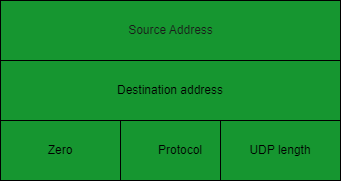{#fig:2 width=70%}

:::
::: {.column width="40%"}

- IP-адрес источника (длина 32 бит)
- IP-адрес получателя (длина 32 бит)
- Поле нулей (длина 8 бит)
- Протокол (длина 8 бит)
- Длина UDP (длина 16 бит)

:::
::::::::::::::

# Практическое применение UDP

## Практическое применение UDP

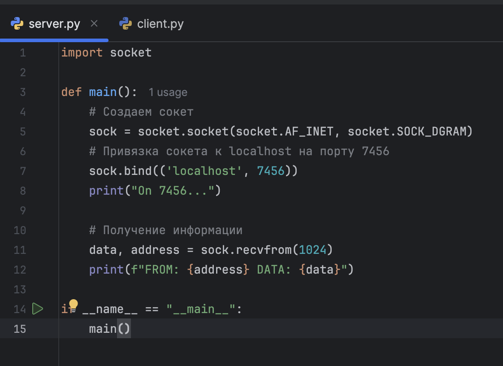{#fig:3 width=60%}

## Практическое применение UDP

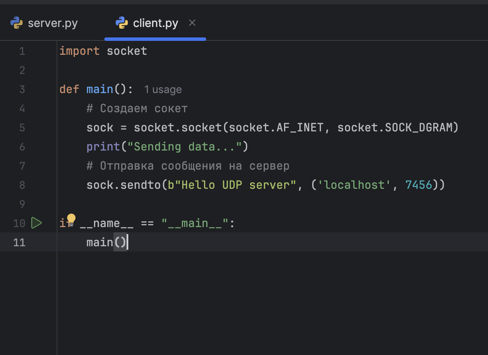{#fig:4 width=50%}

- FROM: ('127.0.0.1', 53439) DATA: b'Hello UDP server'

## Wireshark

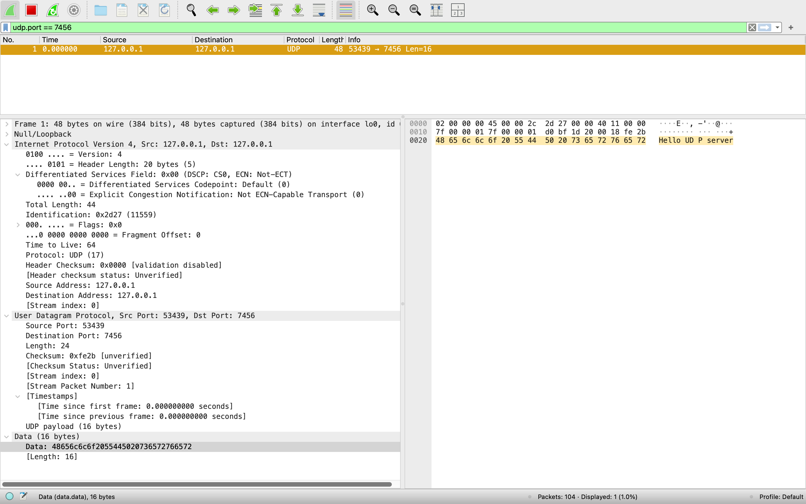{#fig:5 width=70%}

## Wireshark

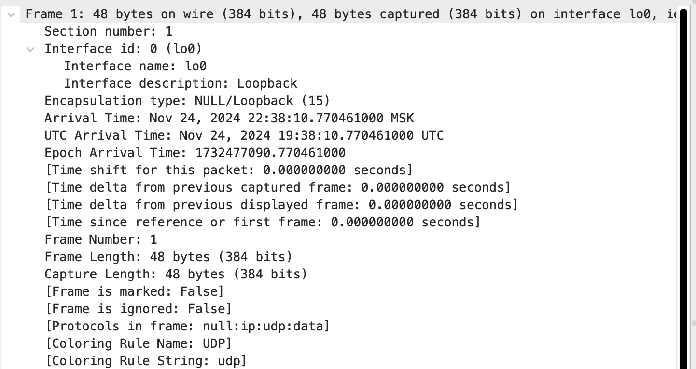{#fig:6 width=70%}

## Wireshark

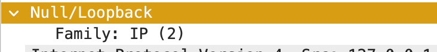{#fig:7 width=70%}

## Wireshark

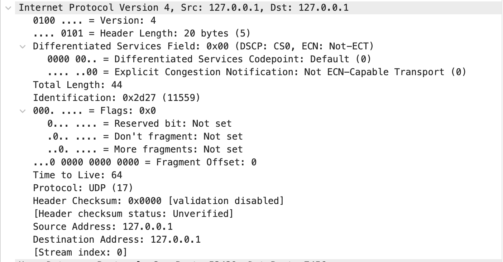{#fig:8 width=70%}

## Wireshark

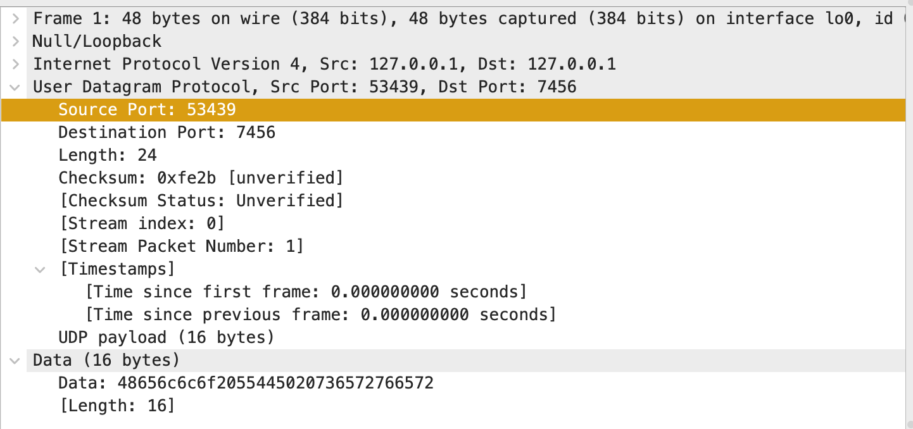{#fig:9 width=70%}

## Практическое применение UDP

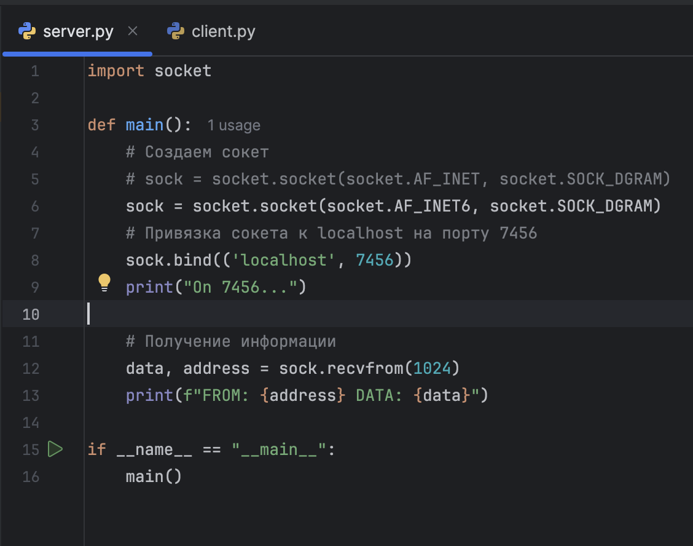{#fig:10 width=60%}

## Практическое применение UDP

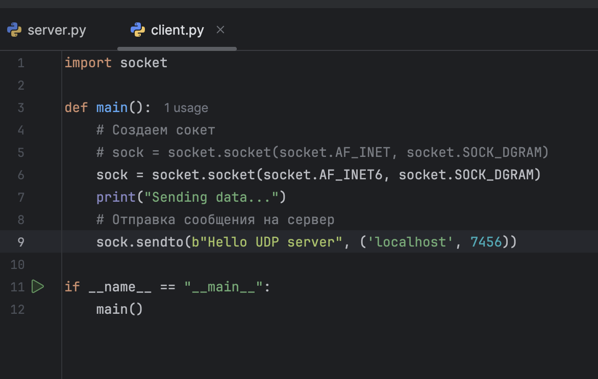{#fig:11 width=50%}

- FROM: ('::1', 49389, 0, 0) DATA: b'Hello UDP server'

## Wireshark

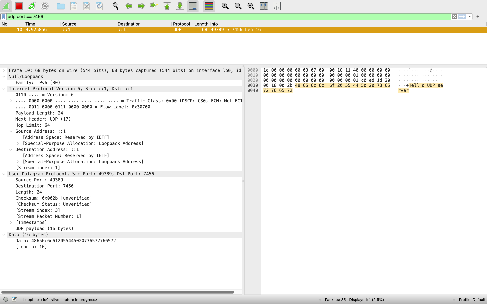{#fig:12 width=70%}

# Преимущества и недостатки UDP

## Преимущества UDP

- Скорость
- Меньшая задержка
- Простота реализации
- Поддержка широковещательной и многоадресной передачи
- Меньшая нагрузка на сеть

## Недостатки UDP

- Отсутствие надёжности
- Отсутствие контроля ошибок
- Отсутствие управления потоком
- Делает систему уязвимой к атакам
- Ограниченная поддержка в некоторых сетях

## Заключение

- Важный протокол транспортного уровня
- Быстрый, но не надежный
- Пользуясь UDP, приложение само несёт ответственность за коррекцию ошибок