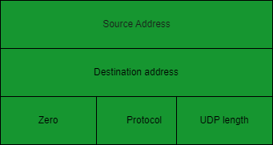
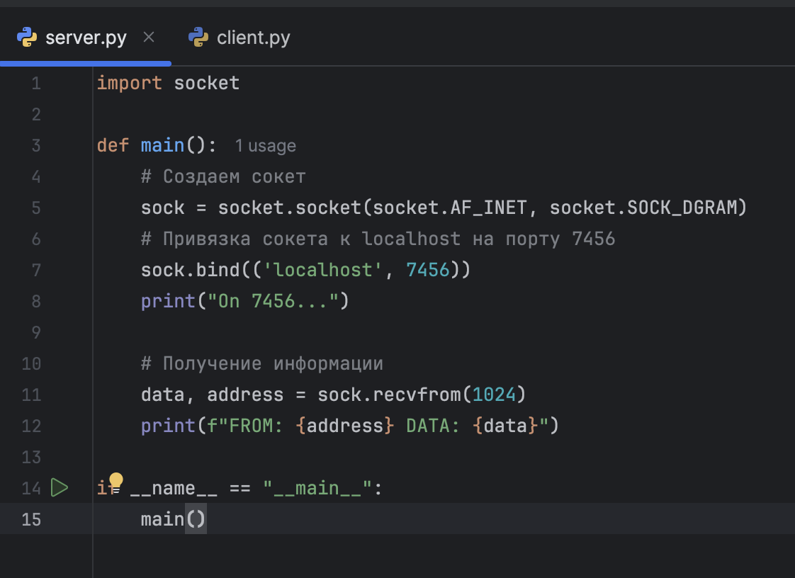
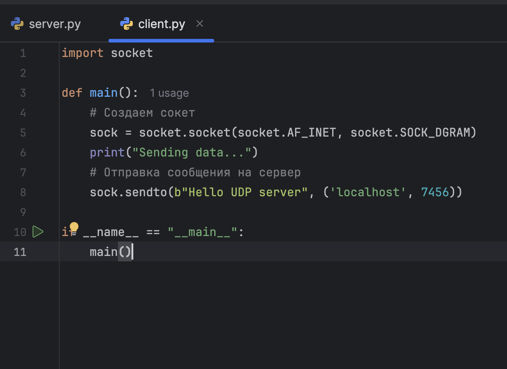
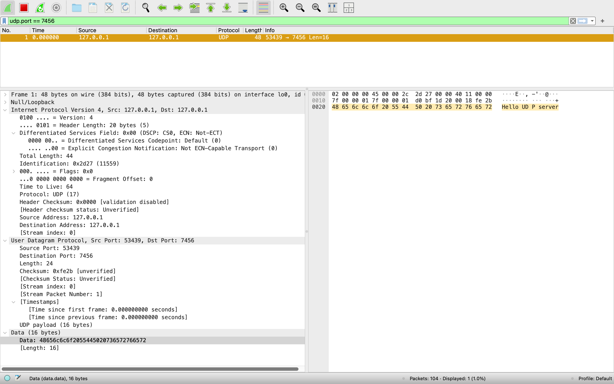
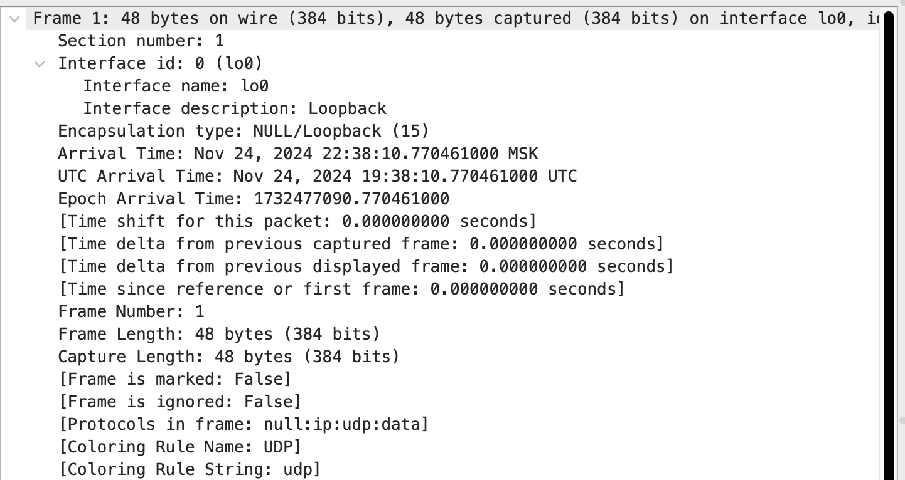
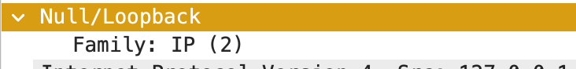
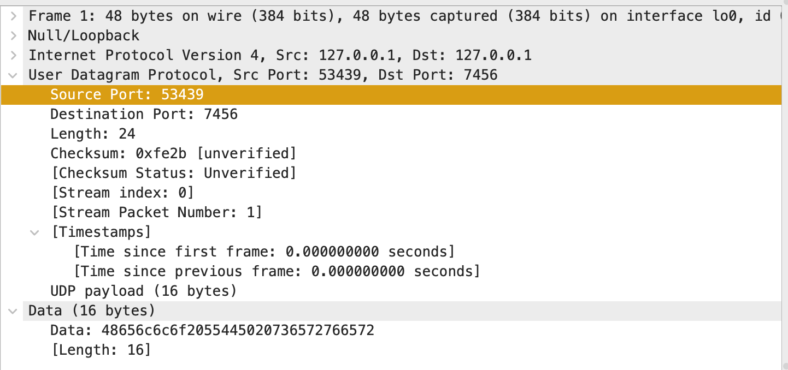

---
## Front matter
title: "Протокол UDP"
subtitle: "Дисциплина: Сетевые технологии"
author: "Мишина Анастасия Алексеевна"

## Generic otions
lang: ru-RU
toc-title: "Содержание"

## Bibliography
bibliography: bib/cite.bib
csl: pandoc/csl/gost-r-7-0-5-2008-numeric.csl

## Pdf output format
toc: true # Table of contents
toc-depth: 2
lof: true # List of figures
lot: true # List of tables
fontsize: 12pt
linestretch: 1.5
papersize: a4
documentclass: scrreprt
## I18n polyglossia
polyglossia-lang:
  name: russian
  options:
	- spelling=modern
	- babelshorthands=true
polyglossia-otherlangs:
  name: english
## I18n babel
babel-lang: russian
babel-otherlangs: english
## Fonts
mainfont: IBM Plex Serif
romanfont: IBM Plex Serif
sansfont: IBM Plex Sans
monofont: IBM Plex Mono
mathfont: STIX Two Math
mainfontoptions: Ligatures=Common,Ligatures=TeX,Scale=0.94
romanfontoptions: Ligatures=Common,Ligatures=TeX,Scale=0.94
sansfontoptions: Ligatures=Common,Ligatures=TeX,Scale=MatchLowercase,Scale=0.94
monofontoptions: Scale=MatchLowercase,Scale=0.94,FakeStretch=0.9
mathfontoptions:
## Biblatex
biblatex: true
biblio-style: "gost-numeric"
biblatexoptions:
  - parentracker=true
  - backend=biber
  - hyperref=auto
  - language=auto
  - autolang=other*
  - citestyle=gost-numeric
## Pandoc-crossref LaTeX customization
figureTitle: "Рис."
tableTitle: "Таблица"
listingTitle: "Листинг"
lofTitle: "Список иллюстраций"
lotTitle: "Список таблиц"
lolTitle: "Листинги"
## Misc options
indent: true
header-includes:
  - \usepackage{indentfirst}
  - \usepackage{float} # keep figures where there are in the text
  - \floatplacement{figure}{H} # keep figures where there are in the text
---

# Введение

Протокол UDP (User Datagram Protocol) — это один из протоколов транспортного уровня, применяемых в сетях передачи данных. Протокол был разработан Дэвидом П. Ридом в 1980 году и официально определён в RFC 768 (документ, определяющий протокол User Datagram Protocol (UDP)). В отличие от TCP (Transmission Control Protocol), протокол UDP является легковесным и обеспечивает минимальную надстройку над сетевым уровнем. Он не гарантирует, что отправленные данные достигнут получателя, и не предусматривает механизмов для восстановления утраченных пакетов. UDP идеально подходит для приложений, где скорость передачи данных важнее, чем их полная сохранность, например, для видеоконференций, онлайн-игр и потокового воспроизведения мультимедиа.

UDP функционирует на транспортном уровне модели OSI и предоставляет лишь базовые возможности для обмена данными между приложениями. Он не требует предварительного установления соединения между отправителем и получателем (connectionless communication), что ускоряет передачу, но снижает надежность. Один узел сети просто отсылает пакеты, адресуя их другому узлу. Отправитель не знает ничего о том, готов ли получатель к приёму пакетов, и вообще, существует ли этот получатель. Отправитель также не ждёт какого-либо подтверждения о том, что получатель принял предыдущие пакеты.

# Протокол UDP

## Состав пакета UDP

Пакеты, передаваемые с помощью UDP, иногда называются датаграммами. Этот термин обычно используется тогда, когда важно подчеркнуть, что пакет передаётся без установки соединения. Рассмотрим состав пакета UDP (рис. [-@fig:1]).

{#fig:1 width=70%}

UDP датаграммы состоят из заголовка и раздела с данными [@udp]. Заголовок пакета UDP состоит из 8 байт, в то время как для TCP он может варьироваться от 20 до 60 байт. UDP-порты используются для идентификации приложений или служб, которые отправляют или получают данные. Номера портов представлены 16-битными беззнаковыми целыми числами в диапазоне от 0 до 65535.

Приведу некоторые распространённые номера UDP-портов и связанные с ними приложения или службы:

- 53 — DNS (система доменных имён);
- 67/68 — DHCP (протокол динамической конфигурации хоста) сервер/клиент;
- 69 — TFTP (простой протокол передачи файлов);
- 123 — NTP (сетевой протокол времени);
- 161/162 — SNMP (простой протокол управления сетью). 

Вернемся к рассмотрению состава заголовка. Он включает в себя:

- Исходный порт: поле длиной 2 байта. В этом поле указывается номер порта отправителя. Предполагается, что это значение задаёт порт, на который при необходимости будет посылаться ответ. В противном же случае значение будет равным 0.
- Порт назначения: поле длиной 2 байта. Это поле обязательно и содержит порт получателя.
- Длина датаграммы: длина пакета UDP, включает в себя длину заголовка и данных. Минимальная длина равна длине заголовка — 8 байт. Теоретически, максимальный размер поля — 65535 байт для UDP-датаграммы (8 байт на заголовок и 65527 на данные). Фактический предел для длины данных при использовании IPv4 — 65507 (помимо 8 байт на UDP-заголовок требуется ещё 20 на IP-заголовок). На практике следует учитывать, что если длина IPv4 пакета с UDP будет превышать 1500 байт, то отправка может вызвать фрагментацию пакета и он может быть не доставлен, если промежуточные маршрутизаторы или конечный хост не будут поддерживать фрагментированные IP пакеты. Для того чтобы быть уверенным, что пакет будет принят любым хостом, размер данных в UDP не должен превышать: (минимальная длина IP пакета) — (Max IP Header Size) — (UDP Header Size) = 576 — 60 — 8 = 508 байт. IPv6 пакеты UDP могут иметь больший размер. Максимальное значение составляет 4 294 967 295 байт (2^32 — 1), из которых 8 байт соответствуют заголовку, а остальные 4 294 967 287 байт — данным.
- Контрольная сумма: поле длиной 2 байта. Контрольная сумма используется для проверки заголовка и данных на ошибки. Если сумма не сгенерирована передатчиком, то поле заполняется нулями.

Порт отправителя и контрольная сумма необязательны к использованию в IPv4, в то время как в IPv6 необязателен только порт отправителя.

## Псевдозаголовки

UDP-заголовок не содержит информации об адресе отправителя и получателя, поэтому даже при совпадении порта получателя нельзя с точностью сказать, что сообщение пришло в нужное место. Для проверки того, что UDP-сообщение достигло пункта своего назначения, вычисляется контрольная сумма с использованием дополнительного псевдозаголовка (рис. [-@fig:2]). Псевдозаголовок не включается в UDP-сообщение.

{#fig:2 width=70%}

Вначале идут поля IP-адрес источника (длина 32 бит) и IP-адрес получателя (длина 32 бит). Далее идёт зарезервированное поле (длина 8 бит), заполненное нулями. Поле Протокол (длина 8 бит) идентифицирует протокол из заголовка пакета IP. Для UDP это значение равно 17 (00010001 в двоичном виде, 0x11 — в шестнадцатеричном). Далее идёт поле Длина UDP (длина 16 бит). Защита заголовка IP несколько избыточна и делает протокол UDP (впрочем, как и TCP) неотделимым от протокола IP, хотя это и позволяет провести двойную проверку датаграмм IP, поступивших для заданного получателя [@netteh].

Контрольная сумма считается перед отправлением сообщения и при его получении (получатель составляет свой псевдозаголовок, используя адрес хоста, с которого пришло сообщение, и собственный адрес, а затем считает контрольную сумму).

Если контрольная сумма совпадает, значит, пакет достиг целевого узла назначения, а также правильного порта протокола на этом узле. Если контрольная сумма в полученном пакете равняется нулю, то считается, что передающий уровень UDP её не вычисляет, и данные не защищены.

# Практическое применение UDP

Для рассмотрения протокола UDP воспользуемся языком программирования python. Нам понадобится написать минимальный функционал для сервера и клиента. Воспользуемся модуоем socket, который предоставляет доступ к низкоуровневым сетевым интерфейсам. Он позволяет создавать и управлять сокетами (название программного интерфейса для обеспечения обмена данными между процессами).

Код для сервера (рис. [-@fig:3]). Создаем сокет: AF_INET - используем IPv4, SOCK_DGRAM - сокет будет использовать протокол UDP. Сокет привязывается к адресу localhost (что означает, что он будет доступен только на локальном компьютере) и порту 7456. Это позволяет сокету прослушивать входящие сообщения, отправленные на этот порт. Метод recvfrom(1024) блокирует выполнение программы до тех пор, пока не поступит сообщение. Максимальный размер получаемых данных составляет 1024 байта. Когда данные приходят, они сохраняются в переменной data, а адрес отправителя — в переменной address.

{#fig:3 width=70%}

Код для клиента (рис. [-@fig:4]). Аналогично создаем сокет и отправляем сообщение с текстом "Hello UDP server".

{#fig:4 width=70%}

Запускаем wireshark и устанавливаем прослушивание на Loopback: lo0. Loopback - это виртуальный сетевой интерфейс, который используется для связи внутри самого устройства. В большинстве операционных систем, включая Unix-подобные системы (такие как Linux и macOS), а также Windows, loopback-интерфейс имеет IP-адрес 127.0.0.1.

Запускаем оба скрипта и в терминале видим следующее сообщение: FROM: ('127.0.0.1', 53439) DATA: b'Hello UDP server'. Это означает, что сообщение с нашим текстом было отправлено с ip-адреса 127.0.0.1 (localhost) и с порта 53439 - каждый раз, когда приложение или процесс открывает сокет для отправки данных, ему назначается случайный порт (в данном случае 53439) для этой сессии.

Заходим в wireshark, фильтруем пакеты по порту - udp.port == 7456 и видим строку с протоколом UDP. Справа можем сразу наблюдать наше сообщение (рис. [-@fig:5]).

{#fig:5 width=70%}

Рассмотрим подробнее информацию по пакету [@wireshark]:

- Фрейм: Обзор фрейма данных физического уровня (рис. [-@fig:6]). Например, тип упаковки - Loopback, номер кадра - 1, длина кадра - 48 байт, длина байта захвата - 48 байт.

{#fig:6 width=70%}

- Null/Loopback канального уровня (рис. [-@fig:7]). Это поле содержит значение «семейства адресов»/«семейства протоколов» для протокола, работающего на канальном уровне, например AF_INET для IPv4 и AF_INET6 для IPv6. AF_INET равен 2 во всех операционных системах на базе BSD, поскольку он был введен одновременно с выпуском версий BSD с сетевыми возможностями; однако AF_INET6, к сожалению, имеет разные значения в {NetBSD, OpenBSD, BSD/OS}, {FreeBSD, DragonFlyBSD} и {Darwin/macOS}, поэтому пакет IPv6 может иметь заголовок канального уровня со значением 24, 28 или 30.

{#fig:7 width=70%}

- Интернет-протокол версии 4: информация заголовка IP-пакета сетевого уровня (рис. [-@fig:8]). Общая длина ip-пакета - 44 байта, исходный ip-адрес - 127.0.0.1, ip-адрес получателя 127.0.0.1.

{#fig:8 width=70%}

- В разделе User Datagram Protocol можно заметить заголовок и те поля, что обсуждались ранее. Это транспортный уровень (рис. [-@fig:9]). Порт источника - 53439, порт получателя (сервер) - 7456, длина - 24 байта (длина заголовка 8 + длина оставшихся данных в пакете), контрольная сумма - 0xfe2b.

{#fig:9 width=70%}

# Преимущества и недостатки UDP

Преимущества UDP:

- Скорость: UDP работает быстрее, чем TCP, потому что ему не нужно устанавливать соединение и обеспечивать надёжную передачу данных.
- Меньшая задержка: поскольку не требуется установка соединения, задержка меньше, а время отклика быстрее.
- Простота реализации: Он не требует сложных механизмов для управления потоком данных и контроля ошибок, что упрощает разработку и уменьшает нагрузку на систему. Это особенно важно для разработчиков, которые хотят быстро и эффективно внедрить сетевые функции в свои приложения. Простота UDP позволяет сосредоточиться на основной логике приложения, а не на сложных механизмах транспортного уровня.
- Поддержка широковещательной и многоадресной передачи: UDP поддерживает широковещательную (broadcast) и многоадресную (multicast) передачу данных, что позволяет отправлять данные сразу нескольким получателям. Это полезно для приложений, таких как видеоконференции и онлайн-трансляции. Широковещательная передача позволяет отправлять данные всем устройствам в сети, а многоадресная передача — только определенной группе устройств, что делает UDP гибким инструментом для различных сценариев использования.
- Меньшая нагрузка на сеть: Так как UDP не использует механизмы подтверждения и повторной передачи данных, он создает меньшую нагрузку на сеть. Это особенно важно в условиях ограниченной пропускной способности, где каждый бит на счету. UDP позволяет передавать данные с минимальными накладными расходами, что делает его подходящим для приложений с высокой интенсивностью передачи данных, таких как стриминг видео и аудио.

Недостатки UDP:

- Отсутствие надёжности: UDP не гарантирует доставку пакетов или порядок их доставки, что может привести к потере или дублированию данных.
- Отсутствие контроля ошибок: UDP не включает механизмов для обнаружения и исправления ошибок. Если данные повреждены во время передачи, они будут доставлены получателю в поврежденном виде.
- Отсутствие управления потоком: UDP не предоставляет механизмов для управления потоком данных. Это может привести к перегрузке сети или получателя, особенно в условиях высокой нагрузки. В отличие от TCP, который использует механизмы управления потоком для предотвращения перегрузки, UDP отправляет данные без учета состояния сети или получателя.
- Уязвим для атак: UDP уязвим для атак типа DoS (отказ в обслуживании) , когда злоумышленник может заполнить сеть UDP-пакетами, перегрузив её и вызвав сбой.
- Ограниченная поддержка в некоторых сетях: Некоторые сети и маршрутизаторы могут ограничивать или блокировать UDP-трафик из-за его потенциальной ненадежности и отсутствия механизмов контроля. Это может ограничить использование UDP в определенных сетевых условиях.

# Заключение

Протокол пользовательских дейтаграмм (UDP) - важный протокол транспортного уровня в наборе интернет-протоколов, известный своей скоростью и эффективностью из-за отсутствия подключения к интернету и легкого дизайна. Хотя UDP не обладает стабильностью TCP и функциями проверки ошибок, он используется в приложениях, которым требуется низкая задержка и производительность в реальном времени, таких как потоковая передача, онлайн-игры и поиск в DNS. Его простота и поддержка широковещательных и многоадресных трансляций делают его полезным инструментом для специализированных приложений, несмотря на его уязвимость к потере данных и перегрузке сети. Пользуясь UDP, приложение само несёт ответственность за коррекцию ошибок.

# Список литературы{.unnumbered}